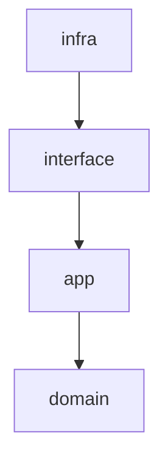

# 将棋AI開発のためのMemory Bank

このドキュメントは、将棋AI「maou」の開発に関する知識ベースとして機能します。LLMがこの情報を参照することで、開発プロセスを効果的に支援できるようになります。

## 目次

1. [将棋AIの基本概念](#1-将棋aiの基本概念)
2. [プロジェクト「maou」の構成](#2-プロジェクトmaoの構成)
3. [評価関数の設計と実装](#3-評価関数の設計と実装)
4. [探索アルゴリズム](#4-探索アルゴリズム)
5. [機械学習モデルの設計](#5-機械学習モデルの設計)
6. [学習プロセス](#6-学習プロセス)
7. [データ処理パイプライン](#7-データ処理パイプライン)
8. [よくある問題と解決方法](#8-よくある問題と解決方法)
9. [将棋AIの評価とチューニング](#9-将棋aiの評価とチューニング)
10. [参考資料とリソース](#10-参考資料とリソース)
11. [日本語コメント](#11-日本語コメント)

## 1. 将棋AIの基本概念

### 1.1 将棋AIの構成要素

将棋AIは主に以下の要素から構成されます：

1. **評価関数**: 局面の有利不利を数値化する関数
2. **探索アルゴリズム**: 最善手を見つけるための探索方法
3. **知識ベース**: 定跡や戦型に関する知識
4. **学習システム**: 棋譜データから学習するシステム

### 1.2 従来型AIと機械学習型AI

将棋AIには大きく分けて2つのアプローチがあります：

1. **従来型AI**:
   - 人間が設計した評価関数
   - アルファベータ探索などの古典的アルゴリズム
   - 明示的なルールベースの知識

2. **機械学習型AI**:
   - ニューラルネットワークによる評価関数
   - モンテカルロ木探索などの確率的アルゴリズム
   - データからの暗黙的な知識獲得

「maou」プロジェクトは、機械学習型AIのアプローチを採用しています。

### 1.3 強化学習と教師あり学習

将棋AIの学習には主に以下の2つのアプローチがあります：

1. **教師あり学習**:
   - プロ棋士の棋譜を教師データとして使用
   - 人間の指し手を模倣することを目標とする
   - 比較的短時間で一定の強さに到達可能

2. **強化学習**:
   - 自己対局による学習
   - 勝敗という報酬シグナルを最大化することを目標とする
   - 人間の知識に縛られない創造的な手を発見可能

「maou」プロジェクトでは、教師あり学習と強化学習を組み合わせたハイブリッドアプローチを採用しています。

## 2. プロジェクト「maou」の構成

### 2.1 アーキテクチャ概要

「maou」プロジェクトはクリーンアーキテクチャに基づいて設計されています：



- **domain**: エンティティのみが存在
- **app**: ユースケースを実装
- **interface**: infraとappの間の変換層
- **infra**: 外部との接続（DB、UI等）

### 2.2 主要コンポーネント

「maou」プロジェクトの主要コンポーネントは以下の通りです：

1. **hcpe_converter**: 棋譜データをHCPE（Human-Computer Position Evaluation）形式に変換
2. **pre_process**: HCPE形式のデータを前処理
3. **network**: ニューラルネットワークモデルの定義
4. **dataset**: データセットの管理
5. **learn**: モデルの学習プロセス

### 2.3 ファイル構造

プロジェクトの主要なファイル構造は以下の通りです：

```
src/maou/
├── app/
│   ├── converter/
│   │   └── hcpe_converter.py  # 棋譜をHCPE形式に変換
│   ├── learning/
│   │   ├── dataset.py         # データセット管理
│   │   ├── dl.py              # 深層学習関連
│   │   └── network.py         # ネットワークモデル定義
│   └── pre_process/
│       ├── feature.py         # 特徴量抽出
│       ├── hcpe_transform.py  # HCPE変換
│       ├── label.py           # ラベル処理
│       └── transform.py       # データ変換
├── domain/
│   ├── loss/
│   │   └── loss_fn.py         # 損失関数
│   ├── network/
│   │   └── resnet.py          # ResNetモデル
│   └── parser/
│       ├── csa_parser.py      # CSA形式の棋譜パーサー
│       ├── kif_parser.py      # KIF形式の棋譜パーサー
│       └── parser.py          # パーサー基底クラス
├── infra/
│   ├── app_logging.py         # ロギング
│   ├── bigquery/              # BigQuery連携
│   ├── console/               # コンソールアプリ
│   ├── file_system/           # ファイルシステム
│   └── gcs/                   # Google Cloud Storage連携
└── interface/
    ├── converter.py           # 変換インターフェース
    ├── learn.py               # 学習インターフェース
    └── preprocess.py          # 前処理インターフェース
```

## 3. 評価関数の設計と実装

### 3.1 評価関数の役割

評価関数は、与えられた局面の有利不利を数値化する関数です。「maou」では、ニューラルネットワークを用いて評価関数を実装しています。

評価関数は以下の2つの出力を持ちます：

1. **方策（Policy）**: 各手の確率分布（どの手を指すべきか）
2. **価値（Value）**: 局面の勝率予測（どれくらい有利か）

### 3.2 特徴量設計

将棋の局面を表現するための特徴量設計は以下の通りです：

```python
# 駒8種類，成駒6種類
PIECE_TYPES = 14

# MAX_PIECES_IN_HANDの構成
# 歩18，香車4，桂馬4，銀4，金4，角2，飛車2

FEATURES_NUM = PIECE_TYPES * 2 + sum(cshogi.MAX_PIECES_IN_HAND) * 2
```

特徴量は以下の情報を含みます：

1. 盤面上の駒の配置（駒の種類と先手/後手）
2. 持ち駒の数

### 3.3 評価関数の実装

評価関数はResNetをベースにしたニューラルネットワークで実装されています：

```python
class Network(nn.Module):
    """Deep Learning Network.
    コア部分はResNetで出力層で二つのヘッドがあり，
    PolicyとValueの2つの評価値を返す．
    """

    def __init__(
        self,
        block: type[nn.Module],
        in_channels: int,
        layers: list[int],
        strides: list[_size_2_t],
        list_out_channels: list[int],
    ):
        super(Network, self).__init__()
        # 入力層
        self.conv1 = nn.Conv2d(
            in_channels=in_channels,
            out_channels=list_out_channels[0],
            kernel_size=3,
            padding=1,
            bias=False,
        )

        # 中間層 (ResNet)
        self.resnet = ResNet(
            block=block,
            in_channels=list_out_channels[0],
            layers=layers,
            strides=strides,
            list_out_channels=list_out_channels,
        )

        # Policy head
        self.policy_head = PolicyHead(list_out_channels[3], MOVE_LABELS_NUM)

        # Value head
        self.value_head = ValueHead(list_out_channels[3])

    def forward(self, x: torch.Tensor) -> tuple[torch.Tensor, torch.Tensor]:
        # 入力層
        x = self.conv1(x)
        x = self.relu(self.norm1(x))

        # 中間層 (ResNet)
        x = self.resnet(x)

        # 出力層
        policy = self.policy_head(x)
        value = self.value_head(x)

        return policy, value
```

## 4. 探索アルゴリズム

### 4.1 モンテカルロ木探索（MCTS）

「maou」プロジェクトでは、モンテカルロ木探索（MCTS）を採用しています。MCTSは以下の4つのステップを繰り返します：

1. **選択（Selection）**: UCB（Upper Confidence Bound）などの評価値に基づいて、探索すべきノードを選択
2. **拡張（Expansion）**: 選択したノードの子ノードを展開
3. **シミュレーション（Simulation）**: ランダムプレイアウトまたはニューラルネットワークによる評価
4. **逆伝播（Backpropagation）**: シミュレーション結果を木の上位ノードに伝播

### 4.2 UCB（Upper Confidence Bound）

MCTSにおけるノード選択には、UCBを使用します：

```
UCB = Q(s,a) + c * sqrt(ln(N(s)) / N(s,a))
```

ここで：
- Q(s,a): 状態sでの行動aの平均報酬
- N(s): 状態sの訪問回数
- N(s,a): 状態sでの行動aの選択回数
- c: 探索と活用のバランスを調整するパラメータ

### 4.3 PUCT（Predictor + UCT）

AlphaZeroでは、UCBの代わりにPUCTを使用します：

```
PUCT = Q(s,a) + c * P(s,a) * sqrt(N(s)) / (1 + N(s,a))
```

ここで：
- P(s,a): ニューラルネットワークによる行動aの事前確率

「maou」プロジェクトでは、PUCTアルゴリズムを採用しています。

## 5. 機械学習モデルの設計

### 5.1 ネットワークアーキテクチャ

「maou」プロジェクトでは、ResNetをベースにしたネットワークアーキテクチャを採用しています：

```python
class ResNet(nn.Module):
    def __init__(
        self,
        block: type[nn.Module],
        in_channels: int,
        layers: list[int],
        strides: list[_size_2_t],
        list_out_channels: list[int],
    ):
        super(ResNet, self).__init__()
        self.in_channels = in_channels
        self.relu = nn.ReLU(inplace=True)

        # レイヤー1
        self.layer1 = self._make_layer(
            block, list_out_channels[0], layers[0], stride=strides[0]
        )
        # レイヤー2
        self.layer2 = self._make_layer(
            block, list_out_channels[1], layers[1], stride=strides[1]
        )
        # レイヤー3
        self.layer3 = self._make_layer(
            block, list_out_channels[2], layers[2], stride=strides[2]
        )
        # レイヤー4
        self.layer4 = self._make_layer(
            block, list_out_channels[3], layers[3], stride=strides[3]
        )

    def _make_layer(
        self,
        block: type[nn.Module],
        out_channels: int,
        blocks: int,
        stride: _size_2_t = 1,
    ) -> nn.Sequential:
        # 略
```

### 5.2 PolicyHeadとValueHead

ネットワークは2つのヘッドを持ちます：

1. **PolicyHead**: 次の手の確率分布を出力

```python
class PolicyHead(nn.Module):
    def __init__(self, in_channels: int, num_classes: int):
        super(PolicyHead, self).__init__()
        self.conv = nn.Conv2d(in_channels, 128, kernel_size=3, stride=1, padding=1)
        self.relu = nn.ReLU()
        self.avg_pool = nn.AdaptiveAvgPool2d((1, 1))
        self.flatten = nn.Flatten()
        self.fc = nn.Linear(128, num_classes)

    def forward(self, x: torch.Tensor) -> torch.Tensor:
        x = self.conv(x)
        x = self.relu(x)
        x = self.avg_pool(x)
        x = self.flatten(x)
        x = self.fc(x)
        return x
```

2. **ValueHead**: 局面の評価値を出力

```python
class ValueHead(nn.Module):
    def __init__(self, in_channels: int):
        super(ValueHead, self).__init__()
        self.conv = nn.Conv2d(in_channels, 128, kernel_size=3, stride=1, padding=1)
        self.relu = nn.ReLU()
        self.avg_pool = nn.AdaptiveAvgPool2d((1, 1))
        self.flatten = nn.Flatten()
        self.fc = nn.Linear(128, 1)

    def forward(self, x: torch.Tensor) -> torch.Tensor:
        x = self.conv(x)
        x = self.relu(x)
        x = self.avg_pool(x)
        x = self.flatten(x)
        x = self.fc(x)
        return x
```

### 5.3 損失関数

学習には以下の損失関数を使用します：

1. **方策損失**: 交差エントロピー損失
2. **価値損失**: 平均二乗誤差（MSE）

総合損失は以下のように計算されます：

```python
loss = policy_loss_ratio * policy_loss + value_loss_ratio * value_loss
```

## 6. 学習プロセス

### 6.1 データセット

学習には以下のデータセットを使用します：

```python
class KifDataset(Dataset, Sized):
    def __init__(
        self,
        *,
        datasource: DataSource,
        transform: Optional[Transform] = None,
        pin_memory: bool,
        device: torch.device,
    ):
        self.__datasource = datasource
        self.transform: Optional[Transform] = transform
        self.device = device
        self.pin_memory = pin_memory

    def __getitem__(
        self, idx: int
    ) -> tuple[torch.Tensor, tuple[torch.Tensor, torch.Tensor, torch.Tensor]]:
        if self.transform is not None:
            # 最初にtransformしないパターン
            features, move_label, result_value, legal_move_mask = self.transform(
                hcp=self.__datasource[idx]["hcp"],
                move16=self.__datasource[idx]["bestMove16"],
                game_result=self.__datasource[idx]["gameResult"],
                eval=self.__datasource[idx]["eval"],
            )
            return (
                torch.from_numpy(features).to(self.device),
                (
                    torch.tensor(move_label, dtype=torch.long, pin_memory=self.pin_memory)
                    .long()
                    .to(self.device),
                    torch.tensor(result_value, dtype=torch.float32, pin_memory=self.pin_memory)
                    .reshape((1))
                    .to(self.device),
                    torch.from_numpy(legal_move_mask).to(self.device),
                ),
            )
```

### 6.2 学習パラメータ

学習には以下のパラメータを使用します：

- **バッチサイズ**: 学習時のバッチサイズ
- **エポック数**: 学習の繰り返し回数
- **学習率**: 最適化アルゴリズムの学習率
- **モメンタム**: SGDのモメンタム
- **方策損失比率**: 方策損失の重み
- **価値損失比率**: 価値損失の重み

### 6.3 学習プロセスの流れ

学習プロセスは以下の流れで行われます：

1. データの読み込み
2. データの前処理
3. モデルの初期化
4. バッチ単位での学習
5. 検証
6. チェックポイントの保存
7. 1-6の繰り返し

## 7. データ処理パイプライン

### 7.1 棋譜データの変換（HCPE Converter）

棋譜データ（KIF, CSA形式）をHCPE形式に変換するプロセスは以下の通りです：

1. 棋譜ファイルの読み込み
2. パーサーによる解析
3. 局面の抽出
4. 特徴量の計算
5. HCPE形式への変換
6. 保存

```python
def transform(
    file_system: FileSystem,
    input_path: Path,
    input_format: str,
    output_dir: Path,
    min_rating: Optional[int] = None,
    min_moves: Optional[int] = None,
    max_moves: Optional[int] = None,
    allowed_endgame_status: Optional[list[str]] = None,
    exclude_moves: Optional[list[int]] = None,
    feature_store: Optional[FeatureStore] = None,
) -> str:
    # 略
```

### 7.2 前処理（Pre-process）

HCPE形式のデータを学習用に前処理するプロセスは以下の通りです：

1. HCPE形式データの読み込み
2. 特徴量の正規化
3. ラベルの変換
4. データの分割（学習用/検証用）
5. 保存

```python
def transform(
    datasource: DataSource,
    output_dir: Optional[Path] = None,
    feature_store: Optional[FeatureStore] = None,
) -> str:
    # 略
```

### 7.3 データソース

データソースには以下の2種類があります：

1. **ファイルデータソース**: ローカルファイルシステムからデータを読み込む
2. **BigQueryデータソース**: BigQueryからデータを読み込む

```python
class FileDataSource(DataSource):
    def __init__(self, file_paths: list[Path], schema: dict[str, str]):
        self.__file_paths = file_paths
        self.__schema = schema
        self.__data_cache: dict[int, dict[str, Any]] = {}
        self.__length = self.__calculate_length()

    def __getitem__(self, idx: int) -> dict[str, Any]:
        # 略

class BigQueryDataSource(DataSource):
    def __init__(
        self,
        dataset_id: str,
        table_name: str,
        batch_size: int = 10000,
        max_cached_bytes: int = 500 * 1024 * 1024,
        clustering_key: Optional[str] = None,
        partitioning_key_date: Optional[str] = None,
        use_local_cache: bool = False,
        local_cache_dir: Optional[str] = None,
    ):
        # 略
```

## 8. よくある問題と解決方法

### 8.1 過学習（Overfitting）

**問題**: モデルが訓練データに過度に適合し、汎化性能が低下する

**解決方法**:
- データ拡張（Data Augmentation）
- 正則化（Regularization）
- ドロップアウト（Dropout）
- バッチ正規化（Batch Normalization）
- 早期終了（Early Stopping）

### 8.2 勾配消失/爆発（Vanishing/Exploding Gradients）

**問題**: 深いネットワークで勾配が消失または爆発する

**解決方法**:
- 残差接続（Residual Connections）
- 適切な重み初期化
- バッチ正規化
- 勾配クリッピング

### 8.3 学習の不安定性

**問題**: 学習が不安定で収束しない

**解決方法**:
- 学習率の調整
- 学習率スケジューラの使用
- バッチサイズの調整
- 損失関数の重みバランス調整

### 8.4 メモリ使用量の問題

**問題**: 大量のデータを扱う際にメモリ不足になる

**解決方法**:
- バッチサイズの削減
- データローダーの最適化
- 分散学習
- 混合精度学習（Mixed Precision Training）

### 8.5 探索の効率性

**問題**: 探索が遅く、実用的な時間内に十分な深さまで探索できない

**解決方法**:
- 枝刈り（Pruning）の最適化
- 並列探索
- ハードウェアアクセラレーション（GPU, TPU）
- キャッシュの最適化

## 9. 将棋AIの評価とチューニング

### 9.1 評価指標

将棋AIの性能を評価するための指標は以下の通りです：

1. **勝率**: 他のAIや人間との対局での勝率
2. **Elo Rating**: レーティング制度による強さの評価
3. **自己対局での勝率**: 以前のバージョンとの自己対局での勝率
4. **探索効率**: 単位時間あたりの探索ノード数
5. **予測精度**: プロの指し手の予測精度

### 9.2 ハイパーパラメータチューニング

以下のハイパーパラメータをチューニングすることで性能を向上させることができます：

1. **ネットワーク構造**: レイヤー数、フィルター数、カーネルサイズなど
2. **学習パラメータ**: 学習率、バッチサイズ、エポック数など
3. **損失関数の重み**: 方策損失と価値損失の重みバランス
4. **探索パラメータ**: PUCTの探索定数、探索ノード数など

### 9.3 チューニング手法

ハイパーパラメータのチューニングには以下の手法を使用します：

1. **グリッドサーチ**: パラメータの組み合わせを網羅的に試す
2. **ランダムサーチ**: パラメータをランダムに選んで試す
3. **ベイズ最適化**: 過去の結果に基づいて次のパラメータを選択
4. **進化的アルゴリズム**: 遺伝的アルゴリズムなどを用いてパラメータを最適化

## 10. 参考資料とリソース

### 10.1 論文

1. Silver, D., et al. (2017). Mastering Chess and Shogi by Self-Play with a General Reinforcement Learning Algorithm. arXiv:1712.01815.
2. Silver, D., et al. (2017). Mastering the game of Go without human knowledge. Nature, 550(7676), 354-359.
3. Silver, D., et al. (2016). Mastering the game of Go with deep neural networks and tree search. Nature, 529(7587), 484-489.

### 10.2 書籍

1. 山本一成 (2018). 『人工知能はどのように将棋を学習したのか』. ダイヤモンド社.
2. 松原仁 (2018). 『AIと人間の将棋』. 河出書房新社.
3. Sutton, R. S., & Barto, A. G. (2018). Reinforcement Learning: An Introduction. MIT press.

### 10.3 ウェブリソース

1. [elmo開発者ブログ](https://mk-takizawa.github.io/elmo/)
2. [やねうら王公式サイト](https://yaneuraou.yaneu.com/)
3. [Bonanza開発者サイト](http://www.geocities.jp/bonanza_shogi/)
4. [DeepMind AlphaZero](https://deepmind.com/blog/article/alphazero-shedding-new-light-grand-games-chess-shogi-and-go)

### 10.4 オープンソースプロジェクト

1. [やねうら王](https://github.com/yaneurao/YaneuraOu)
2. [dlshogi](https://github.com/TadaoYamaoka/DeepLearningShogi)
3. [python-shogi](https://github.com/gunyarakun/python-shogi)
4. [cshogi](https://github.com/TadaoYamaoka/cshogi)

## 11. 日本語コメント

コード中に日本語を書くときは
句点に「、」ではなく「，」を使い，
読点に「。」ではなく「．」を使うこと．
