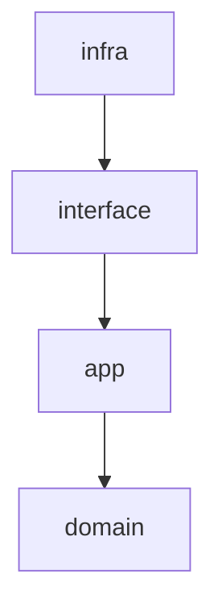

# アーキテクチャ

## 基本的な設計方針

基本的にはクリーンアーキテクチャ inspired な形にする．

基本的な依存関係は以下でおおまかなフォルダも同名になっている．



## infra

- DBやUI等のアプリケーション外部との接続の一番外側なコード
- ここにはビジネスロジックは一切いれずに純粋に外部のDB等とコミュケーションするために一般的に必要なものだけが入っている
- いわゆるプレゼンテーション層といわれるのもここにいれる

## interface

- presenter，controller，gatewayがあるが，要するにここではinfraの取り扱う一般的な形で解釈できるように変換する
- interfaceではentityを取り扱わずに言語の組み込み型だけ使う．これにより，entityへの依存がなくなり，interfaceを読むためにentityを読む必要がなくなる．
- 入力
    - infraを純粋な技術だけにして，appからinfraごとに必要な変換を取り除くといった上下の役割の凝集度をあげる効果がある
      - validation系もinfraから切り離してinterfaceに書いてしまったほうがよさそう
- 出力
    - infraは組み込みの言語の型で返せばよく，変な変換を入れることもしなくていい (変な変換とは1が返ってきたらtrueにするとか)
    - interfaceがappに返すときは，entityでラップするとかはしなくていいが，1が返ってきたらtrueにする等の抽象化は行う．

## app

- 各ユースケースを取り扱う．インプットはinterfaceから受け取って，domainを操作して，結果を出す．必要であればinterface経由でデータを取得してentityを作成して操作する (entityにすることでドメインルールが適用されるのでデータをそのまま使わない)．
- 依存関係の一方向性を持たせるために，domainサービスは存在せず，appでサービスを作る
    - ドメインサービスとは，ある一つのentityに依存しないルールを記載する時に使う．例えば，IDの一意性チェックだと個別のID entityの機能としてあると不自然なのでドメインサービスで実装する．
        - 一意性チェックであればinterfaceを使ってDBへのアクセスが必要

## domain

- ここではentityだけが存在する

## cshogi Library Encapsulation

The project uses the `cshogi` C++ library for Shogi game logic, but it is **completely encapsulated within the domain layer** following Clean Architecture.

### Encapsulation Rules

**Allowed cshogi usage:**
- ✅ `src/maou/domain/board/shogi.py` - Board wrapper (PRIMARY abstraction point)
- ✅ `src/maou/domain/parser/csa_parser.py` - CSA parsing (implementation detail)
- ✅ `src/maou/domain/parser/kif_parser.py` - KIF parsing (implementation detail)
- ✅ `tests/**` - Direct usage allowed for test simplicity (but Board usage preferred)

**Prohibited cshogi usage:**
- ❌ `src/maou/app/**` - MUST use `Board` class, not cshogi directly
- ❌ `src/maou/interface/**` - MUST use domain abstractions
- ❌ `src/maou/infra/**` - MUST use domain abstractions

### Piece ID Mapping (CRITICAL)

cshogi and PieceId enum use **DIFFERENT orderings**:

| Piece | cshogi ID | PieceId enum | Conversion |
|-------|-----------|--------------|------------|
| 金(GOLD) | 7 | 5 (KI) | Reordered |
| 角(BISHOP) | 5 | 6 (KA) | Reordered |
| 飛(ROOK) | 6 | 7 (HI) | Reordered |
| 白(WHITE) | black+16 | black+14 | Offset difference |

**Conversion methods:**
- `Board._cshogi_piece_to_piece_id()` - Convert piece IDs
- `Board._reorder_piece_planes_cshogi_to_pieceid()` - Reorder feature planes

**IMPORTANT:** All piece ID conversions MUST go through these centralized methods. Never implement conversion logic elsewhere.

### Replacing cshogi with Another Library

If you need to replace cshogi:

1. **Update Board class** (`src/maou/domain/board/shogi.py`):
   - Replace `self.board = cshogi.Board()` with new library
   - Update `_cshogi_piece_to_piece_id()` for new library's piece IDs
   - Update `_reorder_piece_planes_cshogi_to_pieceid()` if needed
   - Update move utility functions

2. **Update Parsers**:
   - Replace `cshogi.CSA.Parser` in `csa_parser.py`
   - Replace `cshogi.KIF.Parser` in `kif_parser.py`

3. **Verify Constants**:
   - Check `MAX_PIECES_IN_HAND`, `PIECE_TYPES` still match
   - Update static assertions if values differ

4. **Run Tests**:
   - `poetry run pytest tests/maou/domain/board/`
   - Ensure piece ID conversions are correct
   - Verify no regressions in app/interface/infra layers

### Anti-Patterns (DO NOT DO THIS)

```python
# ❌ BAD: Direct cshogi import in app layer
from cshogi import Board as CshogiBoard

# ✅ GOOD: Use domain Board wrapper
from maou.domain.board.shogi import Board
```

```python
# ❌ BAD: Duplicate piece ID conversion logic
def my_converter(piece):
    if piece == 5:
        return 6  # BISHOP
    # ...

# ✅ GOOD: Use centralized conversion
piece_id = Board._cshogi_piece_to_piece_id(cshogi_piece)
```

## Data I/O Architecture

### Centralized Schema Management
```python
from maou.domain.data.schema import get_hcpe_dtype, get_preprocessing_dtype
from maou.domain.data.io import save_hcpe_array, load_hcpe_array

# Standardized data types
hcpe_dtype = get_hcpe_dtype()
preprocessing_dtype = get_preprocessing_dtype()

# High-performance I/O
save_hcpe_array(array, "output.hcpe.npy", validate=True)
loaded_array = load_hcpe_array("input.hcpe.npy", validate=True)
```

### Explicit Array Type System
**CRITICAL**: Always specify `array_type` parameter:

```python
# File system data source
datasource = FileDataSource(
    file_paths=paths,
    array_type="hcpe"  # REQUIRED
)

# S3 data source
datasource = S3DataSource(
    bucket_name="my-bucket",
    array_type="preprocessing"  # REQUIRED
)
```

Available types: `"hcpe"` (game records), `"preprocessing"` (training features)

## 追加資料

- [HCPE変換コマンドのデータフロー](commands/hcpe_convert.md)
- [学習コマンドとデータフロー (CLIとシーケンス図)](commands/learn_model.md)
