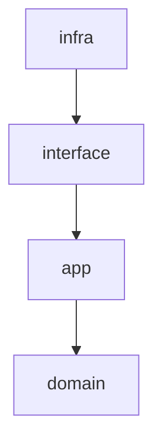

# アーキテクチャ

## 基本的な設計方針

基本的にはクリーンアーキテクチャ inspired な形にする。

基本的な依存関係は以下でおおまかなフォルダも同名になっている。

## infra

- DBやUI等のアプリケーション外部との接続の一番外側なコード
- ここにはビジネスロジックは一切いれずに純粋に外部のDB等とコミュケーションするために一般的に必要なものだけが入っている
- いわゆるプレゼンテーション層といわれるのもここにいれる

## interface

- presenter、controller、gatewayがあるが、要するにここではinfraの取り扱う一般的な形で解釈できるように変換する
- interfaceではentityを取り扱わずに言語の組み込み型だけ使う。これにより、entityへの依存がなくなり、interfaceを読むためにentityを読む必要がなくなる。
- 入力
    - infraを純粋な技術だけにして、appからinfraごとに必要な変換を取り除くといった上下の役割の凝集度をあげる効果がある
      - validation系もinfraから切り離してinterfaceに書いてしまったほうがよさそう
- 出力
    - infraは組み込みの言語の型で返せばよく、変な変換を入れることもしなくていい (変な変換とは1が返ってきたらtrueにするとか)
    - interfaceがappに返すときは、entityでラップするとかはしなくていいが、1が返ってきたらtrueにする等の抽象化は行う。

## app

- 各ユースケースを取り扱う。インプットはinterfaceから受け取って、domainを操作して、結果を出す。必要であればinterface経由でデータを取得してentityを作成して操作する (entityにすることでドメインルールが適用されるのでデータをそのまま使わない)。
- 依存関係の一方向性を持たせるために、domainサービスは存在せず、appでサービスを作る
    - ドメインサービスとは、ある一つのentityに依存しないルールを記載する時に使う。例えば、IDの一意性チェックだと個別のID entityの機能としてあると不自然なのでドメインサービスで実装する。
        - 一意性チェックであればinterfaceを使ってDBへのアクセスが必要

## domain

- ここではentityだけが存在する
