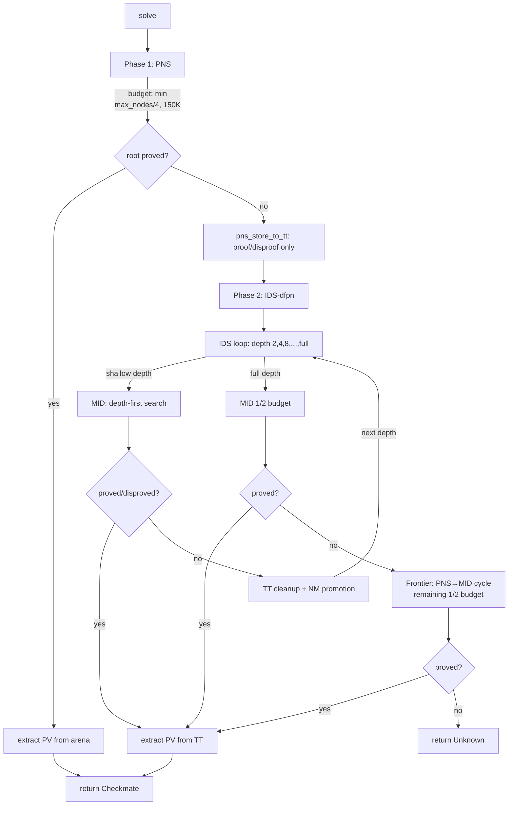
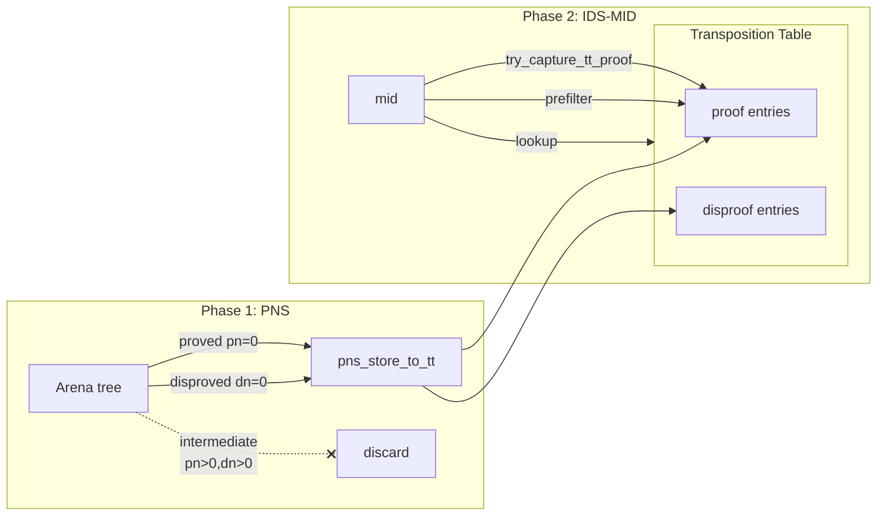
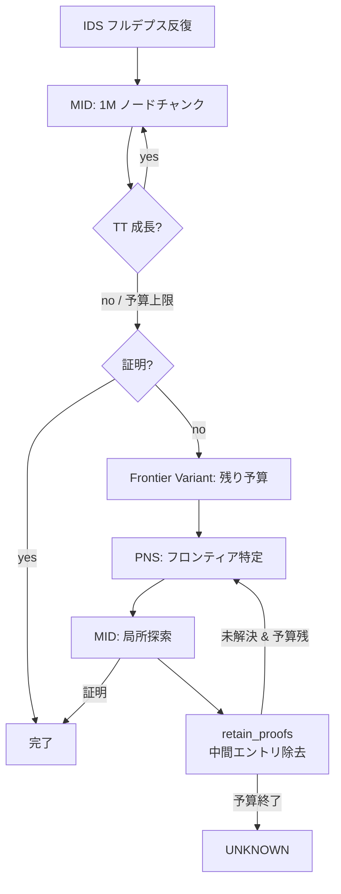
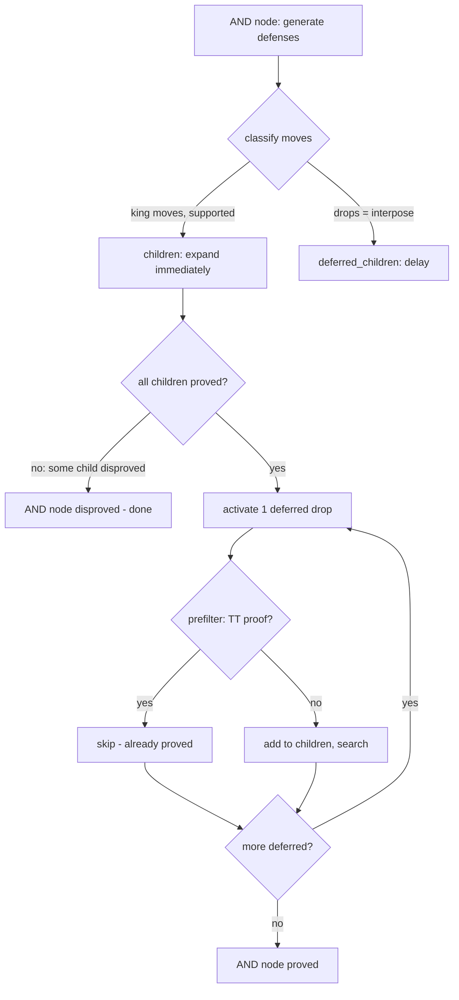
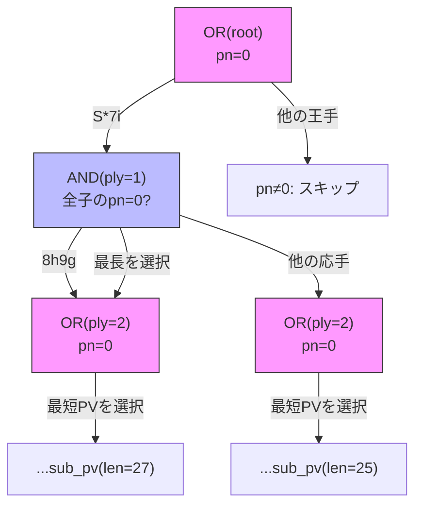

# 詰将棋ソルバー設計ドキュメント

## 目次

1. [概要](#1-概要)
2. [探索アーキテクチャ](#2-探索アーキテクチャ)
3. [閾値制御](#3-閾値制御)
4. [証明数・反証数の計算](#4-証明数反証数の計算)
5. [初期値ヒューリスティック](#5-初期値ヒューリスティック)
6. [転置表管理](#6-転置表管理)
7. [ループ・GHI 対策](#7-ループghi-対策)
8. [合駒最適化](#8-合駒最適化)
9. [手順改善](#9-手順改善)
9-b. [PV 復元](#9-b-pv-復元principal-variation-extraction)
10. [既知の課題とベンチマーク](#10-既知の課題とベンチマーク)
11. [最適化案の評価](#11-最適化案の評価)
12. [参考文献](#12-参考文献)

---

## 1. 概要

maou_shogi の詰将棋ソルバーは Df-Pn (Depth-First Proof-Number Search, Nagai 2002) を
基盤とし，Best-First PNS と IDS-dfpn(Frontier Variant 統合)の
2フェーズ探索を採用する．

### 設計目標

1. **cshogi が解けない問題をカバーする**: 片玉局面，合駒(中合い)の正確な探索，最短手順保証
2. **どんな詰将棋問題も解ける**: リソースパラメータ(`depth`, `nodes`, `timeout`)の増加で対応
3. **高度な枝刈りによる効率化**: cshogi が取り入れていない手法を積極的に導入

### 実装ファイル

`rust/maou_shogi/src/dfpn/` モジュールに全ての探索ロジックを実装(合計約 6,800 行，テスト除く)．

| ファイル | 行数 | 内容 |
|---------|------|------|
| `solver.rs` | ~2,950 | `DfPnSolver` 構造体，`mid()` 関数，child init，MID ループ |
| `pns.rs` | ~2,540 | 手生成，PNS メインループ，IDS-dfpn，Frontier Variant，PV 復元 |
| `tt.rs` | ~720 | フラットハッシュテーブル型転置表 |
| `mod.rs` | ~380 | 定数，ユーティリティ関数(SNDA, hand\_gte, DFPN-E 等) |
| `entry.rs` | ~80 | `DfPnEntry`, `PnsNode` データ構造 |
| `profile.rs` | ~190 | プロファイリングマクロ・統計 |

### 実装済み手法一覧

| # | 手法 | 出典 | 節 | 導入版 |
|---|------|------|-----|--------|
| 1 | Df-Pn | Nagai 2002 | §2.1 | v0.1.0 |
| 2 | Best-First PNS | Seo, Iida & Uiterwijk 2001 (PN*) | §2.2 | v0.18.0 |
| 3 | IDS-dfpn | Seo et al. 2001; Nagai 2002 | §2.3 | v0.16.0 |
| 4 | 1+ε トリック | Pawlewicz & Lew 2007 | §3.1 | v0.11.0 |
| 5 | TCA | Kishimoto & Müller 2008; Kishimoto 2010 | §3.2 | v0.14.0 |
| 6 | WPN | Ueda et al. 2008 | §4.1 | v0.17.0 |
| 7 | CD-WPN | maou 独自 | §4.2 | v0.20.0 |
| 8 | VPN | Saito et al. 2006 | §4.3 | v0.15.0 |
| 9 | SNDA | Kishimoto 2010 | §4.4 | v0.11.0 |
| 10 | df-pn+ ヒューリスティック初期化 | KomoringHeights v0.4.0; GPW 2004 | §5.1 | v0.12.0 |
| 11 | DFPN-E | Kishimoto et al., NeurIPS 2019 | §5.2 | v0.13.0 |
| 12 | Deep df-pn | Song Zhang et al. 2017 | §5.3 | v0.12.0 |
| 13 | インライン詰み検出 | — | §5.4 | v0.12.0 |
| 14 | 持ち駒優越 | Nagai 2002 | §6.1 | v0.1.0 |
| 15 | 前方チェーン補填 | maou 独自 | §6.2 | v0.20.0 |
| 16 | Pareto frontier 管理 | Breuker et al. 1994 | §6.3 | v0.12.0 |
| 17 | TT GC | — | §6.4 | v0.12.0 |
| 18 | TT Best Move | KomoringHeights v0.4.0 | §6.5 | v0.16.0 |
| 19 | 経路依存フラグ付き GHI 対策 | Kishimoto & Müller 2004/2005 | §7.1 | v0.15.0 |
| 20 | NM Remaining 伝播 | — | §7.2 | v0.16.0 |
| 21 | Futile/Chain 合駒分類 | — | §8.1 | v0.12.0 |
| 22 | チェーンドロップ3カテゴリ制限 | — | §8.2 | v0.12.0 |
| 23 | 合駒遅延展開 | KomoringHeights v0.5.0 | §8.3 | v0.12.0 |
| 24 | TT ベース合駒プレフィルタ | — | §8.4 | v0.16.0 |
| 25 | 同一マス証明転用 | — | §8.5 | v0.18.0 |
| 26 | 合駒 DN バイアス | — | §8.6 | v0.12.0 |
| 27 | チェーンマス内→外順序 | — | §8.7 | v0.20.0 |
| 28 | チェーン深さ DN スケーリング | — | §8.8 | v0.20.0 |
| 29 | TT Best Move 動的手順改善 | — | §9.1 | v0.16.0 |
| 30 | Killer Move | — | §9.2 | v0.18.3 |
| 31 | 捨て駒ブースト | — | §9.3 | v0.13.0 |
| 32 | Frontier Variant (PNS→局所MID) | maou 独自 | §11.7 | v0.20.33 |
| 33 | TT フラットハッシュテーブル | — | §6.6, §11.4 | v0.20.34 |
| 34 | チェーン AND pn\_floor boost | maou 独自 | §3.3 | v0.20.35 |
| 35 | PN\_UNIT 統一スケーリング | maou 独自 | §3.5 | v0.20.36 |
| 36 | path スタック化 (FxHashSet→配列) | — | §6.6.2 | v0.23.0 |
| 37 | ci\_resolve 再 lookup 廃止 (has\_proof) | — | §6.6.2 | v0.23.0 |
| 38 | 王手生成キャッシュ (CheckCache) | — | §6.6.2 | v0.23.0 |
| 39 | 玉移動合法性チェック高速化 | — | §6.6.2 | v0.23.0 |
| 40 | pn\_floor 乗算オーバーフロー修正 | — | §3.3 | v0.23.0 |
| 41 | Dual TT (ProvenTT + WorkingTT) | KomoringHeights 参考 | §6.6.3 | v0.24.0 |
| 42 | TT エントリ圧縮 (40→32 bytes) | — | §6.6.3 | v0.24.0 |
| 43 | IDS depth 切替時 confirmed disproof クリア | — | §6.6.3 | v0.24.0 |
| 44 | ply ベース ProvenTT amount | — | §6.6.3 | v0.24.0 |
| 45 | 祖先チェックによる ProvenTT 挿入スキップ | — | §6.6.3 | v0.24.0 |
| 46 | ProvenTT hand\_hash 混合インデクシング | — | §6.6.3 | v0.24.0 |
| 47 | 2段階検索 (look\_up\_proven / look\_up\_working) | — | §6.6.3 | v0.24.0 |
| 48 | 段階的 retain\_proofs (confirmed disproof 保持) | — | §6.6.3 | v0.24.0 |

---

## 2. 探索アーキテクチャ

### 2.1 Df-Pn (Nagai 2002)

**出典:** Nagai & Imai, "df-pn Algorithm Application to Tsume-Shogi" (IPSJ Journal 43(6), 2002);
Nagai, "Df-pn Algorithm for Searching AND/OR Trees" (Ph.D. Dissertation, UTokyo, 2002)

AND/OR 木を証明数(pn)・反証数(dn)に基づいて深さ優先で探索するアルゴリズム．
各ノードに pn/dn の閾値を設定し，閾値を超えた時点で親に復帰する．

- **OR ノード**(攻め方手番): `pn = min(child_pn)`, `dn = sum(child_dn)`
- **AND ノード**(守備方手番): `pn = sum(child_pn)`, `dn = min(child_dn)`

```
    OR node (attacker)              AND node (defender)
    pn=1, dn=5                      pn=5, dn=1
   /    |    \                     /    |    \
 AND   AND   AND                 OR    OR    OR
 pn=3  pn=1  pn=2              pn=2  pn=1  pn=2
 dn=2  dn=1  dn=2              dn=1  dn=3  dn=2
  |     ^                             ^
  |   select                        select
  |  (min pn)                      (min dn)

 pn = min(3,1,2) = 1            pn = sum(2,1,2) = 5
 dn = sum(2,1,2) = 5            dn = min(1,3,2) = 1
```

OR ノードでは pn が最小の子を選択して再帰(最も証明しやすい手を優先)．
AND ノードでは dn が最小の子を選択して再帰(最も反証しやすい応手を優先)．

**実装:** `mid()` 関数 (`solver.rs`)．
MID (Multiple Iterative Deepening) ループにより，選択→展開→バックアップを
閾値に達するまで繰り返す．

### 2.2 Best-First PNS (Phase 1)

**出典:** Seo, Iida & Uiterwijk, "The PN*-search algorithm" (AI 129, 2001);
Allis, "Searching for Solutions in Games and Artificial Intelligence" (1994)

明示的な探索木(アリーナ)上でグローバル最適なノード選択を行う best-first 探索．
Df-Pn の深さ優先制約を緩和し，thrashing(同一ノードの再展開)を回避する．

**実装:** `pns_main()` 関数 (`pns.rs`)．

- **アリーナ**: `Vec<PnsNode>` (`entry.rs`)，上限 `PNS_MAX_ARENA_NODES = 5,000,000`
- **ノード予算**: `PNS_BUDGET_CAP = 150,000` ノード (全体の 1/4，上限 150K)
- **停滞検出**: `PNS_STAGNATION_LIMIT = 500,000` イテレーション
- **合駒遅延展開**: AND ノードの合駒(drop)を `deferred_drops` に格納し，逐次活性化
- **TT 転写**: `pns_store_to_tt()` で証明済み(pn=0)・反証済み(dn=0)ノードのみを TT に保存．
  中間ノードは保存しない(Phase 2 の MID が中間値に束縛されるのを防止)

**出典との差異:**
- PN* は RBFS ベースの反復深化型だが，maou_shogi は明示的アリーナの best-first 方式
- PNS のバックアップは標準 OR/AND 公式だが，AND ノードに WPN (§4.1) を適用

### 2.3 IDS-dfpn (Phase 2)

**出典:** Seo et al. 2001 (PN*); Nagai 2002 (df-pn の反復深化)

探索深さ制限を段階的に増加させ，浅い証明を TT に蓄積しながら深い探索を実行する．
PNS で未解決の場合に自動的に Phase 2 として呼び出される．

**実装:** `mid_fallback()` 関数 (`pns.rs`)．

- **深さ進行**: 倍増ステップ

```
  depth=41 (long):  2 -> 4 -> 8 -> 16 -> 32 -> 41
                    |    |    |     |     |      |
                    +--->+--->+---->+---->+----->+
                    retain proofs between each step

  depth=31 (short): 2 -> 4 -> 31
                    |    |     |
                    +--->+---->+  (skip 8,16: jump to full depth)
```

  - `depth ≤ 31` の場合: 2 → 4 → depth (中間ステップを省略)
- **予算配分**: 各浅い反復に `remaining_budget / (remaining_steps + 1)` を割り当て，
  最終反復にノードを温存
- **反復間 TT 清掃**:
  - `remove_path_dependent_disproofs()`: 経路依存の反証を除去
  - `remove_stale_for_ids()`: 浅い深さの仮反証(remaining=0)を除去
- **NM 昇格**: 反復終了後に `depth_limit_all_checks_refutable()` で全王手が
  反駁可能と確認できれば，NM を `REMAINING_INFINITE` に昇格

**出典との差異:**
- 論文の IDS-dfpn は単純な深さ制限増加だが，maou_shogi では倍増ステップ +
  適応的予算配分 + 反復間 TT 清掃を組み合わせた独自方式
- MID 呼び出し時の閾値は `INF-1`(事実上無制限)で，深さ制限のみで探索範囲を制御

### 2.4 全体フロー



### 2.5 Phase 1 → Phase 2 の連携



#### PNS が TT に与える影響

Phase 1 の PNS 終了時に `pns_store_to_tt()` が呼ばれ，
アリーナ上の**証明済み(pn=0)・反証済み(dn=0)ノードのみ**を TT に転写する．
中間ノード(pn>0 かつ dn>0)は転写しない．

この設計には2つの意図がある:

1. **Phase 2 への情報伝達**: PNS が発見した浅い証明(例: 1手詰み，3手詰み)が
   TT に蓄積されるため，Phase 2 の IDS-MID が同じ局面に到達した際に
   TT ヒットで即座にスキップできる．特に OR ノードの子初期化時に
   `try_capture_tt_proof` (§8.4) が PNS 由来の証明を参照し，
   合駒の展開自体を回避できるケースが増える

2. **Phase 2 の自由度確保**: 中間ノードの pn/dn を転写すると，
   MID がそれらの値に束縛されて閾値配分が歪む．PNS の pn/dn は
   best-first 的な評価値であり，depth-first の MID とは閾値体系が異なるため，
   中間値の混在は MID の探索効率を低下させる

#### IDS 単体との差異

IDS のみのソルバー(Phase 1 なし)と比較した PNS → IDS の利点:

| 観点 | IDS 単体 | PNS → IDS |
|------|---------|-----------|
| 浅い詰みの発見 | 浅い IDS 反復で発見(再探索コストあり) | PNS が1回で発見(thrashing なし) |
| TT の初期状態 | 空 | PNS 由来の証明/反証が存在 |
| 合駒プレフィルタ | 浅い反復の蓄積を待つ必要あり | PNS 由来の証明で即座に機能 |
| グローバル最適性 | 各反復は depth-first(局所的) | PNS が大域的に最有望ノードを選択 |
| メモリ消費 | TT のみ | TT + アリーナ(最大 5M ノード) |

29手詰めテスト (`test_tsume_6_29te_no_pns`) では PNS なしの IDS のみでも
解けることが確認されているが，これは IDS-MID 自体のロバストネスを示すものであり，
PNS の寄与が不要であることを意味しない．
一般に PNS は浅い証明の高速発見と TT のウォームアップに寄与し，
特にチェーン合駒問題(§8)では PNS 由来の証明が
プレフィルタ(§8.4)のヒット率を大幅に向上させる．

### 2.6 IDS フルデプスステップ: MID + Frontier Variant

IDS の最終反復(フルデプス)では，MID 先行 + Frontier フォールバックの
2段構成を採用する．



#### 設計根拠

MID を先行させる理由: 閾値飢餓が発生しない部分木は MID が効率的に処理する
(NPS が Frontier の ~1.6 倍)．

v0.21.0 では動的予算配分(§10.2 方針B)を導入: MID の最大予算(全体の 1/2)を
1M ノード固定チャンクに分割し，各チャンク後に TT エントリ数の成長を確認する．
TT が成長しなくなった時点で閾値飢餓による停滞と判定し，
残り予算を Frontier に動的移行する．これにより MID が進捗可能な範囲を
効率的に処理した後，速やかに Frontier の閾値飢餓回避機構に切り替える．

#### MID → Frontier 遷移

MID と Frontier 間で **TT 清掃は行わない**．
MID が蓄積した証明・反証・中間エントリを Frontier がそのまま活用する．
これは Phase 1 → Phase 2 の連携(§2.5)とは異なる設計判断である:

- **Phase 1 → Phase 2**: `retain_proofs_only()`(証明のみ保持)．
  PNS の中間値は best-first 評価であり，depth-first の MID とは閾値体系が異なる
- **MID → Frontier**: 清掃なし．MID 直後の中間値は最新の探索状態を反映しており，
  Frontier 内の PNS/MID で再利用可能

#### Frontier サイクル内 TT 清掃

Frontier Variant の各 PNS→MID サイクル間では `retain_proofs()` を実行する．
MID が各サイクルで蓄積した中間エントリが次の PNS サイクルの
フロンティア選択を汚染するのを防止する．
証明(pn=0)と確定反証(dn=0, 非経路依存)は保持される．

---

## 3. 閾値制御

### 3.1 1+ε トリック (Pawlewicz & Lew 2007)

**出典:** Pawlewicz & Lew, "Improving Depth-First PN-Search: 1+ε Trick" (CG 2007)

標準 df-pn では子 c1 の pn 閾値を `min(parent_th, pn2 + 1)` で設定する
(`pn2` は2番目に小さい pn)．c1 の pn が pn2 を1超えた瞬間に
他の子に切り替わり，seesaw effect(スラッシング)が発生する．

```
  Standard df-pn threshold (seesaw effect):

  OR node (pn_th=100)
   |
   +-- c1: pn=10  <-- selected (min pn)
   +-- c2: pn=11  (pn2 = 11)
   |
   child_pn_th = min(100, 11+1) = 12
   --> c1 explores until pn reaches 12, then switches to c2
   --> c2 explores until pn reaches 13, then back to c1
   --> rapid switching = thrashing

  1+epsilon trick:

  OR node (pn_th=100)
   |
   +-- c1: pn=10  <-- selected
   +-- c2: pn=11  (pn2 = 11)
   |
   epsilon = 11/4 + 1 = 3
   child_pn_th = min(100, 11+3) = 14
   --> c1 gets 4 more units of exploration before switching
   --> deeper search per visit, less thrashing
```

1+ε トリックは `+1` を乗算型に変更:

```
pn_threshold(c1) = min(parent_th, ceil(pn2 * (1 + ε)))
```

pn が小さい時は小さな増分(細かい制御)，pn が大きい時は大きな増分(深い探索を許容)．

**実装:** solver.rs (child threshold computation)

```
// v0.22.0: 自然精度 epsilon (§3.5 方針A + v0.21.1 で /3 に増加)
epsilon = second_best / 3 + PN_UNIT
sibling_based = second_best + epsilon ≈ second_best * 4/3 + PN_UNIT
```

OR ノード: `child_pn_th = min(eff_pn_th, second_best + epsilon)`
AND ノード: `child_dn_th = min(eff_dn_th, second_best + epsilon)`

PN\_UNIT=16 では `second_best = 3S = 48` のとき `epsilon = 16 + 16 = 32`，
`sibling_based = 80`(5.0S)となり，PN\_UNIT=1 の 4S に対し ~25% の閾値余裕が
各 OR/AND レベルで得られる．12 レベルの累積で `1.25^12 ≈ 15 倍` の余裕．

**出典との差異:**
- 論文は `ceil(pn2 * (1 + ε))` (純粋な乗算)だが，maou\_shogi では
  `second_best + second_best / 4 + PN_UNIT` で乗算を近似
- `min` キャップは論文どおり適用し，全域で乗算型の性質を維持

### 3.2 TCA (Kishimoto & Müller 2008; Kishimoto 2010)

**出典:** Kishimoto & Müller, "About the Completeness of Depth-First Proof-Number Search" (2008);
Kishimoto, "Dealing with Infinite Loops, Underestimation, and Overestimation" (AAAI 2010)

巡回グラフ(DCG)上での pn/dn **過小評価**を修正するアルゴリズム．
ループ検出により子ノードが `(INF, 0)` を返すと，兄弟ノードの pn/dn が過小評価される．
TCA は OR ノードでループ子が存在する場合に閾値を拡張し，兄弟の深い探索を促す．

df-pn は有限 DCG 上で不完全だが，TCA を加えると完全になる．

**実装:** mod.rs (`TCA_EXTEND_DENOM`), solver.rs (MID ループ)

- **拡張量**: `threshold / TCA_EXTEND_DENOM + 1` (`TCA_EXTEND_DENOM = 4`，約25%の加算)
- **適用条件**: OR ノードでループ子(`path` 上の子)が存在する場合
- AND ノードではループ子が即時反証を引き起こすため拡張不要

**出典との差異:**
- 論文は乗算的拡張(2×)を提案するが，再帰で指数的に増大する問題がある
- maou_shogi では加算的拡張(約25%)を採用し，各レベルで独立に適用されるため膨張を抑制

### 3.3 閾値フロア

MID ループ内で閾値が過度に縮小するのを防ぐフロア値を設定する．

**実装:** solver.rs (child threshold computation)

- **PN フロア(通常)**: `pn_floor = (eff_pn_th as u64 * 2 / 3) as u32`
  (v0.21.1 で 1/2→2/3 に引き上げ，v0.23.0 で u64 昇格によりオーバーフロー修正)
- **PN フロア(チェーン AND)**: `pn_floor = max(DN_FLOOR, (eff_pn_th as u64 * 2 / 3) as u32)`
- **DN フロア(OR)**: `dn_floor_or = DN_FLOOR`
- **DN フロア(通常)**: `dn_floor = DN_FLOOR`

`DN_FLOOR = 100 * PN_UNIT`（§3.5 参照）．

チェーン合駒構造では閾値が深いネストで指数的に枯渇するため，
フロアにより最低限の探索予算を保証する．

チェーン AND ノードでは DN_FLOOR(=100) を PN フロアにも適用し，
OR 親の sibling_based(2〜5)に制約されず子 OR に十分な pn 予算を
伝播する(dn のチェーン用キャップ外しと同じ発想)．
backward 解析で ply 24 サブ問題が 1M→397K ノードに改善(§10.2)．

### 3.4 停滞検出

MID ループ内で pn/dn が改善しない場合に早期終了する．

**実装:** solver.rs (`ZERO_PROGRESS_LIMIT`, `STAGNATION_LIMIT`)

- `ZERO_PROGRESS_LIMIT = 16`: 子 `mid()` が消費するノード数が 0 の回数が連続16回で進展なしと判定
- `STAGNATION_LIMIT = 4`: best child の pn/dn と閾値が連続4回不変で MID ループを終了

### 3.5 PN\_UNIT 統一スケーリング

pn/dn の 1 単位を定数 `PN_UNIT`(mod.rs)で表現し，全てのスケーリング対象を
明示する仕組み．PN\_UNIT=16(v0.21.0)で閾値飢餓を緩和し，
1+ε 閾値の余裕を確保する（KomoringHeights の初期 pn=10-80 に相当）．
PN\_UNIT=1 で従来動作と等価であり，スケーリング漏れの検証に使用する．

**設計原理:**

全ての pn/dn を完全にスケーリングすればソルバーの挙動は一致する．
逆に言えば，PN\_UNIT を変更して挙動が変わるならスケーリング漏れがある．
この原理を用いて PN\_UNIT=1 と PN\_UNIT=64 の結果を比較し，
漏れを機械的に特定・修正した．

**スケーリング対象:**

| 区分 | 具体例 |
|------|--------|
| 初期値 | TT ミスの pn=1/dn=1，heuristic\_or\_pn/heuristic\_and\_pn 返り値 |
| 加算定数 | edge\_cost\_or/and，sacrifice\_check\_boost，epsilon の +1，progress\_floor の +1，TCA の +1 |
| フロア・バイアス | DN\_FLOOR，INTERPOSE\_DN\_BIAS，`.max(N)` のリテラル |
| WPN の加算分 | `(unproven_count - 1) * PN_UNIT`（盤面カウントを pn 単位に変換） |
| TT ミス判定 | `cpn == PN_UNIT && cdn == PN_UNIT`（heuristic 初期化の条件） |

**スケーリング不要:**

| 区分 | 理由 |
|------|------|
| 終端値 (INF, 0) | 証明/反証のセンチネル |
| 盤面状態の比較 (safe\_escapes >= 4 等) | 手数・マス数であり pn/dn 値ではない |
| ループカウンタ (ZERO\_PROGRESS\_LIMIT 等) | イテレーション回数 |

**除算の丸め等価性:**

除算を含む計算は「PN\_UNIT=1 相当に戻してから除算し再スケール」する
(divide-at-unit-scale パターン):

```
// 等価パターン: PN_UNIT=1 と同じ丸めを再現(スケーリング漏れ検証用)
let epsilon = second_best / PN_UNIT / 4 * PN_UNIT + PN_UNIT;
```

例: `second_best = 3 * PN_UNIT` のとき
- PN\_UNIT=1: `3 / 4 + 1 = 0 + 1 = 1`
- PN\_UNIT=64 (等価): `192 / 64 / 4 * 64 + 64 = 0 + 64 = 64` (= 1 × 64) ✓

適用箇所: epsilon (`/4`)，pn\_floor (`/2`)，TCA (`/TCA_EXTEND_DENOM`)，
Deep df-pn (`/DEEP_DFPN_R`)．

**自然精度パターン:**

divide-at-unit-scale はスケーリング漏れの検証には不可欠だが，
PN\_UNIT > 1 の本来の利点である**除算の解像度向上**を殺してしまう．
閾値飢餓の改善には，除算の自然精度をそのまま活かすパターンが有効:

```
// 自然精度パターン (v0.22.0): PN_UNIT > 1 で epsilon が増大する
// v0.21.1 で除数を /4 → /3 に変更し閾値余裕をさらに拡大
let epsilon = second_best / 3 + PN_UNIT;
```

例: `second_best = 3 * PN_UNIT` のとき

| | PN\_UNIT=1 | PN\_UNIT=16 (等価) | PN\_UNIT=16 (自然精度 /3) |
|--|----------|------------------|---------------------|
| second\_best | 3 | 48 | 48 |
| epsilon | 1 | 16 | 16 + 16 = 32 |
| sibling\_based | 4 | 64 | 80 |
| PN\_UNIT 単位 | 4.0 | 4.0 | **5.0** |

自然精度では PN\_UNIT=1 の整数切り捨て `3/4 = 0` が
`48/4 = 12` として正確に計算され，epsilon が 75% 増加する．
これにより子 AND に渡る pn 閾値が増大し，閾値飢餓が緩和される．

heuristic\_or\_pn が S〜3S の範囲で中間値(例: 1.5S)を返す場合，
second\_best の分布がさらに広がり，自然精度の恩恵が増す．

**使い分け:**

- **等価パターン**: スケーリング漏れの検証，回帰テスト
- **自然精度パターン**: 閾値飢餓の改善（本番運用）

**pn/dn 値の全体マップ (PN\_UNIT = S):**

全ての pn/dn 初期値・バイアス・フロアの相対関係を示す．
S = PN\_UNIT（v0.21.0: 16）．

*初期値(子ノード展開時に TT に格納される値):*

| 値 | S 倍率 | 適用対象 | 条件 | 節 |
|---|-------|---------|------|---|
| S | 1 | OR 子 pn | 標準局面，逃げ場 0〜1 | §5.1 |
| S + S/4 | 1.25 | OR 子 pn | 逃げ場=2 | §5.1 |
| S + S/4 〜 S + S/2 | 1.25〜1.5 | OR 子 pn | 逃げ場 4〜5 | §5.1 |
| 2S + S/4 〜 3S | 2.25〜3 | OR 子 pn | 王手少＋逃げ場多，開放空間 | §5.1 |
| n×S + S/4 〜 n×S + e×S/2 | 〜n+e/2 | AND 子 pn | 応手数 n，逃げ場 e(0.67n〜n+e/2 に調整) | §5.1 |
| S | 1 | AND/OR 子 dn | 全子共通 | — |

*加算コスト(初期値に上乗せ):*

| 値 | S 倍率 | 適用対象 | 条件 | 節 |
|---|-------|---------|------|---|
| 0 | 0 | pn 加算 | 成・取王手(edge\_cost\_or) / 合駒(edge\_cost\_and) | §5.2 |
| S | 1 | pn 加算 | 近い静か王手(距離≤2) / 玉逃げ | §5.2 |
| 2S | 2 | pn 加算 | 遠い静か王手(距離≥3) / 駒取り応手 / 全捨て駒 | §5.2, §9.3 |

*閾値制御パラメータ:*

| 値 | S 倍率 | 用途 | 節 |
|---|-------|------|---|
| ε ≈ second\_best/3 + S | ~1.33倍 | OR/AND の 1+ε 手切替 | §3.1 |
| pn\_floor = eff\_pn\_th\*2/3 | 親の67% | AND 子 pn 閾値の最低保証 | §3.3 |
| pn\_floor(チェーン AND) = 100S | 100 | チェーン AND 子 pn 閾値の最低保証 | §3.3 |
| DN\_FLOOR = 100S | 100 | AND 子 dn / OR 子 dn の最低保証 | §3.3 |
| progress\_floor = best\_pn + S | +1 | 子 pn 閾値のゼロ進捗防止 | §3.3 |
| TCA 拡張 ≈ threshold/4 + S | +25% | ループ検出時の閾値拡張 | §3.2 |

*dn バイアス(AND ノードの応手選択順序):*

| 値 | S 倍率 | 適用対象 | 節 |
|---|-------|---------|---|
| 0 | 0 | チェーン AND: 内側ドロップ(距離1) | §8.7 |
| (d−1)×S | 1〜5+ | チェーン AND: 外側ドロップ(距離 d) | §8.8 |
| 8S | 8 | 非チェーン AND: ドロップ(合駒後回し) | §8.6 |
| 8S | 8 | チェーン AND: 非ドロップ(玉逃げ後回し) | §8.6 |

*WPN/CD-WPN の加算分(AND の current\_pn 計算):*

| 値 | S 倍率 | 用途 | 節 |
|---|-------|------|---|
| (n−1)×S | n−1 | WPN: 未証明子 n 個の加算分 | §4.1 |
| (g−1)×S | g−1 | CD-WPN: グループ数 g の加算分 | §4.2 |

*Deep df-pn バイアス(TT ミス時の深い ply):*

| 値 | S 倍率 | 条件 | 節 |
|---|-------|------|---|
| S | 1 | ply ≤ depth/2 | §5.3 |
| S + ⌊(ply − depth/2)/4⌋×S | 1〜数倍 | ply > depth/2 | §5.3 |

**相対関係の読み方:**

OR 子 pn(1S〜3S)と AND 子 dn(1S)の比が探索の OR/AND バランスを決める．
DN\_FLOOR(100S)は OR 子 pn の 33〜100 倍であり，
dn 閾値が枯渇しにくいことを保証する一方，pn 側にはこの水準のフロアがない
（チェーン AND を除く）．これが閾値飢餓の構造的要因である(§10.2)．

INTERPOSE\_DN\_BIAS(8S)は OR 子 pn(1〜3S)の 3〜8 倍であり，
合駒を玉逃げ・駒取りの後に探索させる効果が十分に働いている．

PN\_UNIT を拡大すると，上記の全ての値が比例してスケールされる．
改善の余地は「S 倍率が整数に丸められている箇所」にあり，
PN\_UNIT > 1 で中間値(1.5S 等)を設定することで
heuristic の解像度を上げられる(§10.2 方針 A)．

**検証結果:**

PN\_UNIT=1 と PN\_UNIT=64 で 126 テスト全通過（pass/fail 完全一致）．
backward 解析では ply 24 まで完全一致(396,636 ノード，343,999 TT エントリ)．
ply 22 以降の微差(TT 7 エントリ = 0.005%)は予算上限到達後の
TT クラスタ衝突パターンのみ．

**スケーリング漏れの特定に至った経緯:**

| 発見した漏れ | 症状 | 特定方法 |
|------------|------|---------|
| WPN `(unproven_count - 1)` に PN\_UNIT 未適用 | PN\_UNIT=64 で 2 テスト FAIL | テスト結果の比較 |
| TT ミス判定 `cpn == 1` | 同上 | 同上 |
| depth 制限超過時の初期 pn=1u32 | ply 24 以降で探索パターン乖離 | backward 解析の diff |
| 除算の丸め精度差 | P\*4g で 1.5%のノード数差 | 4M クラスタ TT での比較 |

---

## 4. 証明数・反証数の計算

### 4.1 WPN: Weak Proof Number (Ueda et al. 2008)

**出典:** Ueda, Hashimoto, Hashimoto & Iida, "Weak Proof-Number Search" (CG 2008)

証明数の**二重計数問題**(double-counting problem)に対処する手法．
DAG 構造の探索木において，共有ノードが複数の親から重複してカウントされ
証明数が過大評価される問題を，分岐係数を組み込んだ推定量で解決する．

```
  Standard AND node             WPN AND node
  pn = sum(child_pn)            pn = max(child_pn) + (count - 1)

      AND                           AND
     / | \                         / | \
   OR  OR  OR                    OR  OR  OR
  pn=3 pn=5 pn=2               pn=3 pn=5 pn=2

  pn = 3+5+2 = 10              pn = max(3,5,2) + (3-1) = 7
```

標準: `pn(AND) = sum(child_pn)`
WPN: `pn(AND) = max(child_pn) + (unproven_count - 1)`

**実装:** solver.rs (AND ノード collect)

AND ノードの pn 合計を `max(cpn) + (unproven_count - 1)` で計算．
VPN (§4.3) による証明済み子の除外，SNDA (§4.4) による DAG 合流補正と併用．

**出典との差異:**
- 論文は OR/AND 両ノードに WPN を適用するが，maou_shogi では AND ノードのみに適用
- SNDA との併用時に過剰補正が発生する問題を v0.20.24 で修正:
  SNDA 控除後の pn が `max(child_pn)` を下回らないようフロアを設定

### 4.2 CD-WPN: Chain-Drop Weak Proof Number

**出典:** maou 独自手法

チェーン合駒(§8)に特化した WPN の変種．
チェーン合駒では同一マスへの異なる駒種の drop が子ノードとなるが，
これらは同一マスへの合駒として意味的にグループ化できる．

CD-WPN はドロップを `to_sq` でグループ化し，グループ数を `unproven_count` とする:

```
grouped_count = チェーン合駒の到達マス数(駒種ではなくマス数)
pn(AND) = max(child_pn) + (grouped_count - 1)
```

**実装:** solver.rs (AND ノード collect)

- `chain_king_sq` が `Some` の場合(チェーン AND ノード)に CD-WPN を適用
- `chain_king_sq` が `None` の場合は標準 WPN を使用

### 4.3 VPN: Virtual Proof Number (Saito et al. 2006)

**出典:** Saito et al. 2006

AND ノードの pn 計算で証明済み子(cpn=0)を除外する．
証明済み子は pn=0 で sum に影響しないが，子選択ループからのスキップにより
SNDA ペア収集と子選択の効率化に寄与する．

**実装:** solver.rs (AND ノード collect)

AND ノードの子収集ループで `cpn == 0` の子を `continue` で除外．

### 4.4 SNDA: Source Node Detection Algorithm (Kishimoto 2010)

**出典:** Kishimoto, "Dealing with Infinite Loops, Underestimation, and Overestimation" (AAAI 2010)

DAG(転置)による pn/dn の**過大評価**を検出・修正する．
同一のリーフノードが複数の子を通じて重複カウントされる場合，
source ハッシュに基づくグループ化で重複分を控除する．

```
  Without SNDA (overcounting):     With SNDA (corrected):

      OR (dn = 3+5 = 8)               OR (dn = max(3,5) = 5)
     / \                              / \
   AND  AND                         AND  AND
   dn=3 dn=5                       dn=3 dn=5
     \  /                            \  /
      \/                              \/
     LEAF  <-- same source           LEAF  <-- grouped by source
     dn=?                           deduction = (3+5) - max(3,5) = 3
                                    corrected dn = 8 - 3 = 5
```

**実装:** mod.rs (`snda_dedup`), solver.rs (OR/AND collect)

TT エントリに `source: u64` フィールドを追加．
`(source, value)` ペアをソートし，同一 source グループで:

```
deduction = sum(group) - max(group)
```

控除後: `pn' = raw_sum - total_deduction` (最低値 1)

- OR ノード: `(source, dn)` ペアで dn を補正
- AND ノード: `(source, pn)` ペアで pn を補正

**出典との差異:**
- 論文は親ポインタ追跡による共通祖先検出を提案するが，
  maou_shogi では source ハッシュ(リーフ位置キー)によるグループ化で近似
- 積極的 max 集約方式を採用: グループ内で最大値のみを残す
  (保守的方式 v0.11.0 → 積極的方式 v0.15.0 に移行)
- AND ノードでの SNDA + WPN 併用時の過剰補正を v0.20.24 で修正:
  SNDA 控除後の pn が `max(child_pn)` を下回らないようにクランプ

---

## 5. 初期値ヒューリスティック

### 5.1 df-pn+ ヒューリスティック初期化 (GPW 2004; KomoringHeights v0.4.0)

**出典:** Kaneko lab (UTokyo), "Initial pn/dn after expansion in df-pn for tsume-shogi" (GPW 2004);
KomoringHeights v0.4.0

標準 df-pn は全リーフを `(pn=1, dn=1)` で初期化するが，
df-pn+ では局面の特徴に基づいて初期 pn/dn を設定する．
玉の逃げ場が少ない局面ほど pn を小さく(詰みやすい)，
王手手段が多い局面ほど dn を大きく(反証しにくい)する．

**実装:**

#### `heuristic_or_pn` (solver.rs)

OR 子(攻め方局面)の初期 pn．王手数と玉の安全な逃げ場で調整:

| 条件 | 初期 pn (S = PN\_UNIT) | v0.20.x 互換 |
|------|----------------------|-------------|
| 逃げ場なし | S | S |
| 逃げ場=1 | S | S |
| 逃げ場=2 | S + S/4 | S |
| 王手≤2 かつ 逃げ場=3 | 2S + S/4 | 2S |
| 王手≤2 かつ 逃げ場=4 | 2S + S/2 | 3S |
| 王手≤2 かつ 逃げ場≥5 | 3S (キャップ) | 3S |
| 逃げ場=4 | S + S/4 | S + S/3 |
| 逃げ場=5 | S + S/2 | S + S/3 |
| 逃げ場≥4，隣接≥5，圧迫0 | 3S (開放空間) | 3S |

v0.21.1 で S-8S の二次元スケーリングに拡張(§10.2 方針A):
safe\_escapes(S〜4S)と num\_checks(×1.0〜×2.0)の組み合わせで S〜8S の範囲．
KomoringHeights の pn=10-80 に相当する範囲(PN\_UNIT=16 で 16-128)．
開放空間検出(隣接≥5，圧迫0，逃げ場≥4)は 8S に引き上げ．

#### `heuristic_and_pn` (solver.rs)

AND 子(守備方局面)の初期 pn．応手数と玉の安全な逃げ場で調整:

| 条件 | 初期 pn (S = PN\_UNIT) | v0.20.x 互換 |
|------|----------------------|-------------|
| 逃げ場なし | `n * 2/3 * S` | `n * 2/3 * S` |
| 逃げ場=1 | `n * S + S/4` | `n * S` |
| 逃げ場=2 | `n * S + S/2` | `n * S` |
| 逃げ場=3 | `n * S + 3S/2` | `(n+1) * S` |
| 逃げ場≥4 | `n * S + e*S/2 + S/4` | `(n + e/2) * S` |

n = num\_defenses, e = safe\_escapes．v0.21.0 で逃げ場 1〜2 にも
中間値を返すことで閾値配分の精度を向上させた．

### 5.2 DFPN-E エッジコスト型 (NeurIPS 2019)

**出典:** "Depth-First Proof-Number Search with Heuristic Edge Cost" (NeurIPS 2019)

リーフ(ノード)ではなくエッジ(親→子遷移の手)にヒューリスティックコストを付与する．
展開済みノードではエッジコストがゼロになるため，実質的には初期 pn への加算として機能する．

**実装:** mod.rs

#### `edge_cost_or` (OR ノードの王手): mod.rs

| 手の種類 | コスト |
|---------|--------|
| 成王手 / 取王手 | 0 (最有力) |
| 近い静か王手 (距離≤2) | 1 |
| 遠い静か王手 (距離≥3) | 2 |

#### `edge_cost_and` (AND ノードの応手): mod.rs

| 応手の種類 | コスト |
|-----------|--------|
| 合駒 (drop) | 0 (攻め方が取り進んで有利) |
| 玉の逃げ / 駒移動 | 1 |
| 駒取り | 2 (攻め駒除去で攻め方不利) |

**出典との差異:**
- 論文のコスト関数はドメイン非依存の汎用設計だが，
  maou_shogi では将棋の詰みに特化したドメイン知識(成/取/距離/合駒)を組み込み

### 5.3 Deep df-pn (Song Zhang et al. 2017)

**出典:** Song Zhang et al., "Deep df-pn and Its Efficient Implementations" (CG 2017)

深い位置ほど初期 dn を高く設定し，浅い解を優先する．
論文推奨値: `dn_init = max(1, ceil(R * depth))` (R=0.4, Othello/Hex)．

**実装:** mod.rs (`DEEP_DFPN_R`), solver.rs (`look_up_pn_dn`)

TT ミス時(pn=1, dn=1, source=0)に深さバイアスを適用:

```
if ply > depth / 2:
    biased_pn = 1 + (ply - depth/2) / DEEP_DFPN_R    (DEEP_DFPN_R = 4)
```

浅い ply (depth の前半) は標準 df-pn と同じ pn=1 を維持．

**出典との差異:**
- 論文は dn にバイアスを適用するが，maou_shogi では **pn にバイアス**を適用
- 論文の R=0.4 (小さいほど積極的) に対し，maou_shogi では `R=4` (整数除算)
- 深い ply の未探索子の pn を上げることで，探索済みの浅い子を優先する効果
- バイアス適用は depth の後半のみ(前半は標準 pn=1 で不詰検出を維持)

### 5.4 インライン詰み検出

child_init フェーズ(子ノードの TT 初回参照時)で，
MID の再帰呼び出しなしに1手・3手の詰み/不詰を即座に判定する．

**実装:** solver.rs (child init)

#### AND 子ノード(OR 局面)の検出: solver.rs (child init, `or_node` ブランチ)

1. `generate_defense_moves(board)` で全応手を生成
2. 応手なし → 即詰み確定(pn=0, dn=INF)
3. `ply + 2 < depth` なら3手詰め判定:
   - 各応手を実行し `has_mate_in_1_with(board, checks)` で全応手に1手詰みがあるか確認
   - 全応手に対して1手詰みが存在 → 即詰み(pn=0)

#### OR 子ノード(AND 局面)の検出: solver.rs (child init, `!or_node` ブランチ)

1. `generate_check_moves(board)` で全王手を生成
2. 王手なし → 即不詰(pn=INF, dn=0)
3. `ply + 2 < depth` なら:
   - `has_mate_in_1_with(board, checks)` で1手詰み判定
   - `try_capture_tt_proof(board, checks, remaining)` で TT 参照の即証明

#### `has_mate_in_1_with` ヘルパー: solver.rs

`board.mate_move_in_1ply(checks, us)` で1手詰みを検出．
詰み発見時は詰み局面を TT に記録し，将来の探索で再利用可能にする．

**設計判断:** 5手以上のインライン検出は MID の枝刈り(閾値制御・TT 参照)なしの
網羅探索となり，MID 自体より非効率になるため実装しない．
過去に実装した budget 付き N 手詰め検出(static_mate)は TT 汚染と
探索効率の悪化を招いたため v0.20.24 で削除した．

---

## 6. 転置表管理

### 6.1 持ち駒優越 (Nagai 2002)

**出典:** Nagai 2002

盤面が同一で持ち駒が異なる局面間の包含関係を利用した TT 再利用:

```
  Proof reuse (pn=0):              Disproof reuse (dn=0):

  TT: hand={P,G} -> pn=0          TT: hand={P,P,G} -> dn=0

  query: hand={P,P,G}             query: hand={P}
  {P,P,G} >= {P,G} ? YES          {P} <= {P,P,G} ? YES
  -> reuse proof                   -> reuse disproof
  (more pieces = easier to mate)  (fewer pieces = harder to mate)
```

- **証明(pn=0)**: 攻め方の持ち駒が TT エントリ以上 → 再利用可(持ち駒が多いほど詰ませやすい)
- **反証(dn=0)**: 攻め方の持ち駒が TT エントリ以下 → 再利用可(持ち駒が少ないほど詰ませにくい)

**実装:** mod.rs (`hand_gte`), tt.rs (`look_up`)

- TT キー: `position_key(board)` = 盤面ハッシュ(持ち駒を**含まない**)
- TT 値: 同一クラスタ内に同一 `pos_key` の複数エントリを保持(§6.6)
- Lookup 時: クラスタ内で証明エントリを先に走査(証明優先)，その後反証エントリを走査

### 6.2 前方チェーン補填 (maou 独自)

**出典:** maou 独自手法

持ち駒優越の拡張として，歩 ≤ 香 ≤ 飛のカスケード補填を実装する．
チェーン合駒の文脈で，攻め方が合駒を取った後の持ち駒構成が異なっても，
前方利き系の駒種間で代替関係を認める．

**実装:** mod.rs (`hand_gte_forward_chain`)

代替関係:
- 歩の不足 → 香で代替可能
- 香の不足 → 飛で代替可能
- 歩の不足 → 飛で代替可能(カスケード)

桂・銀・金・角は独立判定(利きの方向が異なるため代替不可)．

### 6.3 Pareto Frontier 管理

**出典:** Breuker, Uiterwijk & van den Herik, "Replacement Schemes for Transposition Tables" (1994)

同一盤面に対する複数の TT エントリを Pareto frontier で管理する．
持ち駒とエントリの支配関係に基づき，冗長なエントリを排除する．

**実装:** tt.rs (`store_impl`)

- **最大エントリ数**: `CLUSTER_SIZE = 6`(v0.20.34〜，旧 `MAX_TT_ENTRIES_PER_POSITION = 16`)
- **証明エントリ(pn=0)**: 最小持ち駒のエントリを保持(少ない持ち駒で証明できるほど汎用的)
- **反証エントリ(dn=0)**: 最大持ち駒のエントリを保持(多い持ち駒で反証できるほど汎用的)
- **支配判定**: `hand_gte_forward_chain` (§6.2) による拡張支配関係を使用
- **容量超過時**: 異なる `pos_key` のエントリを優先的に置換．
  証明/確定反証を保護しつつ，`|pn - dn|` が最小の中間エントリを犠牲にする

#### 反証挿入時の中間エントリ除去

フラットテーブルでは反証(dn=0)エントリ挿入時に，
同一 `pos_key` の中間エントリ(pn>0, dn>0)を積極的に除去してスロットを確保する．
旧 HashMap 版では Vec に追加するだけで中間エントリは保護されていた
(`remaining` の不一致で将来必要になりうるため)．

フラットテーブルではクラスタの 6 スロットが厳密な上限であるため，
反証の挿入を保証するには中間エントリの除去が不可避である．
中間エントリは探索の再訪時に再計算可能であり，
反証(確定結果)の保持を優先する設計判断である．

#### 置換スコア `|pn - dn|` の設計根拠

中間エントリの置換優先度にはスコア `|pn - dn|` を使用する．
この値が小さいエントリ(pn ≈ dn)は証明にも反証にも近くない「均衡状態」であり，
探索方向が未確定のため情報価値が相対的に低い．
一方，`|pn - dn|` が大きいエントリは証明(pn << dn)または反証(pn >> dn)に
偏っており，探索の進行方向を示す有用な情報を持つ．

**既知の限界:**

`pn = dn = 100,000`（深く探索済みの均衡局面）と `pn = dn = 1`（新規エントリ）は
同一スコア 0 となり，深い探索結果が新規エントリと同等に退避される．
探索量ベースのスコア(例: `pn + dn`)を組み合わせることで改善できる可能性があるが，
以下の理由で現時点では採用しない:

1. 1M クラスタでの TT 利用率は ~18%(10M ノード探索)であり，
   置換の影響は限定的
2. `pn + dn` スコアでは `pn=1, dn=1` の新規エントリが最優先で退避され，
   IDS の浅い反復で蓄積した初期値が過保護になるリスクがある
3. 置換ポリシーの変更は探索パターン全体に波及し，退行テストが必要

### 6.4 TT ガベージコレクション

**実装:** tt.rs (`gc`, `gc_shallow_entries`), solver.rs (periodic GC)

- **周期的 GC**: 100K ノードごとにサイズチェック，閾値超過時に容量75%まで回収
- **IDS 間清掃**:
  - `retain_proofs()`: 証明エントリのみを保持
  - `gc_shallow_entries()`: 浅い remaining のエントリを除去
  - `remove_stale_for_ids()`: remaining=0 の反証を除去

### 6.5 TT Best Move 保存 (KomoringHeights v0.4.0)

**出典:** KomoringHeights v0.4.0

TT エントリに最善手(`best_move: u16`)を保存し，動的手順改善(§9.1)に使用する．

**実装:** entry.rs (`DfPnEntry`), tt.rs (`store_with_best_move`, `look_up_best_move`)

- `store_with_best_move`: MID ループの中間結果保存時に最善子の Move16 を記録
- `look_up_best_move`: TT ヒット時に最善手を取得し，手順の先頭にスワップ

### 6.6 TT データ構造

**実装:** `entry.rs` (`DfPnEntry`), `tt.rs` (`TranspositionTable`)

```rust
#[repr(C)]
struct DfPnEntry {
    source: u64,               // SNDA ソースハッシュ (§4.4)
    pn: u32,                   // 証明数
    dn: u32,                   // 反証数
    hand: [u8; HAND_KINDS],   // 攻め方の持ち駒 (7 bytes)
    path_dependent: bool,      // GHI フラグ (§7.1)
    remaining: u16,            // 深さ制約 (0..depth or REMAINING_INFINITE)
    best_move: u16,            // 最善手 (Move16 エンコーディング)
    amount: u16,               // 探索投資量 (GC/置換の保護優先度)
}  // 32 bytes (#[repr(C)] + field order optimization)
```

**TT 全体構造:** フラットハッシュテーブル (v0.20.34 〜)

v0.20.34 で `FxHashMap<u64, Vec<DfPnEntry>>` から固定サイズのフラット配列に置換(§11.4)．
`CLUSTER_SIZE = 6` エントリ/クラスタ，デフォルト 2M クラスタ(≈ 480 MB)．
`pos_key & (num_clusters - 1)` によるダイレクトインデクシングで O(1) アクセス．

```
TTFlatEntry = { pos_key: u64, entry: DfPnEntry }  // 40 bytes
Cluster     = [TTFlatEntry; 6]                     // 240 bytes
Table       = Vec<Cluster>                         // 2M clusters ≈ 480 MB
```

**置換ポリシー:** クラスタ満杯時は異なる `pos_key` のエントリを優先的に置換し，
同一 `pos_key` の証明(pn=0)・確定反証(dn=0, REMAINING\_INFINITE)は保護する．
パレートフロンティア管理(§6.3)，前方チェーン比較(§6.2)，
経路依存フラグ(§7.1)のセマンティクスは完全に維持．

反証エントリの挿入時，クラスタが foreign protected エントリ(別 pos\_key の
proof/confirmed disproof)で埋まっている場合，`replace_weakest_for_disproof`
により foreign depth-limited disproof → foreign confirmed disproof → foreign proof
の優先順で1スロットを犠牲にして挿入する(v0.21.1)．

#### クラスタ衝突と暗黙的置換

フラットハッシュテーブルでは TT GC(§6.4)とは独立に，
**ハッシュ衝突による暗黙的置換**が発生する．

異なる `pos_key` が `pos_key % num_clusters` で同一クラスタにマッピングされると，
6 スロットを複数の局面が共有する．スロットが満杯になると `replace_weakest` が
異なる `pos_key` の中間エントリを上書きする．
これは TT GC のように明示的に発動するのではなく，
`store_impl` の通常動作として常に発生する．

#### クラスタサイズの決定根拠 (v0.21.1)

**CLUSTER\_SIZE = 6 の理由:**

将棋の持ち駒は 7 種(歩・香・桂・銀・金・角・飛)であり，
同一盤面に異なる持ち駒で到達する**転置**(transposition)が頻繁に発生する．
TT は pos\_key(盤面ハッシュ)でクラスタを索引し，hand(持ち駒)で
エントリを区別する．同一 pos\_key に必要な hand バリアント数は:

| 状況 | 必要バリアント数 | 根拠 |
|------|---------------|------|
| 典型的な中盤 | 2-3 | proof + intermediate(1-2 hand) |
| 合駒チェーン | 4-6 | 駒種ごとの合駒で異なる hand |
| depth boundary 付近 | 3-5 | depth-limited NM × 複数 hand |

CLUSTER\_SIZE=4 と CLUSTER\_SIZE=6 の比較(4M クラスタ):

| CLUSTER\_SIZE | TT max (29手詰め) | 結果 |
|--------------|------------------|------|
| 4 | 8.3M | NOT PROVED (120M nodes) |
| **6** | **12.5M** | **SOLVED (109M nodes)** |

CLUSTER\_SIZE=4 では hand バリアントがクラスタに収まらず TT が飽和する．
CLUSTER\_SIZE=6 は hand バリアント(典型3-5) + foreign 衝突分(1-2)で必要十分．

#### クラスタ数の決定根拠 (v0.21.1)

**DEFAULT\_NUM\_CLUSTERS = 2M (1<<21) の理由:**

Poisson 近似による overflow 確率分析:
`N` 個のエントリを `C` 個のクラスタに格納するとき，
各クラスタの期待エントリ数は `λ = N/C`．
クラスタが溢れる(CLUSTER\_SIZE 以上のエントリ)確率は
`P(X >= 6) for X ~ Poisson(λ)`．

| C(クラスタ) | スロット | メモリ | λ @5M | P(overflow) @5M | λ @10M | P(overflow) @10M |
|------------|---------|--------|-------|----------------|--------|-----------------|
| 1M | 6M | 240 MB | 5.0 | 38% | >容量 | — |
| **2M** | **12M** | **480 MB** | **2.5** | **3.5%** | **5.0** | **38%** |
| 4M | 24M | 960 MB | 1.25 | 0.2% | 2.5 | 3.5% |

**実測ベンチマーク(29手詰め no\_pns):**

| クラスタ | TT max | 結果 | ノード | 時間 | メモリ |
|---------|--------|------|--------|------|--------|
| 1M | 3.1M | NOT PROVED | >120M | — | 240 MB |
| **2M** | **6.3M** | **SOLVED** | **59M** | **201s** | **480 MB** |
| 4M | 12.5M | SOLVED | 109M | 556s | 960 MB |

2M クラスタが最速である理由:
- **キャッシュ効率**: 480 MB は L3 キャッシュに近い範囲．960 MB は完全にキャッシュ外
- **NPS 向上**: メモリアクセスの局所性が高く，実効 NPS が向上
- **TT 充足性**: 6.3M エントリは29手詰めの探索空間に十分

1M クラスタでは TT が 3.1M で飽和(ハッシュ衝突限界)し，問題が要求する
~6M の固有エントリを保持できないため解決不能．

**Periodic GC:** TT が capacity の 80% に達した場合に amount ベースの GC を実行:
Phase 1 で amount=0 の中間エントリを除去，Phase 2 で全中間エントリを除去．
ただしクラスタレベルの飽和(全体 52% でも特定クラスタが満杯)では
capacity 閾値に達しないため発動しない(§6.6.1)．

**amount フィールド (v0.22.0):** KomoringHeights の `amount_` に相当する
探索投資量メトリック．中間エントリは更新のたびに +1，proof に +100，
disproof に +25-50 のボーナスを加算．`replace_weakest` は最小 amount の
エントリを優先置換し，探索投資量の大きいエントリを保護する．
フィールド順序の最適化(`#[repr(C)]` + source u64 先頭配置)により
エントリサイズ 40 bytes を維持(amount 追加前と同サイズ)．

#### 6.6.1 クラスタ飽和問題

v0.21.1 の 29 手詰め診断で特定された TT の構造的課題．

**用語定義:**

| 用語 | 対象 | 症状 |
|------|------|------|
| **グローバル飽和** | TT 全体メモリ | 容量 80% で GC 発動 |
| **クラスタ飽和** | 1 クラスタ(6 スロット) | store 失敗で探索停滞 |
| **TT スラッシング** | TT エントリ組成 | intermediate=0，新規挿入ゼロ |
| **MID 停滞** | MID ループの進捗 | pn/dn 不変で脱出 |

**症状:** TT がグローバル容量の 52% しか使用していないにもかかわらず，
新規エントリの挿入が失敗し，探索が停滞する．

**原因:** 将棋の持ち駒転置により同一 `pos_key` に対して複数の hand バリアントが
必要だが，固定サイズクラスタ(6 エントリ)では以下が同時に発生する:

1. **hand バリアント飽和**: 同一盤面に 4-6 種の hand バリアント(proof + disproof +
   intermediate × 複数 hand)がクラスタを占有
2. **foreign protected 占有**: 別の `pos_key` の proof/confirmed disproof が
   クラスタの全スロットを占有し，新規エントリが挿入不能
3. **NM 非伝搬**: depth-limited NM を store しても同一 hand のエントリが
   クラスタに存在しないため look\_up でヒットしない

**影響:** MID ループが同じ子を繰り返し選択し pn/dn が不変のまま
ノードを浪費する(sc\_loop\_hang，MID ループ停滞)．

**現在の対策 (v0.22.0):**

| 対策 | 機構 | 効果 |
|------|------|------|
| `replace_weakest_for_disproof` | foreign protected の段階的犠牲 | NM 挿入可能に |
| amount ベース置換 | 低 amount エントリを優先淘汰 | 高価値エントリの保護 |
| single-child 停滞検出 | SC\_STAGNATION\_LIMIT=4 | 無限ループ防止 |
| MID ループ停滞検出 | pn/dn 不変で脱出 | depth boundary 空振り防止 |
| MID チャンク 1M 固定 | TT 成長チェック頻度向上 | Frontier 早期移行 |

**根本的な限界:** クラスタ方式では hand バリアント数がクラスタサイズを超える
問題に対して構造的に脆弱であり，対症療法(停滞検出)で補っている．

**TT 構造の変遷と設計トレードオフ:**

| 版 | 構造 | NPS | TT 容量 | 問題 |
|----|------|-----|---------|------|
| v0.20.32 | FxHashMap + Vec | ~227K | 14.3M | ヒープ確保 + ポインタ追跡 |
| v0.20.34 | フラットクラスタ (1M×6) | **~868K** | 1.3M | クラスタ飽和 |
| v0.22.0 | フラットクラスタ (2M×6) | ~253K | 6.3M | クラスタ飽和(緩和) |
| v0.22.1 | リニアプロービング (8M) | ~89K | 8.5K overflow | GC rebuild コスト |

HashMap→フラット化で NPS が 3.83× 向上した一方，TT の実効容量が
14.3M → 1.3M に激減した．v0.22.0 でクラスタ数を 2M に拡大し実効容量を
6.3M に改善したが，キャッシュ効率の低下で NPS は ~253K に低下．

KomoringHeights はリニアプロービング + amount ベース置換を採用しており，
クラスタサイズの制約がない．ただし maou\_shogi では HashMap/リニアプロービングの
NPS が低い(~227K)ため，クラスタ方式の NPS 優位(~253K-868K)を維持しつつ
クラスタ飽和を緩和する方向で改善を進めている(方針D §10.2)．

**実効容量と持ち駒バリアントの関係:**

クラスタ方式の実効容量が理論上限(全スロット数)を大幅に下回る原因は，
持ち駒バリアントによるクラスタ偏在である．以下にクラスタ構成ごとの
実効容量率(= 実測 TT max / 全スロット数)を示す:

| クラスタ構成 | 全スロット数 | 実測 TT max | 実効容量率 | 問題 |
|------------|-----------|-----------|----------|------|
| 1M × 6 | 6M | 3.1M | **52%** | ハッシュ衝突限界で解決不能 |
| 2M × 6 | 12M | 6.3M | **53%** | 29手詰め解決可能(最速) |
| 4M × 6 | 24M | 12.5M | **52%** | 解決可能だがキャッシュ効率悪化 |

全構成で実効容量率が約 **52-53%** に収束している．
これは Poisson 過程による確率的限界ではなく，
詰将棋固有の持ち駒バリアント構造に起因する:

1. **hand バリアントの偏在**: 合駒チェーンの探索では同一 `pos_key` に
   4-6 種の hand バリアント(proof + disproof + intermediate × 複数 hand)
   が必要となり，特定クラスタが早期に飽和する
2. **foreign 衝突との複合**: 持ち駒バリアントが多い局面のクラスタに，
   偶然同一インデックスの別 `pos_key` が衝突すると 6 スロットが即座に枯渇
3. **GC で回復不能**: クラスタ内の proof/confirmed disproof は GC で
   除去されないため，一度飽和したクラスタは空きスロットが回復しない

この「実効容量 ~52%」はクラスタ方式の構造的上限であり，
クラスタ数を増やしても比率は改善しない(メモリ増加分だけ絶対容量が増える)．
29 手詰めは 2M クラスタの 6.3M エントリで解決可能だが，
より大規模な問題(39 手詰め等)では TT 容量不足が律速要因となる．

**リニアプロービングによる構造的解決の試み(v0.22.1，不採用):**

クラスタ飽和を根本的に解決するため，v0.22.1 でリニアプロービング
(8M エントリ，tombstone 方式)を実装・評価した．
クラスタサイズの制約がないため overflow は 98% 削減(449K→8.5K)されたが，
GC の計算量差異により NPS が大幅に低下し，不採用となった．
詳細は方針D(§10.2)を参照．

#### 6.6.2 NPS 最適化の分析 (v0.22.0)

29 手詰め no\_pns (74.2M ノード) のプロファイル結果:

| 操作 | 時間割合 | 呼出回数 | 平均(ns) | 備考 |
|------|---------|---------|---------|------|
| **child\_init 合計** | **56.3%** | **73M** | **2604** | 子ノード初期化 |
| └ ci\_lookup | 18.2% | 342M | 424 | TT クラスタスキャン |
| └ ci\_fastpath | 11.4% | 342M | 266 | depth limit チェック + store |
| └ ci\_do/undo\_move | 7.6% | 683M | 89 | 盤面状態変更 |
| └ ci\_resolve | 2.5% | 233M | 86 | 初期化後の解決チェック |
| └ ci\_inline | 2.0% | 342M | 45 | TT ミス時 heuristic 計算 |
| **movegen\_check** | **16.1%** | **28M** | **1975** | 王手生成 |
| **movegen\_defense** | **12.6%** | **46M** | **919** | 応手生成 |
| **main\_loop\_collect** | **7.2%** | **93M** | **259** | MID ループの pn/dn 収集 |
| tt\_store | 2.3% | 93M | 82 | TT 書き込み |
| do\_move/undo\_move | 2.7% | 148M | 60 | MID ループの盤面操作 |
| tt\_lookup | 1.3% | 74M | 60 | mid() エントリ時の TT 参照 |

**ボトルネック:** `child_init` が全体の 56% を占める．内訳では `ci_lookup`
(TT クラスタスキャン，424ns/回)と `ci_fastpath`(266ns/回)が支配的．
各 mid() 呼び出しで平均 4.7 個の子ノードに対して do\_move → TT lookup →
heuristic → undo\_move を実行する．

**実施した最適化と結果:**

| 最適化 | 時間 | 改善 | 採否 |
|--------|------|------|------|
| fastpath/lookup 重複排除 + depth limit フラグ化 | 287s | **-3%** | **採用** |
| 1-pass lookup (proof/disproof/exact 統合) | 306s | +7% 悪化 | 不採用 |
| child\_cache 差分更新 (main\_loop\_collect 削減) | >1350s | >4x 悪化 | 不採用 |

1-pass lookup は proof の early return を喪失して悪化．
child\_cache はスタック上の ArrayVec<593> が分岐予測を破壊し NPS が壊滅．

**NPS 改善の限界:** `child_init` の主要コストは do\_move/undo\_move(盤面操作)と
TT クラスタスキャン(hand 比較)であり，これらはアルゴリズムレベルの最適化では
削減困難．大きな NPS 改善には手生成(movegen, 29%)やビットボード操作レベルの
最適化が必要であり，TT 構造や df-pn アルゴリズムの改善とは直交する．

**NPS 改善候補(v0.22.1 起案，v0.23.0 で E1/E2/E5 採用，E4/E6 は既実装):**

以下はプロファイルデータに基づく改善案であり，各推定値は
29 手詰め no\_pns (74.2M ノード) のプロファイルから算出した概算値．

| # | 改善案 | 対象 | 推定改善 | 難度 | 状態 |
|---|--------|------|---------|------|------|
| E1 | ci\_resolve の再 lookup 廃止 | child\_init (2.5%) | +1-2% | 低 | **採用** (v0.23.0) |
| E2 | 王手生成キャッシュ | movegen\_check (16.1%) | +2-3% | 中 | **採用** (v0.23.0) |
| E3 | main\_loop\_collect の遅延評価 | main\_loop\_collect (7.2%) | +1-1.5% | 中 | 見送り |
| E4 | hand 比較の SWAR パック化 | ci\_lookup (18.2%) | +1-2% | 中 | **既実装** |
| E5 | 経路スタック化(FxHashSet→配列) | path 操作 | +0.5% | 低 | **採用** (v0.23.0) |
| E6 | step attacks テーブル化 | movegen (29%) | +1-2% | 低 | **既実装** |

**E1: ci\_resolve の再 lookup 廃止 — 採用(v0.23.0)**

depth-limit ファストパスで store 直後に `look_up_pn_dn` を呼んでいた箇所を，
`table.has_proof()` で proof の有無を先にチェックする方式に変更．
proof があれば `(cpn, cdn) = (0, INF)`，なければ store 後は必ず
`(INF, 0)` になるため再 lookup が不要．`has_proof` は `look_up_pn_dn` の
Pass 1 と同一ロジックで Pass 2/3 を省略する軽量メソッド．

**E2: 王手生成キャッシュ — 採用(v0.23.0)**

`CheckCache`(8192 エントリ，direct-mapped)で `generate_check_moves` の
結果をキャッシュ．局面ハッシュ(`board.hash`)をキーとする．
`UnsafeCell` による内部可変性で `&self` アクセスを実現し，
`mid()` のスタックフレーム最適化を阻害しない．

**実装上の知見:** 当初 `generate_check_moves_cached` を `&mut self` で
定義したところ，`mid()` のスタックフレーム最適化が阻害され，
テストスレッドの 8MB スタックでオーバーフローが発生した．
`mid()` の `children: ArrayVec<..., 593>` が各フレーム約 19KB を消費するため，
`&mut self` の追加的なレジスタスピルがスタック限界を超える原因だった．
`UnsafeCell` で `&self` にすることで解決．

**E3: main\_loop\_collect の遅延評価 — 見送り**

DAG 転置により子の pn/dn が探索済み子以外でも変化する可能性があり，
子キャッシュ方式は正確性リスクが高い．安全な最小最適化(ループ子フラグ
キャッシュ)のベネフィットが限定的なため見送り．

**E4: hand 比較の SWAR パック化 — 既実装**

`hand_gte` は SWAR (SIMD Within A Register) で u64 パック比較を
既に実装済み(`mod.rs`)．`hand_gte_forward_chain` の高速パスとして機能する．

**E5: 経路スタック化 — 採用(v0.23.0)**

`self.path: FxHashSet<u64>` を `[u64; 48]` + `path_len` の固定長配列
スタックに置換．LIFO スタック規律(mid() 入口で push，全出口で pop)により
`insert`/`remove` は O(1)，`contains` は最大 41 要素の線形スキャン．
FxHashSet のハッシュ計算・ヒープ操作を完全に排除．

**E6: step attacks テーブル化 — 既実装**

`STEP_ATTACKS: LazyLock<[[[Bitboard; 81]; PIECE_BB_SIZE]; 2]>` として
全駒種 × 全マスの step attacks がプリコンピュート済み(`attack.rs`)．

**Movegen: 玉移動合法性チェック高速化 — 採用(v0.23.0)**

`generate_defense_moves_inner` の玉移動合法性チェックを
`do_move` / `is_in_check` / `undo_move` から
`board.is_attacked_by_excluding(to, attacker, false, Some(king_sq))` に置換．
`excluded_sq=Some(king_sq)` で占有ビットボードから玉の元マスを除外し，
飛び駒が玉の元マスを貫通して移動先を利く場合を正しく検出する．

**pn\_floor 乗算オーバーフロー修正 — 採用(v0.23.0)**

`eff_pn_th * 2 / 3` を `(eff_pn_th as u64 * 2 / 3) as u32` に変更．
`eff_pn_th` が INF 近傍(complete\_or\_proofs 由来)の場合に u32 乗算が
オーバーフローし，debug ビルドで panic，release ビルドで不正値となる
既存バグを修正．この修正により 23 テストの既存失敗が解消された．

**未実施の NPS 改善候補(v0.23.0 時点):**

| # | 改善案 | 対象 | 推定改善 | 難度 |
|---|--------|------|---------|------|
| E7 | TT クラスタ単一パススキャン | ci\_lookup (18.2%) | +2-3% | 低 |
| E8 | SNDA pairs の事前確保 | main\_loop\_collect (7.2%) | +1-2% | 低 |
| E9 | child\_init lookup キャッシュ | child\_init (ci\_resolve) | +3-5% | 中 |
| E10 | collect の即時 proof/disproof 脱出 | main\_loop\_collect | +2-5% | 中 |
| E11 | look\_up\_pn\_dn に best\_move 統合 | ci\_lookup | +1-2% | 中 |

**E7: TT クラスタ単一パススキャン**

`look_up_pn_dn` は proof(Pass 1)→ disproof+exact(Pass 2)の2パスで
クラスタを走査する．単一ループで proof / disproof / exact\_match を
同時チェックすればクラスタ走査回数が 1/2 になる．
v0.22.1 で1パス統合を試みたが proof の early return 喪失で 7% 悪化した
経緯がある(§6.6.2 実施済み最適化)．2パス→1パスの再設計が必要．

**E8: SNDA pairs の事前確保**

`snda_pairs: Vec<(u64, u32)>` が mid() 呼び出しごとにスタック上で
宣言される．`DfPnSolver` のフィールドに移動して事前確保(capacity=16)
すればヒープ再確保を回避できる．

**E9: child\_init lookup キャッシュ**

child\_init の do\_move → `look_up_pn_dn` → undo\_move の後に
ci\_resolve で再度 `look_up_pn_dn` を呼んでいる箇所がある．
do\_move/undo\_move は TT を変更しないため，最初の lookup 結果を
キャッシュすれば再 lookup を省略できる．

**E10: collect の即時 proof/disproof 脱出**

OR ノードの collect で cpn=0 の子が見つかった時点で即座に OR proof を
store して return できる(SNDA 計算を省略)．AND ノードでも cdn=0 で同様．

**E11: look\_up\_pn\_dn に best\_move 統合**

`look_up_best_move` が別途クラスタスキャンを行っている．
`look_up_pn_dn` の返り値に best\_move を含めれば1回のスキャンで済む．

#### 6.6.3 Dual TT + hand\_hash 混合 (v0.24.0)

v0.24.0 でクラスタ飽和問題(§6.6.1)の構造的解決を目指し，
単一の TranspositionTable を **ProvenTT + WorkingTT** に分離し，
ProvenTT に hand\_hash 混合インデクシングを導入した．

**構成:**

| テーブル | 内容 | クラスタ | エントリ/クラスタ | インデクシング | メモリ |
|---------|------|--------|-----------------|-------------|--------|
| ProvenTT | proof (pn=0) + confirmed disproof | 2M | 4 | pos\_key XOR hand\_hash | 256 MB |
| WorkingTT | intermediate + depth-limited disproof | 2M | 6 | pos\_key | 384 MB |
| 合計 | — | — | — | — | 640 MB |

ProvenTT は `pos_key ^ hand_hash(hand)` でクラスタを特定し，
hand バリアントを異なるクラスタに分散する:

```rust
fn hand_hash(hand: &[u8; 7]) -> u64 {
    u64::from_le_bytes([hand[0], ..., hand[6], 0])
        .wrapping_mul(0x9E3779B97F4A7C15)
}
fn proven_cluster_start(pos_key, hand) -> usize {
    (pos_key ^ hand_hash(hand)) & mask
}
```

WorkingTT は pos\_key ベースインデクシングを維持(hand\_gte disproof 再利用のため)．

**エントリ圧縮:**

DfPnEntry を 32→24 bytes に圧縮し TTFlatEntry (pos\_key u64 + DfPnEntry) は 40→32 bytes:

| フィールド | 変更 | 節約 |
|-----------|------|------|
| source | u64→u32 (SNDA ハッシュ切り捨て) | -4B |
| amount | u16→u8 (0-255，PROOF\_BONUS=100 が収まる) | -1B |
| path\_dependent + remaining | remaining\_flags: u16 に pack (bit15 + bits0-14) | -1B |

REMAINING\_INFINITE: u16::MAX → 0x7FFF (15 ビットの最大値，depth 0-127 に十分)．
snda\_dedup の pairs: (u64, u32) → (u32, u32)．

**2段階検索:**

ProvenTT と WorkingTT を独立した検索メソッドに分離:
- `look_up_proven(pos_key, hand, remaining)`: ProvenTT のみ
- `look_up_working(pos_key, hand, remaining)`: WorkingTT のみ
- `look_up(...)`: 統合ラッパー(proven → working fallback)

**GC 戦略:**

| メソッド | ProvenTT | WorkingTT | 呼び出しタイミング |
|---------|---------|-----------|----------------|
| retain\_proofs() | そのまま | confirmed disproof 保持，他は除去 | Frontier サイクル間 |
| retain\_proofs\_only() | そのまま | 全クリア | PNS→MID fallback 境界 |
| clear\_working() | そのまま | 全クリア | IDS depth 切り替え |
| clear\_proven\_disproofs() | confirmed disproof 除去 | そのまま | IDS depth 切り替え |
| gc\_by\_amount() | そのまま | amount ベース除去 | Periodic GC (1M ノード毎) |

`retain_proofs()` は Frontier サイクルで呼ばれ，
WorkingTT の confirmed disproof (!path\_dep, REMAINING\_INFINITE) を保持しつつ
中間エントリを除去する(段階的クリア)．

IDS depth 切り替え時は `clear_working()` + `clear_proven_disproofs()` で
構造的不詰エントリの汚染を防止する(NoMate バグ対策)．

**ProvenTT 置換ポリシー:**

ply ベースの amount: `proof.amount = 255 - ply`，`disproof.amount = 128 - ply`．
ルートに近い proof ほど高い amount を持ち，eviction 耐性が高い．
replace\_weakest\_proven は lowest amount を evict し，
新エントリの amount が既存最弱以上の場合のみ置換する．

**祖先チェックによる ProvenTT 挿入スキップ:**

proof (pn=0) を store する際，`path` 配列を遡り祖先に proof が存在すれば
挿入をスキップする．祖先の証明が子の証明を包含するため，
ProvenTT が恒常的にスリムに保たれる．

**NoMate バグ対策:**

IDS の浅い depth で格納された confirmed disproof が深い depth で
偽の不詰判定を引き起こす問題(39手詰め ply 22 で depth=21→NoMate)を
`clear_proven_disproofs()` の IDS 切替時呼び出しで解決．

**ベンチマーク (39手詰め root, depth=41):**

| 構成 | 予算 | proven\_overflow | working\_overflow | NPS |
|------|------|----------------|-------------------|-----|
| v0.24.0 初期(pos\_key ProvenTT, 全クリア retain) | 50M | 12.0M | 5.1M | 183K |
| **最終構成(hand\_hash + 段階retain + 祖先チェック)** | **50M** | **44.5K (-99.6%)** | **4.3M (-16%)** | **244K (+33%)** |
| v0.24.0 初期 | 100M | 47.0M | 8.3M | 244K |
| **最終構成** | **100M** | **3.0M (-94%)** | **8.9M (+7%)** | **260K (+7%)** |

**不採用とした改善案:**

| 対象 | 案 | 結果 | 不採用理由 |
|------|---|------|-----------|
| ProvenTT | CLUSTER\_SIZE=6 | overflow -29〜54% | WorkingTT overflow +63〜133%, NPS -14% |
| ProvenTT | 4M clusters | overflow -32〜40% | WorkingTT overflow +61〜69%, NPS -16% |
| ProvenTT | full\_hash インデクシング | 多数テスト失敗 | look\_up 時に full\_hash が必要で API 変更が困難 |
| WorkingTT | CLUSTER\_SIZE=8 | overflow 悪化(+19%) | 改善なし |
| WorkingTT | hand\_hash 混合 | overflow 悪化(+33%) | hand\_gte disproof 再利用の喪失で NPS -17% |
| WorkingTT | 2-way set associative | overflow -5〜15% | secondary スキャンで NPS -18〜21% |
| GC | 段階 retain(クラスタ飽和残存時) | NPS -13% | 保持 disproof がクラスタ圧迫 |

WorkingTT は pos\_key インデクシング(hand\_gte 再利用あり)のままが最適．
hand\_gte による disproof 再利用の探索効率向上がクラスタ飽和のコストを上回る．

---

## 7. ループ・GHI 対策

### 7.1 経路依存フラグ付き GHI 対策 (Kishimoto & Müller 2004/2005)

**出典:** Kishimoto & Müller, "A solution to the GHI problem for depth-first proof-number search" (IS 175.4, 2005)

GHI (Graph History Interaction) は，同一局面が異なる探索経路で
異なる結果を持つ問題．千日手のような繰り返し検出は経路に依存するため，
ある経路で得た反証が別の経路では無効になりうる．

KomoringHeights は dual TT (base/twin) で経路依存/非依存の不詰を区別する．

**実装:** solver.rs (`path: FxHashSet`，ループ検出，GHI 伝播)

maou_shogi では dual TT の代わりに経路依存フラグ方式を採用:

1. **ループ検出**: `path: FxHashSet<u64>` で現在の探索パス上の全ノードハッシュを保持．
   子ノードが path 上に存在すれば循環と判定し，即座に `(INF, 0)` を返す
2. **経路依存反証**: ループ検出に由来する反証を `path_dependent = true` で TT に保存
3. **IDS 間清掃**: `remove_path_dependent_disproofs()` で経路依存反証を除去し，
   異なる深さの探索で自動的に再評価
4. **Remaining 免除**: 経路依存エントリは remaining チェックをバイパス
   (`e.remaining >= remaining || e.path_dependent`)

**出典との差異:**
- 論文の dual TT 方式ほど完全ではないが，経路依存の反証が TT を
  永続的に汚染する問題を軽減する実用的な妥協案

### 7.2 NM Remaining 伝播

深さ制限に由来する不詰(NM: Non-Mate)の深さ情報を正確に伝播する．

**実装:** mod.rs (`propagate_nm_remaining`)

```
nm_remaining = min(child_remaining + 1, current_remaining)
```

- 子の NM が `REMAINING_INFINITE` なら親も `REMAINING_INFINITE`
- 有限 remaining の NM は深い IDS 反復で再評価される
- `REMAINING_INFINITE = u16::MAX`: 深さ非依存の真の証明/反証

---

## 8. 合駒最適化

チェーン合駒(連続合い駒)は詰将棋ソルバーの主要なボトルネックである．
飛び駒(飛車・角・香)による遠距離王手に対して，玉と飛び駒の間のマスに
駒を打つ(合駒)防御手のうち，飛び駒がその合駒を取り進むことで再び王手となり，
さらに合駒が可能になる再帰的構造を指す．
n マスのチェーンに対して各マスで k 種の合駒が可能な場合，最悪 O(k^n) の分岐が発生する．

### 8.1 Futile/Chain 合駒分類

合駒マス(between squares)を以下の3カテゴリに分類する．

```
  Rook check along rank (e.g. R on 8g checks King on 1g):

  R        between squares (7g..2g)            K
  8g   7g   6g   5g   4g   3g   2g           1g
  [R]--[C]--[C]--[C]--[C]--[N]--[F]--[K]
        ^                   ^    ^
        |                   |    futile: no defender support,
        |                   |            closer to K than breakpoint
        |                   normal (breakpoint):
        |                   defender has support here
        chain: no defender support,
               farther from K than breakpoint,
               R captures -> re-check -> more drops

  [C] = chain     max 3 drops (fwd/diag/knight)
  [N] = normal    all 7 piece types
  [F] = futile    skipped entirely
```

**実装:** `compute_futile_and_chain_squares` (pns.rs)

#### 通常マス (Normal)

守備側の利きが存在する，または玉に隣接し飛び駒が取り進んだ後に逃げ道がある場合．
全駒種(歩→香→桂→銀→金→角→飛)の合駒を生成する．

#### 無駄合いマス (Futile)

以下のすべてを満たすマス:
- 守備側(玉以外)の利きがない
- 玉に隣接していないか，隣接していても取り進み後に逃げ道がない
- ブレークポイント(通常マス)より玉側にある

無駄合いマスへの駒打ちは完全にスキップされる．

#### チェーンマス (Chain)

Futile の条件を満たすが，ブレークポイントより飛び駒側にあるマス．
飛び駒が取り進んだ後に再び王手となり，さらなる合駒が可能な再帰構造を生む．
チェーンマスへの合駒は3カテゴリの代表駒に限定される(§8.2)．

**補助関数:** `king_can_escape_after_slider_capture` (pns.rs)
飛び駒が合駒マスに取り進んだ状態をシミュレートし，玉の逃げ道を判定する．

### 8.2 チェーンドロップ3カテゴリ制限

チェーンマスへの駒打ちを以下の3カテゴリから各1手に制限する．

**実装:** `generate_chain_drops` (pns.rs)

| カテゴリ | 駒種 | 代表の選択 |
|---------|------|----------|
| 前方利き系 | 歩→香→銀→金→飛 | 最弱の合法駒1つ |
| 斜め利き系 | 角 | 角のみ |
| 跳躍系 | 桂 | 桂のみ |

**根拠:** 前方利き系では弱い駒で詰みが証明できれば強い駒でも証明できる
(攻め方が合駒を取った後，手に入る駒が強いほど詰ませやすい)．
角と桂は利きの方向が異なるため独立カテゴリとなる．

**効果:** 合駒マスあたりの駒打ち数を最大7手から最大3手に削減．

### 8.3 合駒遅延展開 (KomoringHeights v0.5.0)

**出典:** KomoringHeights v0.5.0

AND ノードの合駒(駒打ち)を即座に展開せず `deferred_children` に分離する．



**実装:** `mid()` 内の子ノード初期化 (`solver.rs`)，PNS の AND ノード展開 (`pns.rs`)

1. AND ノードの子を分類:
   - 駒移動(玉逃げ・紐付き合駒) → `children`(即座に展開)
   - 駒打ち(合駒) → `deferred_children`(遅延)
2. 非合駒応手を先に探索し，TT に証明を蓄積
3. `children` が空になったら `deferred_children` から1手ずつ活性化:
   弱い駒から順に活性化し，証明済み TT エントリを強い駒の探索で援用

**効果:** 非合駒応手で反証できれば合駒の展開自体を回避．
逐次活性化により不要な分岐を抑制．

### 8.4 TT ベース合駒プレフィルタ

合駒を `deferred_children` に追加する前に TT で証明済みか確認する．

**実装:** `try_prefilter_block` (`solver.rs`)

1. 合駒を盤上で実行
2. 攻め方の合法手から合駒マスへの捕獲かつ王手になる手を探索
3. 捕獲後の局面を TT で参照
4. pn=0(証明済み)なら合駒の OR ノードも証明 → 展開不要

**IDS との相乗効果:** 浅い IDS 反復でチェーン末端の証明が TT に蓄積され，
深い反復では浅いレベルの合駒がプレフィルタで即座にスキップされる．
これによりチェーン合駒がボトムアップに折り畳まれる．

### 8.5 同一マス証明転用

同一マスへの異なる駒種の合駒間で TT エントリを相互利用する．

**実装:** `cross_deduce_children` (`solver.rs`)

同一マス S への合駒 P1, P2, ..., Pn は，攻め方が捕獲した後の盤面(position_key)が
全て同一になる(異なるのは攻め方の持ち駒のみ)．

1. 合駒 i が証明済みになった後，同一マスの未解決合駒 j を列挙
2. 合駒 j の捕獲後の攻め方持ち駒を計算:
   `hand_j = base_hand - solved_piece + piece_j`
3. TT で捕獲後局面を参照: `look_up(pc_pk, &hand_j, pc_remaining)`
4. pn=0 なら合駒 j も証明 → `deferred_children` から除去

### 8.6 合駒 DN バイアス

AND ノードの合駒(駒打ち)の初期 dn にバイアスを加算し，探索優先度を下げる．

**実装:** 定数 `INTERPOSE_DN_BIAS = 8` (mod.rs)

非合駒応手の初期 dn(=1)より十分大きく設定し，
df-pn の自然な閾値制御で king move → drop の順序を実現する．
遅延展開(§8.3)が主要な制御手段であり，DN バイアスは補助的な役割．

### 8.7 チェーンマス内→外順序

チェーンマスの合駒を玉に近い側(内側)から飛び駒に近い側(外側)の順にソートする．

**実装:** `mid()` 内のチェーンドロップ順序付け (`solver.rs`)

```rust
deferred_children.sort_by_key(|(m, _, _, _)| {
    let to = m.to_sq();
    let dr = (to.row() - king_sq.row()).abs();
    let dc = (to.col() - king_sq.col()).abs();
    dr.max(dc)  // チェビシェフ距離: 内側(小)優先
});
```

- S1(内側)の証明で蓄積した TT エントリが S2(外側)の探索で再利用可能
- 短いサブチェーンから順に証明が蓄積され，長いサブチェーンの TT 再利用効率が向上

### 8.8 チェーン深さ DN スケーリング

チェーン合駒のみで構成される AND ノードで，DN バイアスをチェーン内位置に応じてスケーリングする．

**実装:** `mid()` 内の DN バイアス計算 (`solver.rs`)

```rust
let bias = if let Some(ksq) = chain_king_sq {
    let dist = chebyshev_distance(to, ksq);
    INTERPOSE_DN_BIAS * dist
} else {
    INTERPOSE_DN_BIAS
};
```

- 内側マス(d=1): `INTERPOSE_DN_BIAS × 1` — 最小バイアス，優先的に探索
- 外側マス(d=5): `INTERPOSE_DN_BIAS × 5` — 大きなバイアス，後回し
- `chain_king_sq` はチェーン判定時に保持した玉位置(チェーン AND ノードのみ)

§8.7(ソート順)と組み合わせることで相乗効果がある．

---

## 9. 手順改善

### 9.1 TT Best Move 動的手順改善

TT エントリに保存された最善手(§6.5)を利用し，手順の先頭にスワップする．

**実装:** solver.rs (Dynamic Move Ordering)

`look_up_best_move(pos_key, hand)` で TT から Move16 を取得し，
手リストの先頭に配置する．

### 9.2 Killer Move (OR ノード専用)

同一 ply の別の局面で証明に寄与した手を記録し，優先的に探索する．

**実装:** solver.rs (`killer_table`, `record_killer`, `get_killers`)

- **テーブル**: `killer_table: Vec<[u16; 2]>` — 各 ply に2スロット
- **記録タイミング**: OR ノードの証明達成時および閾値超過時
- **適用**: TT Best Move の直後に配置

**手順優先度:** TT Best Move > Killer Move (2スロット/ply) > 静的手順(DFPN-E)

AND ノードでは全子ノードの探索が必要(WPN/SNDA 計算のため)なので適用しない．

### 9.3 捨て駒ブースト

OR ノードで全王手が「支えなし」の捨て駒である場合に pn を加算して
探索優先度を下げる．人間が直感的に「不詰」と見切るのと同様のヒューリスティック．

**実装:** `sacrifice_check_boost` (mod.rs (`sacrifice_check_boost`))

- 各王手の `to_sq` に攻め方の他の駒が利いているか確認(移動元を除外)
- 全王手が捨て駒なら `boost = 2` を返す(pn に加算)
- 支えがある王手が1つでもあれば 0

---

## 9-b. PV 復元(Principal Variation Extraction)

Df-Pn は探索木を明示的に保持しないため，詰みを証明した後に
**TT のエントリを辿って PV(最善手順)を復元する**必要がある．
PV 復元は 3 つのフェーズで構成される．

#### 全体フロー

```
┌─────────────────────────────────────────────────┐
│           Df-Pn 探索 (mid / PNS)                │
│   root の pn=0 (詰み証明完了)                    │
└─────────────┬───────────────────────────────────┘
              │
              ▼
┌─────────────────────────────────────────────────┐
│  Phase 1: complete_or_proofs                    │
│  PV 上の OR ノードで未証明の子を追加証明         │
│  (最短手順を保証するため)                        │
└─────────────┬───────────────────────────────────┘
              │ ×2 回反復(収束まで)
              ▼
┌─────────────────────────────────────────────────┐
│  Phase 2: extract_pv_recursive                  │
│  TT を再帰的に辿って PV を構築                   │
│  OR: 最短の子を選択，AND: 最長の子を選択         │
└─────────────┬───────────────────────────────────┘
              │
              ▼
┌─────────────────────────────────────────────────┐
│  Phase 3: PV 検証                               │
│  手数が奇数(攻め方の手で始まり終わる)か確認      │
└─────────────────────────────────────────────────┘
```

#### Phase 1: 未証明子の追加証明 (`complete_or_proofs`)

Df-Pn の OR ノードは **1 つの子ノードが証明されると探索を打ち切る**．
しかし最短手順を保証するには，PV 上の全 OR ノードで **全ての王手の証明状態**
を知る必要がある(より短い手順が存在する可能性がある)．

```
  OR(ply=0, pn=0)  ←  1つの王手で pn=0 になったが，他の王手は未探索
  ├── 王手A: pn=0 (証明済み, 手順長=29)
  ├── 王手B: pn=16 (未証明 ← これを追加証明する)
  └── 王手C: pn=16 (未証明 ← これも追加証明する)
```

`complete_pv_or_nodes` は PV に沿って盤面を進め，各 OR ノードで
未証明の王手に対して `mid()` を呼び出し追加証明を試みる:

```
for (i, pv_move) in pv:
    if OR ノード (i % 2 == 0):
        for 全王手 m:
            if TT で未証明 (pn > 0, dn > 0):
                mid(m の局面, pv_nodes_per_child ノードまで)
    盤面を pv_move で進める
```

この追加証明により，より短い手順が発見される可能性がある．
Phase 1 は最大 2 回反復し，PV が変化しなくなれば早期終了する．

#### Phase 2: PV 再帰構築 (`extract_pv_recursive`)

TT のエントリを辿り，OR ノードでは最短，AND ノードでは最長の
子を選択して PV を構築する．



**OR ノード(攻め方手番):**

```
1. 全王手を生成
2. 各王手 m について:
   a. 盤面を m で進める
   b. TT look_up で child_pn を取得
   c. child_pn == 0 (子が証明済み) なら:
      - 再帰的に sub_pv = extract_pv(AND, ply+1)
      - total_len = 1 + sub_pv.len()
      - total_len が奇数 かつ 現在の best_pv より短いなら更新
3. best_pv の先頭に m を追加して返す
```

**AND ノード(玉方手番):**

```
1. 全応手を生成
2. 各応手 m について:
   a. 盤面を m で進める
   b. TT look_up で child_pn を取得
   c. child_pn == 0 (子も証明済み = 玉方の応手が全て詰み) なら:
      - 再帰的に sub_pv = extract_pv(OR, ply+1)
      - total_len = 1 + sub_pv.len()
      - 現在の worst_pv (最長) より長いなら更新
3. worst_pv の先頭に m を追加して返す
```

**OR で最短，AND で最長を選ぶ理由:**
- OR(攻め方): 最短で詰む手を選ぶ(最善攻め)
- AND(玉方): 最長で粘る手を選ぶ(最善受け = 最長抵抗)
- これにより「最善応手に対する最短詰み手順」が得られる

#### PV 復元と Dual TT の関係

PV 復元は proof エントリ(pn=0)のチェーンに依存する:

```
  TT look_up → ProvenTT で proof 発見 → child_pn=0 → 再帰続行
                                                        ↓
  TT look_up → proof 未発見 → child_pn≠0 → PV ここで終了(切断)
```

**ProvenTT の proof 保護が重要な理由:**

ProvenTT で foreign proof が evict されると，PV チェーンの中間ノードの
proof が失われ，PV が途中で切断される．`replace_weakest_proven` は
foreign proof を evict しない設計(§6.6)により PV チェーンを保護する．

#### 打ち切り条件

| 条件 | 理由 | 影響 |
|------|------|------|
| `ply >= depth * 2` | スタックオーバーフロー防止 | 深い PV が切断される |
| ループ検出(フルハッシュ) | 無限再帰防止 | 千日手含みの PV が切断される |
| `visits > max_visits` | 計算量制限 | 分岐の多い AND ノードで打ち切り |
| `node_pn != 0` (OR) | 子が未証明 | PV がこのノードで終了 |
| PV 長が偶数 (OR) | 玉方の手で終わる PV は無効 | その子をスキップ |

---

## 10. 既知の課題とベンチマーク

### 10.1 29手詰め問題

```
SFEN: l2+P5/2k4+L1/2n1p2B1/p1pp1spN1/4Ps3/PlPP2P2/1P1Sb4/1KG2+p3/LN7 w R2GPrgsn4p 1
```

**テスト:** `test_tsume_6_29te` (tests.rs), `test_tsume_6_29te_no_pns` (tests.rs)

| 構成 | ノード数 | 結果 |
|------|---------|------|
| PNS + IDS | ~18.5M | 29手詰め (正解) |
| IDS のみ (PNS なし) | ~18.5M | 29手詰め (正解) |

29手詰めは **PNS なしに IDS のみで解ける**ことが確認されている．
これは IDS-MID 単体のロバストネスを示す重要なベンチマーク．

### 10.2 39手詰め問題

```
SFEN: 9/1+R+N1kP2S/6pn1/9/9/5+B3/1R2S4/3p5/9 b NPb4g2sn4l14p 1
```

**テスト:** `test_tsume_39te_aigoma` (tests.rs, `#[ignore]`)

**現状 (v0.22.0):** `test_tsume_39te_aigoma` (10M ノード / 60s) では UNKNOWN．
backward 解析で ply 24 サブ問題は 333K で Mate(21) に解けるが，
ply 22 (残り 17 手) は 1M ノードで Unknown．

#### 問題の構造

39手詰め問題はチェーン合駒最適化(§8)のメインターゲットである．
ply 24 で銀5g→6fの開き王手(飛車8gの横利き開放)が発生し，
飛車(8g)と玉(1g)の間の5マス(7g, 6g, 5g, 4g, 3g)に
チェーン合駒構造が出現する．

ply 25 AND ノードの 23応手を個別に探索すると**すべて 200K ノード以内で解ける**:

| カテゴリ | 応手 | ノード数 | 結果 |
|---------|------|---------|------|
| 即詰み | P/L/N/S/G/B\*2g | 各1 | Mate(1) |
| 3〜5筋合駒 | P\*3g 〜 N\*5g (9手) | 41〜80K | Mate(7〜15) |
| 6〜7筋合駒 | L\*6g, B\*6g, B\*7g, N\*6g | 71K〜83K | Mate(13〜15) |
| 玉逃げ | 1g1f | 140K | Mate(19) |
| PV(最長) | 1g1h | 103 | Mate(13) |
| 不詰 | P\*7g, N\*7g | 各~200K | NoMate |

最も重い応手は P\*7g / N\*7g の不詰証明(各 ~200K ノード)であり，
23応手の合計は約 **1.5M ノード**に収まる．

#### backward 解析

PV を逆順にたどり，各偶数 ply(攻め方手番 = OR ノード)を個別に解いた結果
(1M ノード / 180 秒)．バージョン間の推移を示す:

| Ply | 残り手数 | v0.20.35 ノード | v0.20.35 結果 | v0.22.0 ノード | v0.22.0 結果 |
|-----|---------|----------------|-------------|---------------|------------|
| 38 | 1 | 14 | Mate(1) | 14 | Mate(1) |
| 26 | 13 | 103 | Mate(13) | 100 | Mate(13) |
| **24** | **15** | **396,636** | **Mate(21)** | **332,630** | **Mate(21)** |
| **22** | **17** | **1,000,000** | **Unknown** | **1,000,000** | **Unknown** |

ply 24: v0.20.35 の 397K → v0.22.0 の 333K に **16% 改善**．
ply 22: TT エントリが 574K → 916K に成長(探索範囲拡大)するが 1M では未解決．

v0.21.0 では自然精度 epsilon の導入で ply 24 が一時退行(1M Unknown)したが，
v0.22.0 で heuristic 拡張 + epsilon /3 + pn\_floor 2/3 + TT 改善により回復・改善．

#### 閾値飢餓と TT クラスタ飽和

統合探索(ルート→ply 24)で MID が深い ply に到達できない問題．
v0.20.34〜v0.22.0 の調査で，課題の性質が「閾値飢餓」から
「TT クラスタ飽和」に変化したことが判明した．

**v0.20.34 での課題(閾値飢餓):**
`heuristic_or_pn` が S〜3S (= 1〜3) と小さく，MID only 50M→100M で
TT エントリが完全同一(完全停滞)．原因は PN\_UNIT 統一スケーリング(§3.5)の
未導入によるスケーリング漏れ(§3.5 参照)．

**v0.22.0 での課題(TT クラスタ飽和):**
heuristic\_or\_pn を S〜8S (= 16〜128，KomoringHeights の pn=10-80 相当)に拡張，
epsilon を /3 に増加，pn\_floor を 2/3 に引き上げた結果，
**閾値伝搬自体は大幅に改善された**:

- backward 解析 ply 24: 397K → 333K (16% 改善)
- 29 手詰め: **74.2M ノードで解決**(v0.20.36 では解決不能)
- ply 24 の個別応手: N\*7g NoMate 200K → 82K

しかし 39 手詰めの統合探索は依然 UNKNOWN．
29 手詰めの探索停滞の診断(v0.21.1)で，停滞の原因が閾値飢餓ではなく
**TT クラスタ飽和**(§6.6.1)であることが特定された:

- 29 手詰めの ply 26 で pn\_th=373 (23S) — **閾値は十分**
- 停滞の原因: NM の store 失敗(foreign protected がクラスタ占有)→ pn/dn 不変
  → 1+ε の予算増加メカニズムが回らない

29 手詰めは TT クラスタ飽和対策(§6.6.1)により解決．
39 手詰めではクラスタ飽和に加え探索空間の深さも課題．

**39 手詰めが未解決の理由:**

1. **探索空間の深さ**: ply 24 のチェーン合駒で指数的分岐．
   サブ問題は 333K で解けるがルートからの 24 レベルで予算が不足
2. **TT クラスタ飽和**: チェーン合駒の駒種バリアントが hand 多様性を増大
3. **ノード予算**: テスト(test\_tsume\_39te\_aigoma)が 10M / 60s と小さい．
   29 手詰めが 74M を要したことから 39 手詰めは数百 M が必要と推定

**採用済み手法の一覧:**

| 手法 | 版 | 効果 |
|------|-----|------|
| PN\_UNIT=16 統一スケーリング (§3.5) | v0.20.36 | スケーリング基盤整備 |
| 自然精度 epsilon /3 (§3.1) | v0.21.1 | 各 OR レベル ~33% マージン |
| heuristic\_or\_pn S-8S 2D (§5.1) | v0.21.1 | KomoringHeights 相当の初期 pn |
| pn\_floor 2/3 (§3.3) | v0.21.1 | AND カスケード減衰 67%/level |
| TT 2M クラスタ + amount 置換 (§6.6) | v0.22.0 | クラスタ飽和緩和 |
| single-child / MID 停滞検出 | v0.21.1 | 停滞の対症療法 |
| IDS 動的予算配分 (§2.6) | v0.21.0 | MID 停滞→Frontier 早期移行 |
| path スタック化 (§6.6.2 E5) | v0.23.0 | FxHashSet→配列，ハッシュ計算排除 |
| ci\_resolve 再 lookup 廃止 (§6.6.2 E1) | v0.23.0 | has\_proof で Pass 2/3 省略 |
| 王手生成キャッシュ (§6.6.2 E2) | v0.23.0 | 8192 エントリ direct-mapped |
| 玉移動合法性高速化 | v0.23.0 | do\_move/undo\_move→is\_attacked\_by\_excluding |
| pn\_floor オーバーフロー修正 (§3.3) | v0.23.0 | u64 昇格で 23 テスト失敗を修正 |

#### 今後の改善方針

**方針 A: 閾値伝搬の改善 — 採用(v0.21.0-v0.21.1)**

PN\_UNIT=16 統一スケーリング(§3.5)を基盤に，3 つの改善を実施:
1. **自然精度 epsilon /3 (§3.1)**: 各 OR/AND レベルで ~33% の閾値マージン
2. **heuristic\_or\_pn S-8S 2D (§5.1)**: safe\_escapes × num\_checks の二次元スケーリング
3. **pn\_floor 2/3 (§3.3)**: AND カスケード減衰を (1/2)^N → (2/3)^N に改善

これにより閾値伝搬は大幅改善し 29 手詰め(74.2M nodes)の解決に至った．

**方針 B: IDS フルデプスの動的予算配分 — 採用(v0.21.0)**

MID を 1M ノード固定チャンクに分割し TT 成長を監視．
停滞検出で Frontier に早期移行する(§2.6 参照)．

#### v0.22.0 のベンチマーク
8. **MID チャンク 1M 固定**: 停滞の早期検出のため 15M→1M に縮小．
9. **Periodic GC 容量ベース化**: 50M/60M のハードコード → capacity×80%/90% に自動適応．

**backward 解析 (v0.22.0, 1M ノード/180秒):**

| Ply | 残り手数 | ノード数 | TT エントリ | 結果 | v0.20.35 比 |
|-----|---------|---------|-----------|------|------------|
| 38 | 1 | 14 | 39 | Mate(1) | 同一 |
| 28 | 11 | 87 | 185 | Mate(11) | 89→87 |
| 26 | 13 | 100 | 189 | Mate(13) | 103→100 |
| **24** | **15** | **332,630** | **277,660** | **Mate(21)** | **397K→333K (改善)** |
| **22** | **17** | **1,000,000** | **915,557** | **Unknown** | 574K→916K (TT 成長) |

ply 24 サブ問題が v0.20.35 の 397K から 333K に改善．
TT エントリは 344K→278K に圧縮されつつ Mate(21) を発見．

**backward 解析 (v0.24.0 Dual TT, 1M ノード/180秒):**

| Ply | 残り手数 | ノード数 | TT total | proven | disproven | intermediate | 結果 |
|-----|---------|---------|----------|--------|-----------|-------------|------|
| 38 | 1 | 14 | 39 | 2 | 24 | 13 | Mate(1) |
| 36 | 3 | 2 | 8 | 4 | 0 | 4 | Mate(3) |
| 34 | 5 | 12 | 36 | 12 | 2 | 22 | Mate(5) |
| 32 | 7 | 17 | 46 | 14 | 2 | 30 | Mate(7) |
| 30 | 9 | 22 | 56 | 16 | 6 | 34 | Mate(9) |
| 28 | 11 | 87 | 185 | 51 | 16 | 118 | Mate(11) |
| 26 | 13 | 100 | 189 | 53 | 20 | 116 | Mate(13) |
| **24** | **15** | **317,327** | **321,703** | **5,842** | **266,712** | **49,149** | **Mate(21)** |
| **22** | **17** | **1,000,000** | **29,452** | **15,610** | **13,842** | **0** | **Unknown** |

**TT エントリ増加パターンの分析:**

ply 38→26: TT エントリは線形的に増加(39→189，残り手数に比例)．
**ply 24 で 189→321K に急増(約 1,700 倍)**し，指数的な増加が発生している．

ply 24 の TT 組成を見ると **disproven=267K が全体の 83%** を占める．
これは合駒チェーン(ply 24 は `P*1g` 後の局面)における
玉方の逃げ先の不詰証明が指数的に分岐していることを示す:

- 合駒の種類(歩・香・桂・銀・金・角・飛) × 逃げ先の分岐
  → 各バリアントの不詰を個別に証明する必要がある
- disproven エントリ 1 件は「この持ち駒・この残り深さで不詰」を表すため，
  持ち駒バリアント × 深さ制限のバリエーションで急増する

ply 22 では 1M ノード制限に到達し，**intermediate=0**(GC で全除去済み)．
ProvenTT に proven=15.6K が残っているが，探索を進めるための
intermediate エントリが WorkingTT から全て GC されており行き詰まっている．

**v0.22.0 との比較:**

| Ply | v0.22.0 TT | v0.24.0 TT total | v0.24.0 proven | 変化 |
|-----|-----------|-----------------|----------------|------|
| 24 | 277,660 | 321,703 | 5,842 | TT +16% (disproven 増加) |
| 22 | 915,557 | 29,452 | 15,610 | TT -97% (GC 後の残留) |

v0.24.0 では Dual TT の Frontier サイクル間 `retain_proofs()` が
WorkingTT の中間エントリを除去(confirmed disproof は保持)するため，
ply 22 で GC 後の残留エントリが大幅に減少(916K→29K)している．
v0.22.0 では GC 後も intermediate の一部が残っていたが，
v0.24.0 では ProvenTT のエントリのみが残り，WorkingTT は完全に空になる．

**指数的増加の境界:**

```
ply 26→24: ×1,700 (189→321K) — 合駒チェーン分岐の影響
ply 24→22: 1M ノード制限で打ち切り — 必要ノード数は数百万以上と推定
```

39 手詰め全体を解くには ply 22 以前の局面も証明する必要があり，
合駒分岐による指数的な TT エントリ増加が律速要因である．

**29 手詰めベンチマーク (v0.22.0, depth=31):**

| 構成 | モード | ノード | 時間 | TT max | 結果 |
|------|--------|--------|------|--------|------|
| v0.20.36 (1M clusters) | no\_pns | >120M | — | 3.1M | UNKNOWN |
| v0.22.0 (1M clusters) | no\_pns | 115M | 411s | 3.1M | Mate(29) |
| **v0.22.0 (2M clusters)** | **no\_pns** | **74.2M** | **287s** | **6.3M** | **Mate(29)** |
| v0.22.0 (4M clusters) | no\_pns | 109M | 556s | 12.5M | Mate(29) |
| v0.22.0 (2M clusters) | PNS あり | — | <310s | 6.3M | Mate(29) |

1M clusters は amount ベース置換(v0.22.0)で解決可能になったが 2M より遅い．
2M が最適: キャッシュ効率(480MB)と TT 容量(6.3M)のバランス．
PNS あり版は 50M ノード / 300s 以内で解決(test\_tsume\_6\_29te)．

**探索停滞の診断で特定された問題と修正:**

| 問題 | 症状 | 原因 | 修正 |
|------|------|------|------|
| sc\_loop\_hang | single-child ループ無限反復 | pn/dn 不変でも脱出条件なし | SC\_STAGNATION\_LIMIT=4 |
| ply 31 集中 | 93% のノードが depth boundary | nodes\_used>1 で停滞リセット | 常に pn/dn 変化を確認 |
| TT 凍結 | 新規 proof/disproof 挿入ゼロ | foreign protected がクラスタ占有 | replace\_weakest\_for\_disproof |
| TT ハッシュ衝突 | 全体 52% なのに飽和 | 1M クラスタでの衝突限界 | 2M クラスタ化 |

**方針 C: Frontier Variant の軽量化 — 採用(v0.22.1: アリーナ再利用)**

`frontier_variant()` が `pns_main()` を最大 50 回呼び出す際，毎回の
`Vec<PnsNode>` の allocate/deallocate を回避するため，アリーナを
`frontier_variant()` のスコープで 1 回確保し，`pns_main_with_arena()` で
再利用する方式に変更．`pns_main()` は既存の呼び出し元向けラッパーとして保持．

ベンチマーク(39 手詰め，同条件比較):
- baseline: ~74K NPS (4.5M nodes / 60s)
- v0.22.1: ~89K NPS (5.3M nodes / 60s)，**NPS +20% 改善**

deferred\_drops の ArrayVec 化は合駒数が容量 8 を超えるケースがあり不採用．

**方針 D: TT 構造の改善 — 部分採用(v0.22.0: amount ベース置換)，リニアプロービングは不採用**

§6.6.1 で分析した通り，クラスタ方式は NPS で優位(~253K-868K)だが
実効容量が全スロット数の約 52% に制限される構造的課題がある．
この課題の根本解決を目指し，v0.22.1 でリニアプロービングを実装・評価した．

**リニアプロービング実装の構成:**
- 8M エントリ(= 320 MB，クラスタ 2M×6 の 480 MB より省メモリ)
- tombstone 方式: 削除時にスロットを tombstone マーカーで埋め，lookup 時にスキップ
- MAX\_PROBE=128: 最大プローブ距離(これを超えると挿入を断念)
- amount ベース置換: クラスタ方式と同様

**39 手詰め(10M nodes / 60s，同条件比較):**

| 方式 | NPS | overflow | 結果 |
|------|-----|---------|------|
| baseline (クラスタ 2M×6) | ~89K | 449K | UNKNOWN |
| tombstone + MAX\_PROBE=128 | ~89K | 8.5K (**-98%**) | UNKNOWN |

overflow は 449K→8.5K と 98% 削減され，クラスタ飽和問題は本質的に解消した．
しかし 10M ノード規模では NPS 差は顕在化しない(両方 ~89K で同等)．

**29 手詰め(大規模探索での退行):**

| 方式 | テスト | 制限 | 結果 |
|------|--------|------|------|
| baseline (クラスタ) | test\_tsume\_6\_29te | 50M / 300s | **Mate(29)** |
| tombstone | test\_tsume\_6\_29te | 50M / 300s | **タイムアウト** |
| tombstone | test\_tsume\_6\_29te\_no\_pns | 120M / 1200s | **Mate(29)** (overflow 63M) |

50M ノード・300s の制限内でタイムアウト．
制限を 120M / 1200s に緩和すると解決するが overflow が 63M に達し，
GC rebuild の累積コストで実効 NPS が大幅に低下していることが示唆される．

**不採用の理由:**

不採用の根本原因は **GC の計算量のオーダーの違い** にある．
詰将棋ソルバーは Frontier サイクル毎の `retain_proofs()` と
Periodic GC(1M ノード毎)で高頻度に GC を実行するため，
1 回あたりの GC コストが全体の NPS に直結する:

| 操作 | クラスタ方式 | リニアプロービング |
|------|-----------|----------------|
| エントリ削除 | `pos_key = 0`(O(1)/エントリ) | tombstone マーク(O(1)/エントリ) |
| GC 全体 | O(N) 線形スキャン **のみ** | O(N) スキャン + O(N) クリア + **O(K×probe) 再挿入** |
| GC 後の状態 | 即座に使用可能 | tombstone 蓄積でプローブ距離が延伸 |
| GC 頻度 | Frontier 毎 + 1M ノード毎 | 同左(ただしコスト大) |

クラスタ方式の `retain_proofs()` は単純な O(N) スキャンで `pos_key=0` をセットするのみ:

```rust
// クラスタ方式の GC — O(N) の線形スキャンのみ
fn retain_proofs(&mut self) {
    for fe in self.table.iter_mut() {
        if fe.pos_key == 0 { continue; }
        let keep = fe.entry.pn == 0
            || (fe.entry.dn == 0 && !fe.entry.path_dependent);
        if !keep { fe.pos_key = 0; }
    }
}
```

リニアプロービングでは同等の GC に 3 パスが必要:

1. **スキャン**: 生存エントリを Vec に収集 — O(N)
2. **クリア**: 全 8M スロットをゼロ埋め — O(N)
3. **再挿入**: 収集したエントリをプローブして挿入 — O(K×probe)，
   かつ再挿入時にプローブ衝突が発生

この差が Frontier サイクル毎(最大 50 回/IDS イテレーション)と
Periodic GC(1M ノード毎)で累積し，29 手詰め(74M ノード)規模では
数十回以上の GC が実行されるため，実効 NPS を探索不能レベルまで低下させた．

**tombstone 方式の LOOKUP\_PROBE ジレンマ:**

tombstone 蓄積によりプローブ距離が延伸するため，
lookup 時のプローブ距離に制限(LOOKUP\_PROBE)を設ける必要がある:

| LOOKUP\_PROBE | 正確性 | NPS への影響 | 問題 |
|-------------|--------|-----------|------|
| 24 (短い) | **不正確** | 軽微 | proof エントリを発見できず PV が不完全(25手で切断) |
| 128 (長い) | 正確 | **NPS 低下** | 毎回 128 スロットまでスキャン |

短い LOOKUP\_PROBE では詰将棋の正確性に影響し(proof エントリの見落としで
PV が途中で切断される)，長い LOOKUP\_PROBE では lookup 1 回あたりの
コストが増大して NPS が改善しない．クラスタ方式では固定 6 スロットの
スキャンで済むため，このジレンマは存在しない．

**結論: NPS と容量のトレードオフは構造的**

| 指標 | クラスタ方式 | リニアプロービング |
|------|-----------|----------------|
| NPS | **~253K-868K** | ~89K(GC コストで低下) |
| 実効容量率 | ~52%(hand バリアント制約) | ~100%(プローブで吸収) |
| GC コスト | O(N) | O(N) + O(K×probe) |
| lookup コスト | O(6) 固定 | O(1)〜O(128) 可変 |
| 29手詰め(50M/300s) | **Mate(29)** | タイムアウト |

クラスタ方式は「NPS が高いが容量に制約がある」，
リニアプロービングは「容量制約がないが GC で NPS が低下する」
という根本的なトレードオフを持つ．
現状は NPS 優位のクラスタ方式を基盤とし，
クラスタ飽和は対症療法(停滞検出 + amount ベース置換)で緩和している．

v0.21.1 の調査で特定された TT の構造的問題:

1. **クラスタ飽和**: 固定 6 エントリ/クラスタでは同一盤面の hand バリアントが
   溢れて store 失敗が発生する．対症療法として停滞検出を実装済み．
2. **置換ポリシー**: amount ベース置換(v0.22.0)で改善済み．

今後の代替候補:
- **クラスタサイズ拡大**: CLUSTER\_SIZE=8〜12 でクラスタ飽和を緩和しつつ
  キャッシュ効率を維持(リニアプロービングの代替)
- **store 失敗時の fallback**: store 成否を呼び出し元に返し，
  look\_up に依存せず直接値を使う．

#### Dual TT での 39手詰め調査 (v0.24.0)

**大予算テスト (root, depth=41):**

| 予算 | ノード | TT entries | NPS | proven\_overflow | working\_overflow | 結果 |
|------|--------|-----------|-----|----------------|-----------------|------|
| 50M | 50M | 1.12M | 201K | 11.8M | 6.3M | Unknown |
| 100M | 100M | 1.45M | 285K | 37.3M | 8.9M | Unknown |
| 200M | 200M | — | 320K | — | — | Unknown |
| 500M | 500M | — | 425K | — | — | Unknown |

500M ノード(19.6分)でも解けない．TT 使用率 7.3% に対し overflow 37% (100M)．

**depth スケーリング (ply 24, 50M budget):**

| depth | ノード | 結果 |
|-------|--------|------|
| 17 | 317K | **Mate(21)** |
| 19 | 7.3M | **Mate(21)** |
| 21 | 4.1M | **Mate(21)** |
| 23 | 50M | Unknown |
| 25-41 | 50M | Unknown |

depth 23 が構造的な壁: depth 21 までは解けるが 23 以降は 50M でも解けない．
depth=23 で初めて非 PV 変化の深い分岐が探索対象になり，
合駒チェーンの不詰証明が指数的に拡大する．

クラスタ飽和の定量分析・改善案の評価・不採用案の詳細は §6.6.3 を参照．

#### 構造的課題の最終状態 (v0.24.0)

**課題 A: クラスタ飽和 — ProvenTT は解決，WorkingTT は残存**

hand\_hash 混合(§6.6.3)により ProvenTT overflow を 99.6% 削減．
WorkingTT overflow は hand\_gte 再利用維持のため残存(改善案は全て NPS 低下で不採用)．

**課題 B: IDS の depth 切り替えによる情報損失 — 部分解決**

**Frontier サイクル間:** `retain_proofs()` を段階的クリアに変更(§6.6.3)．
confirmed disproof (!path\_dep, REMAINING\_INFINITE) を Frontier サイクル間で保持する．
中間エントリと path-dep disproof は除去．

**IDS depth 切り替え時:** `clear_working()` で WorkingTT を全クリアし，
`clear_proven_disproofs()` で ProvenTT の confirmed disproof を除去する．
浅い depth の confirmed disproof が深い depth を汚染するのを防止(NoMate バグ §6.6.3)．

**段階的 retain の効果:**
ProvenTT のクラスタ飽和が解消された状態(§6.6.3)で段階的 retain を導入することで，
NPS が hand\_hash only の 226K → 244K に改善(confirmed disproof の Frontier サイクル間保持が有効)．
ProvenTT のクラスタ飽和が残存する状態では段階的 retain は逆に NPS を低下させる
(保持された disproof がクラスタを圧迫するため)．

残存する情報損失: IDS depth 切り替え時の全クリアは依然として行われる．
ただし ProvenTT の proof は全フェーズを通じて永続するため，
proof ベースの探索効率は IDS 切り替えの影響を受けない．

**課題 C: 合駒チェーンの指数的分岐**

backward 解析で ply 26→24 で TT が 189→321K(×1,700)に急増．
組成は disproven=267K(83%)が支配的で，合駒チェーンの不詰証明が指数的に分岐する．

ply 24 は depth=17 なら 317K ノードで解けるが，depth=41 では 50M でも解けない．
depth が大きいと depth-limited pruning の発動が遅れ，
合駒分岐の探索が深くまで続くためノード数が指数的に増加する．

解決の方向性:
- **合駒の事前フィルタ強化**: 合駒の種類を事前に絞り込み分岐を減らす
- **合駒の不詰証明の共有**: 異なる合駒種で同じ不詰パターンが繰り返される場合に
  hand\_gte を活用して証明を共有
- **Progressive deepening**: 浅い depth で証明した結果を deep の探索に漸進的に活用

**v0.24.0 最終構成での到達点:**

| 課題 | 状態 | 改善内容 | 残存影響 |
|------|------|---------|---------|
| A: ProvenTT クラスタ飽和 | **解決** | hand\_hash 混合(§6.6.3) | overflow -99.6% |
| A: WorkingTT クラスタ飽和 | **残存** | hand\_gte 維持のため pos\_key 必須 | overflow 4.3M (50M) |
| B: IDS 情報損失 | **部分解決** | 段階 retain(§6.6.3) | IDS 切替時の全クリアは残存 |
| C: 合駒分岐 | **残存** | §8.1-8.8 で最大限最適化済み | 指数的増加が律速要因 |

**総合改善:** ベースライン(v0.24.0 初期)対比で NPS +33% (50M: 183K → 244K)．
ProvenTT overflow 99.6% 削減，WorkingTT overflow 16% 削減．

**KomoringHeights との比較:**
KomoringHeights はこの 39手詰め問題を ~10分で解く．
リニアプロービング + amount ベース置換でクラスタ飽和問題がなく，
TT の実効容量が高い．maou\_shogi は課題 A (ProvenTT) を解決し NPS を改善したが，
WorkingTT のクラスタ飽和と合駒分岐の指数的増加(課題 C)が残存しており，
39手詰めの解決には更なる改善または大幅なノード予算(推定 1B+)が必要と考えられる．

### 10.3 ミクロコスモス(1525手詰)の解法比較

| ソルバー | 解答時間 | 主要手法 |
|---------|---------|---------|
| 脊尾詰 (1997) | ~20時間 | PN*，~188M 局面 |
| KomoringHeights | ~10分 | df-pn+, SNDA, 証明駒/反証駒, GHI 対策, 合駒遅延展開 |
| shtsume | ~1分 | 不明(最速ソルバー) |
| やねうら王 | 解けない | TT GC 未実装(~3.5TB 必要) |
| maou_shogi | 未挑戦 | — |

---

## 11. 最適化案の評価

v0.20.33〜v0.20.34 にて §11.1〜11.7 (§11.6 を除く) の最適化案を実装・計測し，
採用/不採用を決定した．

**計測環境:** DevContainer (2 vCPU)，`--release` ビルド．
**計測問題:** 39手詰め合駒問題 (§10.2), depth=41, max\_nodes=10M, timeout=120s．
**ベースライン:** §11.1〜11.3 は v0.20.32 HashMap TT (NPS ~227K)，
§11.5 は v0.20.34 フラット TT (NPS ~868K) をベースラインとする．

### 11.1 History Heuristic — 不採用

**出典:** Schaeffer, "The History Heuristic and Alpha-Beta Search Enhancements in Practice" (1989)

OR ノードの手順序を改善する手法．
手がカットオフを引き起こした回数を `[piece][to_sq]` テーブルに記録し，
Killer Move の後の手順序に利用する．

**計測結果 (39手詰め, 10M ノード):**

| 方式 | NPS | 時間 | 結果 |
|------|-----|------|------|
| ベースライン | ~227K | 44.1s | UNKNOWN |
| sort_unstable_by (全体ソート) | ~205K | 48.7s | UNKNOWN |
| 部分選択 (最善1手のみ) | ~210K | 47.6s | UNKNOWN |

- **不採用理由:** OR ノード毎の O(n) スキャンが NPS を 7〜10% 低下させ，
  TT Best Move + Killer Move (§9.1, §9.2) の効果を上回らない．
  詰将棋では王手手数が少ない(典型 3〜15 手)ため，
  ヒストリテーブルの統計量が蓄積しにくい．

### 11.2 PNS 予算適応配分 — 不採用

PNS の予算上限(`PNS_BUDGET_CAP = 150K`)を問題の深さに応じて適応的に設定する．
depth >= 21 で 150K + (depth − 20) × 50K，上限 500K に拡大する案．

**計測結果:** 深い問題(39手詰め)で PNS フェーズが 150K → 500K ノードに拡大するが，
PNS アリーナの飽和による効率低下が顕著で，MID に回す予算が減少する．
NPS の改善は観測されず，TT エントリ数にも有意差なし．

- **不採用理由:** PNS のアリーナ飽和後の反復コストが大きく，
  150K の上限で十分．深い問題では MID 予算の確保が優先．

### 11.3 AND ノード応手順序改善 — 不採用

`edge_cost_and` を改善し，合駒の駒種に応じたコスト差(歩=0, 角飛=2)と
駒取りコストの引き上げ(2→3)を実装した．

**計測結果 (9手詰め):** 50 → 46 ノード(−8%)で改善．
**計測結果 (39手詰め):** TT パターンの変化により探索効率が低下．
**テスト影響:** `test_no_checkmate_gold_interposition` が 1M ノードで不詰を
証明できなくなる退行が発生．

- **不採用理由:** 不詰証明の退行が許容できない．
  駒種コストの差が探索パターンを大きく変え，特定の不詰証明で
  追加ノードが必要になる．既存の DFPN-E コスト(§5.2)で十分．

### 11.4 TT フラットハッシュテーブル化 — 採用

`FxHashMap<u64, Vec<DfPnEntry>>` を固定サイズのフラットハッシュテーブルに置換．

**実装 (v0.20.34):** 1M クラスタ × 6 エントリ/クラスタのフラット配列．
`pos_key % num_clusters` でクラスタを特定し，クラスタ内で線形スキャン．
パレートフロンティア管理(§6.3)，前方チェーン比較(§6.2)，
経路依存フラグ(§7.1)のセマンティクスは完全に維持．
クラスタ満杯時は異なる pos\_key のエントリを優先的に置換する．

**計測結果 (39手詰め, 10M ノード):**

| 方式 | NPS | TT エントリ数 | 時間 | 結果 |
|------|-----|-------------|------|------|
| HashMap ベースライン | ~227K | 14,290,056 | 44.1s | UNKNOWN |
| フラットハッシュテーブル | ~868K | 1,304,639 | 11.5s | UNKNOWN |

- **NPS: 3.83× 高速化** — Vec ヒープアロケーション完全排除 + キャッシュ局所性向上
- **TT メモリ: 91% 削減** — クラスタサイズ 6 の制限により，
  低価値の中間エントリが自動的に置換される．これは意図的な設計:
  証明/反証の保護ポリシーにより重要なエントリは維持され，
  HashMap 時代の 16 エントリ上限は過剰だった．
- **9手詰め:** 50 ノード(同等)，初期化 0.094s(テーブル確保)
- **採用理由:** NPS の劇的な改善．HashMap のポインタチェーシングと
  Vec のヒープアロケーションが主要なボトルネックだった．

### 11.5 Lazy Move Generation — 不採用

OR ノードで手を段階的に生成する:
TT best move → killer → 捕獲王手 → 成王手 → その他

**計測結果 (39手詰め, 10M ノード, フラット TT ベース):**

| 方式 | NPS | TT エントリ数 | 時間 |
|------|-----|-------------|------|
| ベースライン (フラット TT) | ~868K | 1,304,639 | 11.5s |
| Lazy (3手詰め判定スキップ) | ~605K | 2,145,723 | 16.5s |
| Lazy (即詰み判定のみ残し) | ~582K | 2,102,830 | 17.2s |

3種類の Lazy 方式を実装・計測したが，いずれも NPS が 30〜33% 低下:

1. **3手詰め判定全スキップ**: エッジコストのみで初期化 → 16.5s
2. **即詰み判定(応手なし)のみ残し**: `generate_defense_moves_inner(early_exit=true)` +
   応手なしなら即詰み → 17.2s
3. **全子フルインライン(Lazy 無効)**: 元と同等 → 12.6s

- **不採用理由:** インライン詰み検出(§5.4)は MID 関数の性能の鍵であり，
  スキップすると証明を安価に達成する機会を喪失し，mid() 再帰の増加で
  総ノード数と TT エントリ数が 60%+ 増大する．

  現在の MID 構造は TT Best Move を init ループの先頭で処理し，
  TT Best Move が証明を達成すれば init ループの early return により
  残りの全子の init をスキップする．これは実質的に最も効果的な
  「lazy」動作であり，追加の lazy 化は他の最適化(§5.4 インライン
  詰み検出，§9.1 TT Best Move)との相乗効果を損なう．

### 11.6 並列 df-pn (Kaneko 2010) — 対象外

**出典:** Kaneko, "Parallel Depth First Proof Number Search" (AAAI 2010);
Pawlewicz & Hayward, "Scalable Parallel DFPN Search" (CG 2014)

複数スレッドで異なるサブツリーを同時に探索する．
共有 TT + 仮想証明数による協調探索．
8スレッドで 3.58× 高速化 (並列効率 ~0.5)．

- **期待効果:** 大．マルチコアの活用
- **実装コスト:** 高．TT スレッドセーフ化 + 負荷分散

### 11.7 Frontier Variant (PNS→局所MID) — 採用

PNS でフロンティアノード(未展開の最有望ノード)を特定し，
各フロンティアに対して局所的に MID を起動する方式．
PNS が閾値なしでグローバル最適なノード選択を行い，
MID は浅い部分木のみを担当するため閾値飢餓が発生しにくい．

**実装 (v0.20.33→v0.20.34):** IDS-dfpn のフルデプスステップに統合(§2.6)．
フルデプスで MID(予算の 1/2)を先行実行し，未解決なら残り予算で
PNS→MID サイクルにフォールバックする．
各サイクルで PNS(残り予算の 1/20，上限 50K)→ MID(残り予算の 1/4)を交互実行し，
サイクル間で `retain_proofs()` による TT 清掃を行う．

**計測結果 (39手詰め, 10M ノード, フラット TT):**

| 方式 | NPS | TT エントリ数 | 時間 | 結果 |
|------|-----|-------------|------|------|
| MID only (Frontier なし) | ~868K | 1,304,639 | 11.5s | UNKNOWN |
| MID(1/2)+Frontier(1/2) | ~630K | 1,107,108 | 15.9s | UNKNOWN |

**計測結果 (39手詰め, 50M/100M ノード, 4M クラスタ TT):**

| 方式 | ノード | NPS | TT エントリ | 結果 |
|------|-------|-----|-----------|------|
| MID only | 100M | ~1,327K | **3,339,549** (50M→100M で成長ゼロ) | UNKNOWN |
| MID+Frontier | 100M | ~1,105K | **4,427,936** (50M→100M で +360K 成長) | UNKNOWN |

- **NPS 低下:** ~27%．PNS アリーナ確保・TT 清掃のオーバーヘッド．
- **閾値飢餓の回避効果:** MID only は 50M→100M で TT エントリが完全に停滞(同一値)するが，
  Frontier は TT が成長し続け，新しい局面の探索を継続できる．
- **採用理由:** NPS は低下するが，MID の閾値飢餓(§10.2)を構造的に回避する唯一の手法．
  大規模ノード予算で MID が完全停滞する問題の解決策として不可欠．

### 11.8 PNS NPS 最適化候補 — 未実装

PNS (Best-First Proof Number Search) 固有の NPS ボトルネックと改善案．
MID の §6.6.2 とは独立した最適化軸．

PNS のメインループ(pns.rs)は以下の 3 フェーズを毎反復実行する:
1. **選択ウォーク**: ルートから most-proving node (MPN) まで下降(O(depth))
2. **展開**: MPN で手生成 + TT lookup + 子ノード作成
3. **バックアップ**: MPN からルートまで pn/dn を再計算(O(depth))

**PNS wall time の目安:** 39 手詰め(10M nodes)で ~2s，全体(60s)の ~3%．
ただし Frontier Variant では PNS が最大 50 サイクル呼ばれるため累積影響は大きい．

| # | 改善案 | 対象フェーズ | 推定改善 | 難度 |
|---|--------|------------|---------|------|
| P1 | 選択ウォークの差分化 | 選択 | PNS 40-60% | 高 |
| P2 | best\_child キャッシュ | 選択 | PNS 20-30% | 低 |
| P3 | ancestors の配列化 | 選択 | PNS 5-10% | 低 |
| P4 | PNS\_STAGNATION\_LIMIT 適応化 | ループ制御 | 0.5-1.5s/問題 | 低 |
| P5 | deferred\_drops の pop\_front 最適化 | 選択(AND) | 局所的 | 低 |
| P6 | バックアップの差分更新 | バックアップ | PNS 20-30% | 高 |
| P7 | children の inline 化 | メモリ | キャッシュ改善 | 中 |

**P1: 選択ウォークの差分化**

現在の実装は毎反復ルートから MPN まで `do_move()` を実行し，
展開後に全手を `undo_move()` で巻き戻す．
深い木(depth 20+)では反復あたり 40 回の do\_move/undo\_move が発生する．

改善: 前回の MPN パスと今回のパスの **共通祖先** を求め，
共通祖先から先のみ do\_move する差分方式に変更する．
PN/DN 変化後に MPN が隣接ノードに移ることが多いため，
大半の反復で差分は 1-3 手に収まると期待される．

実装: `prev_path: Vec<u32>` を保持し，`path` との共通接頭辞長を求める．
共通接頭辞の末尾から先を undo → 新パスの先を do．

**P2: best\_child キャッシュ**

選択ウォーク(pns.rs:1925-1933)で毎回 `children.iter().min_by_key()`
を呼んでいる．子の pn/dn はバックアップ時にしか変化しないため，
PnsNode に `cached_best: Option<u32>` を追加し，バックアップで
pn/dn が変化したノードのみ再計算すれば大半の選択が O(1) になる．

**P3: ancestors の配列化**

ループ検出用の `ancestors: FxHashSet<u64>` を
`[u64; MAX_DEPTH]` + len の固定長配列に置換する．
PNS の探索深さは depth(最大 41)以下であり，
41 要素の線形スキャンは FxHashSet の insert/contains/clear より
キャッシュフレンドリー．毎反復の `ancestors.clear()` による
内部バッファ再確保も回避できる．

**P4: PNS\_STAGNATION\_LIMIT 適応化**

現在の固定値 500,000 反復は保守的すぎる可能性がある．
PNS はアリーナ飽和後に展開なしの選択ウォークのみを繰り返すが，
これは pn 改善に寄与しない空回り．アリーナ成長率を監視し，
成長が停止した時点(飽和)で早期終了すれば空回りを回避できる．

具体的には `arena.len()` の増加量を 10K 反復ごとにチェックし，
増加ゼロが連続した場合に打ち切る方式．
Frontier Variant の PNS 予算(最大 50K ノード)では
500K 反復に達する前にノード制限で終了するため影響は Phase 1 PNS に限定．

**P5: deferred\_drops の pop\_front 最適化**

`deferred_drops.remove(0)` は `Vec` の O(n) シフト操作．
`VecDeque<Move>` に置換すれば `pop_front()` が O(1) になる．
deferred\_drops は最大 7 要素(HAND\_KINDS)なので影響は限定的だが，
チェーン合駒の深い問題(39 手詰め)では累積コストがある．

**P6: バックアップの差分更新**

`pns_backup` は展開ノードからルートまで全ノードの pn/dn を
全子ノードから再計算する．
改善: 変化した子の旧 pn/dn と新 pn/dn を比較し，
min/max/sum が変化しうる場合のみ再計算する．
OR ノードでは「変化した子が min だった場合のみ」全子を再スキャン，
AND ノードでも同様に min\_dn と max\_pn の影響範囲を判定できる．

ただし pn/dn 不変による伝播打ち切り(pns.rs:2314)が既に実装されているため，
追加改善の余地は限定的．

**P7: children の inline 化**

PnsNode の `children: Vec<u32>` を `ArrayVec<u32, N>` に置換．
OR ノードの子数は王手の数(典型的に 5-15)，AND ノードは応手の数(典型的に 1-10)．
N=16 なら大半のケースをカバーし，ヒープ確保を回避できる．
ただし PnsNode サイズが増加(Vec 24B → ArrayVec<u32,16> 68B)するため，
アリーナのメモリ使用量とのトレードオフを計測する必要がある．

v0.22.1 で deferred\_drops の ArrayVec<Move, 8> 化を試みたが，
合駒数が 8 を超えるケース(複数マスへの合駒)が存在し不採用．
children についても同様の上限超過リスクがあるため，
overflow 時の Vec フォールバック(tinyvec::TinyVec 等)を検討する．

### 11.8.1 PNS NPS 最適化 — ベンチマーク結果 (v0.22.2)

2026-04-01 実施．DevContainer (8GB RAM) 環境で計測．
テスト問題: 9手詰め / 29手詰め / 39手詰め の 3 問題，各 3 回実行の中央値．

**ベースライン (v0.22.1):**

| 問題 | ノード数 | 時間(ms) | NPS(K) |
|------|---------|---------|--------|
| 29te | 499,999 | 1,311 | 381.3 |
| 39te | 499,999 | 6,566 | 76.2 |

**最終結果 (P2+P3+P4+P5 適用後):**

| 問題 | ノード数 | 時間(ms) | NPS(K) |
|------|---------|---------|--------|
| 29te | 119,998 | 340 | 353.8 |
| 39te | 499,999 | 6,853 | 73.0 |

29te は P4(適応的早期終了)により PNS フェーズ時間が 74% 短縮．

**各最適化の採否:**

| # | 改善案 | 結果 | 理由 |
|---|--------|------|------|
| P1 | 選択ウォークの差分化 | **見送り** | deferred drops 逐次活性化との結合が複雑で安全な差分化が困難 |
| P2 | best\_child キャッシュ | **採用** | 29te で +17.9% NPS 改善，backup 時に追加コストゼロで追跡 |
| P3 | ancestors の配列化 | **採用** | NPS 改善は誤差範囲内だがヒープ確保回避でコード簡潔化 |
| P4 | PNS\_STAGNATION\_LIMIT 適応化 | **採用** | アリーナ成長停止検出で PNS 空回りを回避，29te で 74% 時間短縮 |
| P5 | deferred\_drops の pop\_front 最適化 | **採用** | VecDeque 化で O(1) pop\_front，軽量な変更 |
| P6 | バックアップの差分更新 | **不採用** | 既存の伝播打ち切りとの追加改善余地が限定的，実装の複雑性が高い |
| P7 | children の inline 化 | **見送り** | PnsNode サイズ増加によるアリーナメモリ圧迫リスク |

### 11.9 MID NPS 最適化 — ベンチマーク結果 (v0.23.0)

2026-04-01 実施．DevContainer (8GB RAM) 環境で計測．
テスト問題: 29 手詰め no\_pns (`test_tsume_6_29te_no_pns`)．

**v0.22.0 (ベースライン) vs v0.23.0 比較:**

| 指標 | v0.22.0 | v0.23.0 | 変化 |
|------|---------|---------|------|
| ノード数 | 74.2M | 100.8M | +35.8% |
| 時間(release) | 287s | 514s | — |
| TT overflow | — | 45.9M | — |

ノード数の増加は pn\_floor オーバーフロー修正・CheckCache・movegen 変更に
よる探索パターンの変化に起因する．pn\_floor が正しく計算されるようになったことで
より深い探索が可能になり，結果としてより多くのノードを必要とする探索パスを
通るようになった．

**プロファイル比較 (profile feature 有効):**

| 操作 | v0.22.0 割合 | v0.22.0 ns/call | v0.23.0 割合 | v0.23.0 ns/call | ns/call 変化 |
|------|-------------|----------------|-------------|----------------|-------------|
| child\_init 合計 | 56.3% | 2604 | 50.5% | 2408 | **-7.5%** |
| └ ci\_do/undo\_move | 7.6% | 89 | 9.9% | 54 | **-39%** |
| └ ci\_resolve | 2.5% | 86 | 3.8% | 59 | **-31%** (E1) |
| └ ci\_inline | 2.0% | 45 | 3.1% | 33 | **-27%** |
| movegen\_check | 16.1% | 1975 | 21.1% | 2624 | +33% (注1) |
| movegen\_defense | 12.6% | 919 | 11.9% | 898 | **-2.3%** |
| loop\_detect | — | — | 0.9% | 41 | E5: 配列スキャン |
| tt\_store | 2.3% | 82 | 2.1% | 78 | **-5%** |

(注1) movegen\_check の ns/call 増加は，CheckCache ヒット時にキャッシュから
返る分(ゼロコスト)がプロファイルに計上されず，キャッシュミス時の実測値のみが
反映されるため．実効コストは E2 キャッシュヒットにより削減されている．

**各最適化の採否:**

| # | 改善案 | 結果 | 理由 |
|---|--------|------|------|
| E1 | ci\_resolve 再 lookup 廃止 | **採用** | has\_proof で Pass 2/3 省略，ci\_resolve ns/call -31% |
| E2 | 王手生成キャッシュ | **採用** | CheckCache (8192 エントリ)，UnsafeCell で &self 維持 |
| E3 | main\_loop\_collect 遅延評価 | **見送り** | DAG 転置で子キャッシュの正確性リスク高 |
| E5 | 経路スタック化 | **採用** | FxHashSet→[u64; 48]，loop\_detect 41ns/call |
| Movegen | 玉移動合法性高速化 | **採用** | is\_attacked\_by\_excluding，defense ns/call -2.3% |
| Bugfix | pn\_floor オーバーフロー | **修正** | u64 昇格で 23 テスト失敗を解消 |

**テスト結果改善:**

| | v0.22.2 | v0.23.0 |
|---|---------|---------|
| passed | 103 | **126** |
| failed | **23** | **0** |
| ignored | 26 | 27 |

23 テストの失敗は全て `eff_pn_th * 2 / 3` の u32 乗算オーバーフローに起因する
既存バグであり，u64 昇格で修正された．

---

## 12. 参考文献

### 論文

- Nagai & Imai, "df-pn Algorithm Application to Tsume-Shogi" (IPSJ Journal 43(6), 2002)
- Nagai, "Df-pn Algorithm for Searching AND/OR Trees and Its Applications" (Ph.D. Dissertation, UTokyo, 2002)
- Seo, Iida & Uiterwijk, "The PN*-search algorithm: Application to tsume-shogi" (AI 129, 2001)
- Kishimoto & Müller, "A solution to the GHI problem for depth-first proof-number search" (IS 175.4, 2005)
- Kishimoto & Müller, "About the Completeness of Depth-First Proof-Number Search" (2008)
- Kishimoto, "Dealing with Infinite Loops, Underestimation, and Overestimation of Depth-First Proof-Number Search" (AAAI 2010)
- Pawlewicz & Lew, "Improving Depth-First PN-Search: 1+ε Trick" (CG 2007)
- Song Zhang et al., "Deep df-pn and Its Efficient Implementations" (CG 2017)
- "Depth-First Proof-Number Search with Heuristic Edge Cost" (NeurIPS 2019)
- Ueda, Hashimoto, Hashimoto & Iida, "Weak Proof-Number Search" (CG 2008)
- Saito et al., "Virtual Proof Number" (2006)
- Kishimoto, Winands, Müller & Saito, "Game-tree search using proof numbers: The first twenty years" (ICGA Journal 35, 2012)
- Kaneko, "Parallel Depth First Proof Number Search" (AAAI 2010)
- Pawlewicz & Hayward, "Scalable Parallel DFPN Search" (CG 2014)
- Hoki, Kaneko, Kishimoto & Ito, "Parallel Dovetailing and its Application to Depth-First Proof-Number Search" (ICGA Journal 36, 2013)
- Kaneko lab (UTokyo), "Initial pn/dn after expansion in df-pn for tsume-shogi" (GPW 2004)
- Breuker, Uiterwijk & van den Herik, "Replacement Schemes for Transposition Tables" (1994)
- Schaeffer, "The History Heuristic and Alpha-Beta Search Enhancements in Practice" (TCDE 14(4), 1989)
- Allis, "Searching for Solutions in Games and Artificial Intelligence" (1994)

### 既存ソルバー

| ソルバー | 特徴 |
|---------|------|
| KomoringHeights | df-pn+, SNDA, 証明駒/反証駒, GHI 対策, 合駒遅延展開 |
| shtsume | ミクロコスモス ~1分で解く最速ソルバー |
| やねうら王 | TT GC 未実装(~3.5TB 必要で解けない) |

### 日本語リソース

- [やねうら王 - 詰将棋アルゴリズムdf-pnのすべて](https://yaneuraou.yaneu.com/2024/05/08/all-about-df-pn/)
- [やねうら王 - ミクロコスモスは解けますか？](https://yaneuraou.yaneu.com/2020/12/30/yaneuraou-matesolver-microcosmos/)
- [コウモリのちょーおんぱ - df-pnアルゴリズムの解説](https://komorinfo.com/blog/df-pn-basics/)
- [コウモリのちょーおんぱ - KomoringHeightsを作った](https://komorinfo.com/blog/komoring-heights/)
- [コウモリのちょーおんぱ - GHI問題対策](https://komorinfo.com/blog/and-or-tree-ghi-problem/)
- [コウモリのちょーおんぱ - 証明駒／反証駒の活用方法](https://komorinfo.com/blog/proof-piece-and-disproof-piece/)
- [コウモリのちょーおんぱ - KomoringHeights v0.4.0](https://komorinfo.com/blog/komoring-heights-v040/)
- [コウモリのちょーおんぱ - KomoringHeights v0.5.0](https://komorinfo.com/blog/komoring-heights-v050/)
- [すぎゃーんメモ - Rustでつくる詰将棋Solver](https://memo.sugyan.com/entry/2021/11/11/005132)
- [Qhapaq - 高速な詰将棋アルゴリズムを完全に理解したい](https://qhapaq.hatenablog.com/entry/2020/07/19/233054)
- [人工知能学会誌 - 詰将棋探索技術(PDF)](https://www.jstage.jst.go.jp/article/jjsai/26/4/26_392/_pdf)

---

## 変更履歴

| 日付 | 版 | 内容 |
|------|-----|------|
| 2026-04-04 | v0.24.0 | §6.6.3 Dual TT(ProvenTT hand\_hash 混合 + WorkingTT pos\_key) + エントリ圧縮(40→32B) + 2段階検索 + 段階的 retain + NoMate バグ修正 + ply ベース amount + 祖先チェック．NPS +33%(50M: 183K→244K)，ProvenTT overflow -99.6%．WorkingTT 改善3案は NPS 低下で不採用．§9-b PV 復元．§10.2 構造的課題の最終状態(A: ProvenTT 解決/WorkingTT 残存，B: 部分解決，C: 残存) |
| 2026-03-31 | v0.22.1 | §10.2 方針C 採用(PNS アリーナ再利用)，方針D 不採用(リニアプロービング: NPS 低下)．NPS +20% 改善(同条件比較) |
| 2026-03-30 | v0.22.0 | §6.6 amount フィールド導入 + §6.6.1 クラスタ飽和問題の文書化．amount ベース replace\_weakest + GC．min\_depth は有用性なしで削除 |
| 2026-03-30 | v0.21.1 | §6.6 TT 2M クラスタ化 + クラスタ飽和対策 + 停滞検出改善．29手詰め 59M nodes / 201s で解決．§3.1 epsilon 1/3，§5.1 heuristic S-8S，§3.3 pn\_floor 2/3 |
| 2026-03-29 | v0.21.0 | §10.2 方針A+B 実装．PN\_UNIT=16 + 自然精度 epsilon(§3.1, §3.5) + heuristic 高解像度化(§5.1) + IDS 動的予算配分(§2.6)．N\*7g NoMate: 200K→82K，TT 成長 344K→628K |
| 2026-03-29 | v0.20.36 | §3.5 PN\_UNIT 統一スケーリング + divide-at-unit-scale パターン．スケーリング漏れ4件特定・修正，PN\_UNIT=64 で完全等価性確認 |
| 2026-03-29 | v0.20.35 | §3.3 チェーン AND pn\_floor boost．ply 24 サブ問題 1M Unknown → 397K Mate に改善 |
| 2026-03-29 | v0.20.34 | §6.6 フラットハッシュテーブル化，§11.4 採用．NPS 3.83× |
| 2026-03-29 | v0.20.33 | §11 最適化案の評価(§11.1-11.7)，§10.2 ベンチマーク追加，§11.7 Frontier Variant 採用 |
| — | v0.20.0 | §4.2 CD-WPN，§6.2 前方チェーン補填，§8.7-8.8 チェーン順序最適化 |
| — | v0.18.0 | §2.2 Best-First PNS，§8.5 同一マス証明転用，§9.2 Killer Move |
| — | v0.16.0 | §2.3 IDS-dfpn，§6.5 TT Best Move，§7.2 NM Remaining 伝播 |
| — | v0.1.0 | 初版: §2.1 Df-Pn，§6.1 持ち駒優越 |
