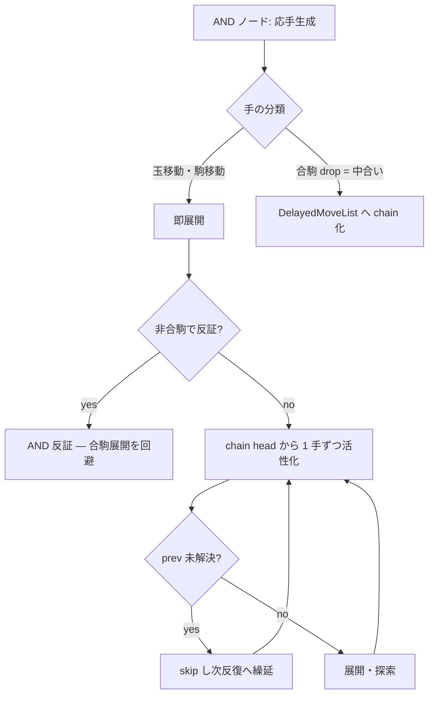

# 合駒最適化

合駒 (特に連続中合い) は詰将棋ソルバーの主要なボトルネックである．飛び駒 (飛・角・香) による
遠距離王手に対し，玉と飛び駒の間のマスへ駒を打つ防御 (中合い) のうち，飛び駒がその合駒を
取り進んで再び王手となりさらに合駒できる再帰構造を持つものがある．n マスのチェーンで各マス
k 種の合駒が可能なら最悪 O(k^n) の分岐が生じる．

### 8.1 中合い遅延展開 (DelayedMoveList)

**出典:** KomoringHeights v0.5.0 (合駒の遅延展開)

合駒を即座に全展開すると，AND ノードの δ (= Σ 子 φ) が合駒の数だけ過大評価され，探索が
合駒方向へ過剰に誘導される．**合駒を遅延させ，必要になるまで活性化しない**ことでこれを抑える．

**実装:** `DelayedMoveList` (`movegen/delayed_move_list.rs`)．`Params::use_delayed_move_list`
(既定 **true**) と parity 版 `Params::dml` (既定 **true**) で制御する．

- **遅延対象**:
  - AND ノード (守備): 全ての駒打ち (合駒) を遅延可能とする．
  - OR ノード (攻め): 成/不成ペアを遅延可能とする (parity DML)．
- **chain (双方向リスト)**: `prev[i]` / `next[i]` で同マス・対称な手を連結する．
  - 同一着手先 (同じ中合いマス) の手を chain 化する．
  - 王手でない通常の合駒打ち同士を chain 化する (**中合い対称性**)．
- **semantics** (`has_unresolved_prev`): 子 `i` を展開する際，`prev` chain に未解決の hand が
  あれば `i` を skip し次反復へ繰り延べる．`update_best_child` で繰り延べた子を復活させる．
- **parity DML の健全性**: 成/不成ペアの chain 化は深い局面での depth-limit 偽反証による
  TT 汚染 (false NoMate) を抑える補助になる．その根治は反証の scope 化
  ([loop-ghi §7.2](loop-ghi.md)) が担い，DML は guidance の頑健性改善として併用する．

非合駒の応手で反証できれば合駒の展開自体を省け，逐次活性化で不要な分岐を抑える．

### 8.2 無駄合いの除外 (最短手数のため既定 on)

無駄合い (取られて終わる無意味な中合い) は詰将棋規約上**手数に数えない**ため，最短手数を正しく
求めるには手生成段階で除外する必要がある．`compute_futile_and_chain_squares` が合駒マスを
futile / chain / normal に分類し，`generate_interpositions` が **futile マスへの駒打ちを skip**
する (駒移動による合駒は盤上駒の relocation = 無駄合い対象外ゆえ除外しない)．

**無駄合いの正確な定義 (誤りやすい)**: 中合いが無駄合いになる条件は「守備の支えがない」だけでは
**不十分**で，**玉がどこへ逃げても同じ手数以下で詰む (中合いしても詰み手数が変わらない)** ことが
必須である．単に支えなしで除外すると，**中合いで攻め方の駒をずらす (取らせて利きを変える) 正当な
受けテクニック**を誤って消す．`king_can_escape_after_slider_capture` が「飛び駒が合駒を取り進んだ
後に玉が逃げられるか」を検査してこれを防ぐ (逃げられれば駒ずらしが効く = 無駄合いでない)．

**3.2.0 での再配線**: この filter は旧 PNS エンジンに存在したが，PNS→mid 移行で
`compute_futile_and_chain_squares` の結果が `generate_interpositions` に**適用されないまま**
残っていた (`_futile`/`_chain` 引数が未使用)．3.2.0 で再配線し，無駄合いを最短手数に算入しない
ようにした (例: tsume_4 は無駄合い込み 13 手 → 規約上の 11 手)．旧記述の「無駄合い filter の
寄与は小さい」は誤りであった (無駄合いが max-resistance に算入され最短手数を過大評価していた)．
`Params::muda_filter` は歴史的フラグで現在は未参照 (futile skip は常時有効)．

**正解の oracle はユーザ**: 無駄合いの判定は微妙で，最短手数/正解 PV の最終確認先は常にユーザで
ある (KH MinLength は無駄合いを数えるため最短 oracle にならない; [move-ordering-and-pv §9-b.3]
(move-ordering-and-pv.md))．

同様に，同一マスへの異種合駒間で取り進み後の局面の証明/反証を転用する cross-deduction
(`Params::capture_dedup` / `cross_dedup`, 既定 off) も用意されるが，deep AND fan-out の主因を
削らないため既定 off である．これらの opt-in lever の採否計測の経緯は
[legacy/benchmarks.md](legacy/benchmarks.md) に保全されている (将来 mid で再検討しうる方法論)．

### 8.3 持ち駒越境・dominance との連携

合駒探索で生じる「同一盤面・異なる持ち駒」の局面群は，TT の持ち駒優越と forward-chain 代替
([transposition-table.md §6.1-6.2](transposition-table.md)) で広く再利用される．また持ち駒の
多様性が指数爆発する局面は visit-history dominance ([loop-ghi §7.3](loop-ghi.md)) で枝刈り
される．これらが DML と併せて中合いチェーンの探索量を抑える．

旧版の Futile/Chain 3 分類・チェーンドロップ 3 カテゴリ制限・cross_deduce neighbor_scan・
reverse disproof sharing・refutable disproof は，二エンジン期に Dual TT 上で開発された機構で
あり統一 mid では DML + 持ち駒越境 + dominance に整理・代替された (記録は
[legacy/](legacy/README.md))．

### 8.4 無駄合い-free len budget — find_shortest 探索側 (3.4.0)

§8.2 の post-pass は**証明済み PV の報告手数**を無駄合い抜きへ補正するが，`find_shortest` の
**len 予算 (反復深化の tight-len 再探索) 自体**は無駄合い込みの raw ply を数えていた．このため
受け方が無駄合い (取り返される透過中合い) で raw 手数を膨らませると，攻め方が真の最短 ≤L 手詰を
持っていても raw 手数が L を超えて `build_expansion` の予算切れ cutoff (`len < 1 手` → disprove)
に触れ，**短い詰みを偽 disproof** してしまう (39te root で 39 手詰を持ちながら len=37 以下を偽反証
→ root を 43 手と過大評価していた; 前 session は「完全性/探索質バグ」と誤診していたが，実体は
この len 予算の単位バグであった)．

**修正 (案A)**: 透過中合いへの合駒 drop を len 予算から credit し，len 予算を「無駄合い抜き手数」に
一致させる．

- `transparent_interposition_squares` (`movegen/mod.rs`): AND ノードで飛び駒王手中のとき，
  `compute_futile_and_chain_squares` の **chain マス** (取り返される透過中合いの代表マス) を返す
  (OR ノード / 非王手 / 非飛び駒王手では空)．
- `child_len` (`search/mod.rs`): 子局面へ渡す len 予算を計算する．AND ノードで **chain マスへの
  合駒 drop** 子は `len.add(1)` (通常は `len.sub(1)`)．直後の攻め方の取り返し (`len.sub(1)`) と
  相殺し，**合駒+取り返しの 2 手 pair の len コストを 0** にする (= 無駄合いは len を消費しない)．
  `step_best_child` と `build_expansion` の seed・look-ahead 双方で同一値を使う．
- `current_result` (`search/expansion.rs`): AND-proven の mate_len 集計 (max-resistance) で，
  chain drop 子は `r.len().sub(2)` (末尾 `+1` 後に `r.len()-1` = 取り返し後局面の手数)．
  → AND ノードの詰み手数が無駄合いで膨らまず `find_shortest` が真の最短へ収束する．build 時の
  chain マスは `LocalExpansion.chain_sqs` に保持する．
- **`len < DEPTH_MAX` のときのみ発火**する (tight-len 再探索でのみ len を credit)．first-mate 探索
  (`find_shortest=false`, len=DEPTH_MAX) では発火せず，canonical first-mate anchor
  (29te 9,288 / 39te 4,272,957 node) は不変である．

**探索側 (len 予算) と post-search 側 (post-pass) の役割分担**: 過去に「無駄合い除外を探索側の
`proven_len` を discount して行う」案は，`find_shortest` の len 予算 (actual ply) と衝突し無駄合い
込み actual line を budget-cut して偽 disproof を生んだため棄却された．案A はこれと別物で，
`proven_len` を直接改変せず **len 予算 (入力側) の credit と mate_len 集計 (出力側) の除外を両方向
consistent** に行うため単位衝突を起こさない．

**perf 影響 (未解決)**: 無駄合いを正しく展開するため disproof 探索が膨張し，39te は
4.27M→24.8M node (~15s→113s) と遅くなった (旧の速さは len-cutoff の偽 disproof=バグ が無駄合いを
早期に切り捨てていた副産物であった)．無駄合いを**刈る** (探索しない) 案は，futile filter が chain
代表合駒を**本物のチェーン受けの起点として残している**ため刈ると偽詰みを生む (unsound) → 不可．
透過中合いの取り返しへ collapse する高速化は今後の課題である．
