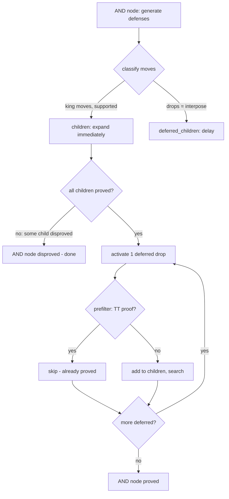

# 合駒最適化

チェーン合駒(連続合い駒)は詰将棋ソルバーの主要なボトルネックである．
飛び駒(飛車・角・香)による遠距離王手に対して，玉と飛び駒の間のマスに
駒を打つ(合駒)防御手のうち，飛び駒がその合駒を取り進むことで再び王手となり，
さらに合駒が可能になる再帰的構造を指す．
n マスのチェーンに対して各マスで k 種の合駒が可能な場合，最悪 O(k^n) の分岐が発生する．

### 8.1 Futile/Chain 合駒分類

合駒マス(between squares)を以下の3カテゴリに分類する．

```
  Rook check along rank (e.g. R on 8g checks King on 1g):

  R        between squares (7g..2g)            K
  8g   7g   6g   5g   4g   3g   2g           1g
  [R]--[C]--[C]--[C]--[C]--[N]--[F]--[K]
        ^                   ^    ^
        |                   |    futile: no defender support,
        |                   |            closer to K than breakpoint
        |                   normal (breakpoint):
        |                   defender has support here
        chain: no defender support,
               farther from K than breakpoint,
               R captures -> re-check -> more drops

  [C] = chain     max 3 drops (fwd/diag/knight)
  [N] = normal    all 7 piece types
  [F] = futile    skipped entirely
```

**実装:** `compute_futile_and_chain_squares` (pns.rs)

#### 通常マス (Normal)

守備側の利きが存在する，または玉に隣接し飛び駒が取り進んだ後に逃げ道がある場合．
全駒種(歩→香→桂→銀→金→角→飛)の合駒を生成する．

#### 無駄合いマス (Futile)

以下のすべてを満たすマス:
- 守備側(玉以外)の利きがない
- 玉に隣接していないか，隣接していても取り進み後に逃げ道がない
- ブレークポイント(通常マス)より玉側にある

無駄合いマスへの駒打ちは完全にスキップされる．

#### チェーンマス (Chain)

Futile の条件を満たすが，ブレークポイントより飛び駒側にあるマス．
飛び駒が取り進んだ後に再び王手となり，さらなる合駒が可能な再帰構造を生む．
チェーンマスへの合駒は3カテゴリの代表駒に限定される(§8.2)．

**補助関数:** `king_can_escape_after_slider_capture` (pns.rs)
飛び駒が合駒マスに取り進んだ状態をシミュレートし，玉の逃げ道を判定する．

### 8.2 チェーンドロップ3カテゴリ制限

チェーンマスへの駒打ちを以下の3カテゴリから各1手に制限する．

**実装:** `generate_chain_drops` (pns.rs)

| カテゴリ | 駒種 | 代表の選択 |
|---------|------|----------|
| 前方利き系 | 歩→香→銀→金→飛 | 最弱の合法駒1つ |
| 斜め利き系 | 角 | 角のみ |
| 跳躍系 | 桂 | 桂のみ |

**根拠:** 前方利き系では弱い駒で詰みが証明できれば強い駒でも証明できる
(攻め方が合駒を取った後，手に入る駒が強いほど詰ませやすい)．
角と桂は利きの方向が異なるため独立カテゴリとなる．

**効果:** 合駒マスあたりの駒打ち数を最大7手から最大3手に削減．

### 8.3 合駒遅延展開 (KomoringHeights v0.5.0)

**出典:** KomoringHeights v0.5.0

AND ノードの合駒(駒打ち)を即座に展開せず `deferred_children` に分離する．



**実装:** `mid()` 内の子ノード初期化 (`solver.rs`)，PNS の AND ノード展開 (`pns.rs`)

1. AND ノードの子を分類:
   - 駒移動(玉逃げ・紐付き合駒) → `children`(即座に展開)
   - 駒打ち(合駒) → `deferred_children`(遅延)
2. 非合駒応手を先に探索し，TT に証明を蓄積
3. `children` が空になったら `deferred_children` から1手ずつ活性化:
   弱い駒から順に活性化し，証明済み TT エントリを強い駒の探索で援用

**効果:** 非合駒応手で反証できれば合駒の展開自体を回避．
逐次活性化により不要な分岐を抑制．

### 8.4 TT ベース合駒プレフィルタ

合駒を `deferred_children` に追加する前に TT で証明済みか確認する．

**実装:** `try_prefilter_block` (`solver.rs`)

1. 合駒を盤上で実行
2. 攻め方の合法手から合駒マスへの捕獲かつ王手になる手を探索
3. 捕獲後の局面を TT で参照
4. pn=0(証明済み)なら合駒の OR ノードも証明 → 展開不要

**IDS との相乗効果:** 浅い IDS 反復でチェーン末端の証明が TT に蓄積され，
深い反復では浅いレベルの合駒がプレフィルタで即座にスキップされる．
これによりチェーン合駒がボトムアップに折り畳まれる．

#### 8.4.1 or_ph 計算と A-fix (v0.24.58)

プレフィルタで捕獲後局面の証明 (`pc_ph`) を発見した後，OR ノードの
proof\_hand (`or_ph`) を導出する．この or\_ph は child\_pk に格納し，
init\_and\_proof に累積して AND 証明の判定に使用される．

##### v0.24.55 以前 (baseline clamp)

```
or_ph = pc_ph - X_cap           // saturating_sub
or_ph[k] = min(or_ph[k], child_hand[k])   // clamp
```

componentwise clamp は own-cluster match (componentwise dominance) では
正常に動作するが，forward-chain substitution match 時に unsound な
proof を生成する:

- `pc_ph = [0,5,0,0,0,0,0]` (5 lances)，`pc_hand = [0,0,0,0,0,0,5]` (5 rooks)
- clamp 後 `or_ph = [0,0,0,0,0,0,0]` → 「空手で詰む」(FALSE)

##### v0.24.58 A-fix (2 段階 lookup + either-or 選択)

- **Phase 1**: own cluster のみ lookup (`neighbor_scan=false`)．
  hit → baseline clamp 方式を踏襲 (wider dominance，実害なし)．
- **Phase 2**: Phase 1 miss 時，`proven_has_other_hand_variant` で
  同一 `pos_key` の hand バリアントが存在する場合のみ `neighbor_scan=true`
  で再 lookup (適応的 neighbor\_scan)．
  hit → either-or 方式で sound な or\_ph を選択:
  - **tight**: `or_ph = pc_ph - X_cap` (`child_hand ≥_fc or_ph` 成立時)
  - **trivial**: `or_ph = child_hand` (fallback，常に sound)

### 8.5 同一マス証明転用

同一マスへの異なる駒種の合駒間で TT エントリを相互利用する．

**実装:** `cross_deduce_children` (`solver.rs`)

同一マス S への合駒 P1, P2, ..., Pn は，攻め方が捕獲した後の盤面(position_key)が
全て同一になる(異なるのは攻め方の持ち駒のみ)．

1. 合駒 i が証明済みになった後，同一マスの未解決合駒 j を列挙
2. 合駒 j の捕獲後の攻め方持ち駒を計算:
   `hand_j = base_hand - solved_piece + piece_j`
3. TT で捕獲後局面を参照: `look_up(pc_pk, &hand_j, pc_remaining)`
4. pn=0 なら合駒 j も証明 → `deferred_children` から除去

#### 8.5.1 multi-step cross\_deduce (v0.24.59 候補 C)

`cross_deduce_children` は同一マスの兄弟のみを対象とするが，chain
aigoma では子 A (square S) の sub-tree 探索中に deeper chain step
(例: S-1, S-2) の captured position proof が ProvenTT に蓄積される．

候補 C は cross\_deduce 完了直後に **異なるマス** のドロップ children
全体に prefilter を再発火し，ProvenTT の新規 entry を即座に活用する:

```
cross_deduce_children(solved_move@sq_S) 完了
→ for child_j (drop@sq_T, T ≠ S), unproven:
    try_prefilter_block(child_j)
    if hit → cross_deduce_children(child_j) 連鎖発火
```

新たに proven 化された child\_j に対しても同一マスの cross\_deduce +
transitive closure を連鎖的に発火させる (proof cascade)．

**効果**: 39te canonical -25%，29te -33% の性能改善を達成．

#### 8.5.2 逆方向不詰共有 (v0.24.61)

cross\_deduce は **proof 方向** (弱い駒で詰む → 強い駒でも詰む) の伝搬のみ
だが，**disproof の逆方向** (強い駒で詰まない → 弱い駒でも詰まない) の
伝搬も有効である．

**原理:** 守備方が強い駒 (飛車) を合駒 → 攻方が飛車を捕獲 → hand H\_strong で
不詰 (cdn=0)．弱い駒 (歩) を合駒 → 攻方が歩を捕獲 → hand H\_weak は
H\_strong より弱い → なおさら不詰．

```
hand_gte_forward_chain(H_strong, H_weak) = true
→ H_strong で不詰 → H_weak でも不詰
```

**実装:** `reverse_disproof_sharing()` (`solver.rs`)

MID main loop で子 (合駒 drop) の cdn が 0 になった直後に発火し，
同一マスの兄弟ドロップに post-capture level の disproof を WorkingTT に格納．
ProvenTT を汚染しない (depth-limited disproof のみ)．

#### 8.5.3 multi-step 逆方向不詰共有 (v0.24.62)

§8.5.1 と対称的に，**異なるマス** のドロップ children にも
reverse\_disproof\_sharing を re-trigger する:

```
reverse_disproof_sharing(disproved_move@sq_S) 完了
→ for child_j (drop@sq_T, T ≠ S), not disproven:
    reverse_disproof_sharing(child_j)
```

**効果**: reverse\_disproof 発火 8-18 倍増，TT disproven -92%，
depth=25 cliff 突破 (Unknown → Mate(15))．

#### 8.5.4 Post-Capture Proof Summary Cache (v0.24.64)

TT の hand\_hash Zobrist 混合によるクラスタ分散を迂回する pos\_key ベースの
直接マップキャッシュ (64K entries)．

- `min_proof_hand`: この pos\_key で詰む最弱の攻方手駒
- `max_disproof_hand`: この pos\_key で詰まない最強の攻方手駒

`try_prefilter_block` の TT lookup 前に O(1) で参照し，
`hand_gte_forward_chain` チェックで TT lookup を完全にスキップ可能．

**効果**: prefilter\_hits +59%〜×3.7．

### 8.6 合駒 DN バイアス

AND ノードの合駒(駒打ち)の初期 dn にバイアスを加算し，探索優先度を下げる．

**実装:** 定数 `INTERPOSE_DN_BIAS = 8` (mod.rs)

非合駒応手の初期 dn(=1)より十分大きく設定し，
df-pn の自然な閾値制御で king move → drop の順序を実現する．
遅延展開(§8.3)が主要な制御手段であり，DN バイアスは補助的な役割．

### 8.7 チェーンマス内→外順序

チェーンマスの合駒を玉に近い側(内側)から飛び駒に近い側(外側)の順にソートする．

**実装:** `mid()` 内のチェーンドロップ順序付け (`solver.rs`)

```rust
deferred_children.sort_by_key(|(m, _, _, _)| {
    let to = m.to_sq();
    let dr = (to.row() - king_sq.row()).abs();
    let dc = (to.col() - king_sq.col()).abs();
    dr.max(dc)  // チェビシェフ距離: 内側(小)優先
});
```

- S1(内側)の証明で蓄積した TT エントリが S2(外側)の探索で再利用可能
- 短いサブチェーンから順に証明が蓄積され，長いサブチェーンの TT 再利用効率が向上

### 8.8 チェーン深さ DN スケーリング

チェーン合駒のみで構成される AND ノードで，DN バイアスをチェーン内位置に応じてスケーリングする．

**実装:** `mid()` 内の DN バイアス計算 (`solver.rs`)

```rust
let bias = if let Some(ksq) = chain_king_sq {
    let dist = chebyshev_distance(to, ksq);
    INTERPOSE_DN_BIAS * dist
} else {
    INTERPOSE_DN_BIAS
};
```

- 内側マス(d=1): `INTERPOSE_DN_BIAS × 1` — 最小バイアス，優先的に探索
- 外側マス(d=5): `INTERPOSE_DN_BIAS × 5` — 大きなバイアス，後回し
- `chain_king_sq` はチェーン判定時に保持した玉位置(チェーン AND ノードのみ)

§8.7(ソート順)と組み合わせることで相乗効果がある．

---

### 8.9 Refutable Disproof (v0.24.75+)

**概要**: `depth_limit_all_checks_refutable` の再帰的 NM 判定 (depth 5 の
check-defense exchanges) 結果を ProvenTT に格納する専用エントリ種別．
PNS の arena-limited false NM を防ぎつつ，MID の boundary check で
NM 情報を活用することで合駒探索全体を高速化する．

#### 動機

v0.24.73 時点で `refut_tt_hits = 0` (TT 高速パス不発火) が判明．再帰判定
(`all_checks_refutable_recursive`) で NM と確認した AND ノードを
TT に格納しないため，同じ局面で再帰判定が繰り返し実行されていた．

単純に confirmed disproof として格納すると false NM cascade が発生
(後述)．refutable disproof という PNS から不可視の新しいエントリ種別で
この問題を解決した．

#### エントリ構造

`ProvenEntry.flags` の **bit 7** を refutable disproof マーカーとして使用
(詳細は `transposition-table.md §6.6.3`):

- bit 0 = 0 (is_proof=false)
- bits 1-6: `ids_depth` (0-63)
- **bit 7 = 1: refutable disproof** (0: confirmed disproof)

同じ ProvenTT クラスタに共存し，メモリ構造は不変．

#### 可視性制御

| 参照元 | confirmed disproof | refutable disproof |
|:---|:---:|:---:|
| MID `look_up_pn_dn` | 可視 | 可視 |
| MID boundary `all_checks_refutable_by_tt` | 可視 | **不可視** |
| PNS `look_up_pn_dn` (`skip_refutable_disproof=true`) | 可視 | **不可視** |
| refutable check 高速パス `all_checks_refutable_by_tt_or_refutable` | 可視 | 可視 |

- **MID の通常 lookup**: refutable disproof を confirmed と同様に NM として扱う．
  AND 子の dn=0 を発見しても threshold-based 探索は他の子を継続するため
  false NM cascade は起きない．
- **PNS の lookup**: `skip_refutable_disproof=true` で不可視化．arena-limited
  best-first 探索が escape path を先に発見して root.dn=0 を引き起こす
  cascade を防止．
- **MID boundary check**: confirmed のみ参照．refutable disproof 経由で
  NM を confirmed に昇格させないことで depth-limited NM の混入を防止．

#### なぜ arena-limited disproof として扱うか

PNS の `AND.dn = min(child.dn)` は defender の 1 つの escape defense で
`dn=0` になる．PNS の limited arena (5M ノード) では:

1. refutable disproof が interior 探索で hit → 子 AND ノードが dn=0
2. cascade: AND 子 dn=0 → OR parent の check が refuted → 親 AND の
   別の child via  (`dn = sum(child.dn)`) で最小 dn になる
3. root まで伝搬 → `root.dn=0` (false NM, 実際は checkmate 可能)

**NM 自体は論理的に正しい** (defender に escape があれば NM は事実)．
問題は PNS の limited exploration が proof path よりも escape path を
先に発見してしまうこと．これは **IDS における depth-limited disproof
と同様の provisional disproof** と解釈できる:

| 種別 | provisional の理由 | 解消方法 |
|:---|:---|:---|
| depth-limited disproof | IDS の depth 制限内で探索打ち切り | より深い IDS step で検証 |
| **refutable disproof (PNS 文脈)** | **arena-limited 探索で escape path 優先発見** | **MID の threshold-based 探索で検証** |

MID の threshold-based 探索は AND 子の `dn=0` を発見しても他の子の
探索を継続するため，refutable disproof を NM として使用しても false NM
にならない．したがって MID からは可視のまま活用する．

#### hand_gte 支配チェック

`store_refutable_disproof` は格納時に `hand_gte_forward_chain` で支配関係を確認:

- 既存 disproof (confirmed/refutable) が新 hand を支配 → 挿入スキップ
- 新エントリが既存 refutable disproof を支配 → 既存を除去

39手詰め depth=25 で挿入試行 767 万回のうち **83% (607 万) がスキップ**され，
ProvenTT クラスタの圧迫を防いでいる．

#### 境界 NM 判定パイプライン

3 つの判定機構が連携して boundary (remaining=0) で NM を検出する:

```
[MID が remaining=0 に到達]
  ↓
[look_up_pn_dn_impl: TT lookup]
  ├─ refutable/confirmed disproof hit → (INF, 0, 0) で即 return
  └─ miss → (INF, 0, 0) 仮反証 (main MID は早期 return)

[PNS expand が remaining=0 OR ノードに到達]
  ↓
[refutable_check_with_cache]
  ├─ Fast path (all_checks_refutable_by_tt_or_refutable)
  │   └─ 全 AND 子が TT disproof → true
  ├─ Memo (refutable_check_failed)
  │   └─ pos_key in set → false
  └─ Fallback (depth_limit_all_checks_refutable, depth=5)
      ├─ true → AND 子を store_refutable_disproof で格納
      └─ false → refutable_check_failed に pos_key 格納
```

- **PNS → MID の情報伝達**: PNS が refutable disproof を蓄積．
  次の MID パスで同一局面に到達すると `look_up_pn_dn` で NM として
  検出され，MID の threshold propagation で上位に伝搬．

#### 効果 (backward_10m warmup なし)

| Ply | Remain | v0.24.73 baseline | v0.24.78 (refutable disproof) |
|:---:|:---:|:---|:---|
| 24 | 15 | 451K Mate(15), 61s | 379K Mate(15), 41s |
| 22 | 17 | 9.89M Mate(17), 199s | 7.44M Mate(17), 124s |
| 20 | 19 | **Unknown** | 9.87M Mate(19), 169s |
| 18 | 21 | Unknown | Unknown (境界) |

詳細は `benchmarks.md §10.2` 参照．

---

