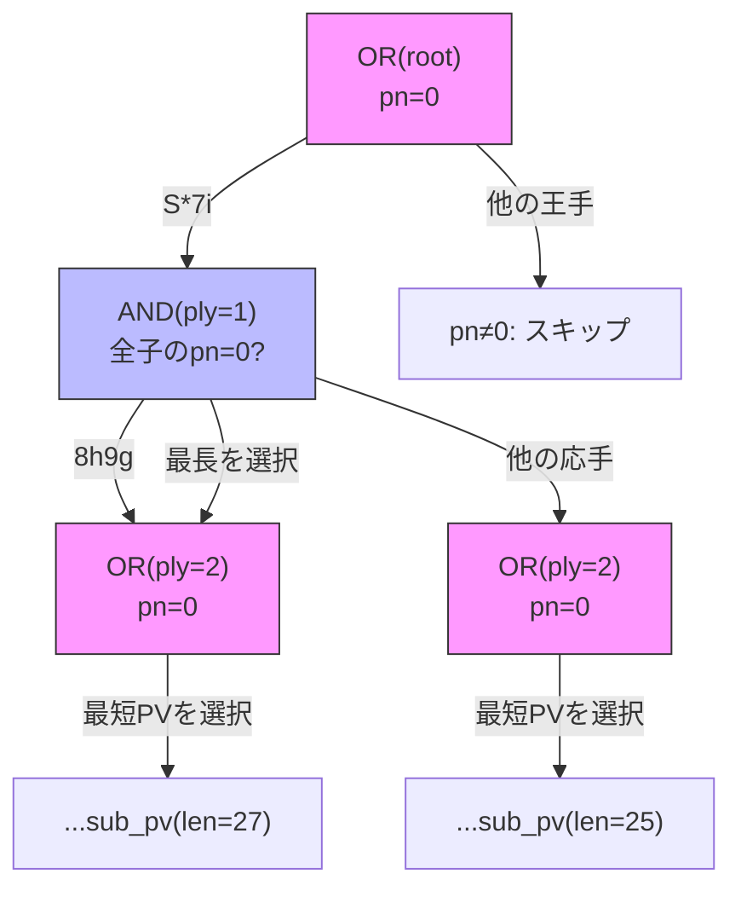

# ループ・GHI 対策

### 7.1 経路依存フラグ付き GHI 対策 (Kishimoto & Müller 2004/2005)

**出典:** Kishimoto & Müller, "A solution to the GHI problem for depth-first proof-number search" (IS 175.4, 2005)

GHI (Graph History Interaction) は，同一局面が異なる探索経路で
異なる結果を持つ問題．千日手のような繰り返し検出は経路に依存するため，
ある経路で得た反証が別の経路では無効になりうる．

KomoringHeights は dual TT (base/twin) で経路依存/非依存の不詰を区別する．

**実装:** solver.rs (`path: FxHashSet`，ループ検出，GHI 伝播)

maou_shogi では dual TT の代わりに経路依存フラグ方式を採用:

1. **ループ検出**: `path: FxHashSet<u64>` で現在の探索パス上の全ノードハッシュを保持．
   子ノードが path 上に存在すれば循環と判定し，即座に `(INF, 0)` を返す
2. **経路依存反証**: ループ検出に由来する反証を `path_dependent = true` で TT に保存
3. **IDS 間清掃**: `clear_working()` で WorkingTT 全クリア(経路依存反証を含む)し，
   `clear_proven_disproofs()` で ProvenTT の confirmed disproof を除去．
   異なる深さの探索で自動的に再評価
4. **Remaining 免除**: 経路依存エントリは remaining チェックをバイパス
   (`e.remaining >= remaining || e.path_dependent`)

**出典との差異:**
- 論文の dual TT 方式ほど完全ではないが，経路依存の反証が TT を
  永続的に汚染する問題を軽減する実用的な妥協案

### 7.2 NM Remaining 伝播

深さ制限に由来する不詰(NM: Non-Mate)の深さ情報を正確に伝播する．

**実装:** mod.rs (`propagate_nm_remaining`)

```
nm_remaining = min(child_remaining + 1, current_remaining)
```

- 子の NM が `REMAINING_INFINITE` なら親も `REMAINING_INFINITE`
- 有限 remaining の NM は深い IDS 反復で再評価される
- `REMAINING_INFINITE = u16::MAX`: 深さ非依存の真の証明/反証

---


---

## 9. 手順改善

### 9.1 TT Best Move 動的手順改善

TT エントリに保存された最善手(§6.5)を利用し，手順の先頭にスワップする．

**実装:** solver.rs (Dynamic Move Ordering)

`look_up_best_move(pos_key, hand)` で TT から Move16 を取得し，
手リストの先頭に配置する．

### 9.2 Killer Move (OR ノード専用)

同一 ply の別の局面で証明に寄与した手を記録し，優先的に探索する．

**実装:** solver.rs (`killer_table`, `record_killer`, `get_killers`)

- **テーブル**: `killer_table: Vec<[u16; 2]>` — 各 ply に2スロット
- **記録タイミング**: OR ノードの証明達成時および閾値超過時
- **適用**: TT Best Move の直後に配置

**手順優先度:** TT Best Move > Killer Move (2スロット/ply) > 静的手順(DFPN-E)

AND ノードでは全子ノードの探索が必要(WPN/SNDA 計算のため)なので適用しない．

### 9.3 捨て駒ブースト

OR ノードで全王手が「支えなし」の捨て駒である場合に pn を加算して
探索優先度を下げる．人間が直感的に「不詰」と見切るのと同様のヒューリスティック．

**実装:** `sacrifice_check_boost` (mod.rs (`sacrifice_check_boost`))

- 各王手の `to_sq` に攻め方の他の駒が利いているか確認(移動元を除外)
- 全王手が捨て駒なら `boost = 2` を返す(pn に加算)
- 支えがある王手が1つでもあれば 0

---

## 9-b. PV 復元(Principal Variation Extraction)

Df-Pn は探索木を明示的に保持しないため，詰みを証明した後に
**TT のエントリを辿って PV(最善手順)を復元する**必要がある．
PV 復元は 3 つのフェーズで構成される．

#### 全体フロー

```
┌─────────────────────────────────────────────────┐
│           Df-Pn 探索 (mid / PNS)                │
│   root の pn=0 (詰み証明完了)                    │
└─────────────┬───────────────────────────────────┘
              │
              ▼
┌─────────────────────────────────────────────────┐
│  Phase 1: complete_or_proofs                    │
│  PV 上の OR ノードで未証明の子を追加証明         │
│  (最短手順を保証するため)                        │
└─────────────┬───────────────────────────────────┘
              │ ×2 回反復(収束まで)
              ▼
┌─────────────────────────────────────────────────┐
│  Phase 2: extract_pv_recursive                  │
│  TT を再帰的に辿って PV を構築                   │
│  OR: 最短の子を選択，AND: 最長の子を選択         │
└─────────────┬───────────────────────────────────┘
              │
              ▼
┌─────────────────────────────────────────────────┐
│  Phase 3: PV 検証                               │
│  手数が奇数(攻め方の手で始まり終わる)か確認      │
└─────────────────────────────────────────────────┘
```

#### Phase 1: 未証明子の追加証明 (`complete_or_proofs`)

Df-Pn の OR ノードは **1 つの子ノードが証明されると探索を打ち切る**．
しかし最短手順を保証するには，PV 上の全 OR ノードで **全ての王手の証明状態**
を知る必要がある(より短い手順が存在する可能性がある)．

```
  OR(ply=0, pn=0)  ←  1つの王手で pn=0 になったが，他の王手は未探索
  ├── 王手A: pn=0 (証明済み, 手順長=29)
  ├── 王手B: pn=16 (未証明 ← これを追加証明する)
  └── 王手C: pn=16 (未証明 ← これも追加証明する)
```

`complete_pv_or_nodes` は PV に沿って盤面を進め，各 OR ノードで
未証明の王手に対して `mid()` を呼び出し追加証明を試みる:

```
for (i, pv_move) in pv:
    if OR ノード (i % 2 == 0):
        for 全王手 m:
            if TT で未証明 (pn > 0, dn > 0):
                mid(m の局面, pv_nodes_per_child ノードまで)
    盤面を pv_move で進める
```

この追加証明により，より短い手順が発見される可能性がある．
Phase 1 は最大 2 回反復し，PV が変化しなくなれば早期終了する．

#### Phase 2: PV 再帰構築 (`extract_pv_recursive`)

TT のエントリを辿り，OR ノードでは最短，AND ノードでは最長の
子を選択して PV を構築する．



**OR ノード(攻め方手番):**

```
1. 全王手を生成
2. 各王手 m について:
   a. 盤面を m で進める
   b. TT look_up で child_pn を取得
   c. child_pn == 0 (子が証明済み) なら:
      - 再帰的に sub_pv = extract_pv(AND, ply+1)
      - total_len = 1 + sub_pv.len()
      - total_len が奇数 かつ 現在の best_pv より短いなら更新
3. best_pv の先頭に m を追加して返す
```

**AND ノード(玉方手番):**

```
1. 全応手を生成
2. 各応手 m について:
   a. 盤面を m で進める
   b. TT look_up で child_pn を取得
   c. child_pn == 0 (子も証明済み = 玉方の応手が全て詰み) なら:
      - 再帰的に sub_pv = extract_pv(OR, ply+1)
      - total_len = 1 + sub_pv.len()
      - 現在の worst_pv (最長) より長いなら更新
3. worst_pv の先頭に m を追加して返す
```

**OR で最短，AND で最長を選ぶ理由:**
- OR(攻め方): 最短で詰む手を選ぶ(最善攻め)
- AND(玉方): 最長で粘る手を選ぶ(最善受け = 最長抵抗)
- これにより「最善応手に対する最短詰み手順」が得られる

#### PV 復元と Dual TT の関係

PV 復元は proof エントリ(pn=0)のチェーンに依存する:

```
  TT look_up → ProvenTT で proof 発見 → child_pn=0 → 再帰続行
                                                        ↓
  TT look_up → proof 未発見 → child_pn≠0 → PV ここで終了(切断)
```

**ProvenTT の proof 保護が重要な理由:**

ProvenTT で foreign proof が evict されると，PV チェーンの中間ノードの
proof が失われ，PV が途中で切断される．`replace_weakest_proven` は
foreign proof を evict しない設計(§6.6)により PV チェーンを保護する．

#### 打ち切り条件

| 条件 | 理由 | 影響 |
|------|------|------|
| `ply >= depth * 2` | スタックオーバーフロー防止 | 深い PV が切断される |
| ループ検出(フルハッシュ) | 無限再帰防止 | 千日手含みの PV が切断される |
| `visits > max_visits` | 計算量制限 | 分岐の多い AND ノードで打ち切り |
| `node_pn != 0` (OR) | 子が未証明 | PV がこのノードで終了 |
| PV 長が偶数 (OR) | 玉方の手で終わる PV は無効 | その子をスキップ |

---

