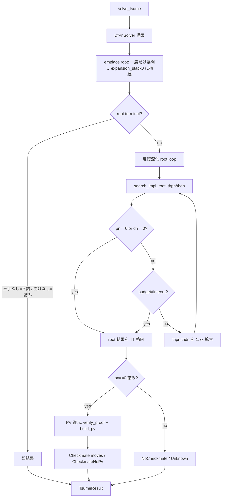

# 探索アーキテクチャ

統一探索本体 `mid` (実体は `search/mod.rs` の `search_impl` / `search_impl_root`) は，
df-pn を φ/δ に統一した深さ優先探索を，root で閾値を段階的に拡大しながら実行する単一エンジンである．

### 2.1 Df-Pn (Nagai 2002)

**出典:** Nagai & Imai, "df-pn Algorithm Application to Tsume-Shogi" (IPSJ Journal 43(6), 2002);
Nagai, "Df-pn Algorithm for Searching AND/OR Trees" (Ph.D. Dissertation, UTokyo, 2002)

AND/OR 木を証明数 (pn)・反証数 (dn) に基づいて深さ優先で探索する．各ノードに pn/dn の閾値を
設定し，閾値を超えた時点で親へ復帰する (= 深さ優先で最有望部分木に資源を集中する)．

- **OR ノード** (攻め方手番): `pn = min(child_pn)`, `dn = sum(child_dn)`
- **AND ノード** (守備方手番): `pn = sum(child_pn)`, `dn = min(child_dn)`

```
    OR node (attacker)              AND node (defender)
    pn=1, dn=5                      pn=5, dn=1
   /    |    \                     /    |    \
 AND   AND   AND                 OR    OR    OR
 pn=3  pn=1  pn=2              pn=2  pn=1  pn=2
 dn=2  dn=1  dn=2              dn=1  dn=3  dn=2

 pn = min(3,1,2) = 1            pn = sum(2,1,2) = 5
 dn = sum(2,1,2) = 5            dn = min(1,3,2) = 1
```

OR ノードでは pn 最小の子を選択 (最も証明しやすい王手を優先)，AND ノードでは dn 最小の子を選択
(最も反証しやすい応手 = 最善の受けを優先) して再帰する．`pn=0` で詰み証明，`dn=0` で不詰確定．

### 2.2 φ/δ 統一表現

実装は OR/AND を場合分けせず **φ (phi) / δ (delta)** に統一して扱う．この φ/δ 統一表現と
それに伴う集約 (§4) は KomoringHeights で実装されている形式に基づく．手番側から見て:

| ノード | φ (= 0 で手番側の勝ち) | δ (= 0 で手番側の負け) |
|--------|----------------------|----------------------|
| OR (攻め方) | pn | dn |
| AND (守備方) | dn | pn |

集約は **φ(n) = min 子 δ**，**δ(n) = Σ 子 φ** に統一される (§2.1 の OR/AND 公式と等価)．
- `current_result` (`search/expansion.rs`): φ==0 → 手番 win (OR=詰み proven / AND=逃れ disproven)，
  δ==0 → 手番 lose (OR=不詰 disproven / AND=詰み proven)，いずれでもなければ unknown．
- δ の総和は **二重計数除去 (`sum_mask`)** の対象となり，DAG 合流する子は sum でなく max で
  集約される (詳細 [proof-disproof-numbers.md §4](proof-disproof-numbers.md))．

`SearchResult` は φ/δ に加えて **mate length** (proven_len / disproven_len) を保持する
**len-aware** 表現であり，最短手順保証・cross-hand 集約の健全性に用いる
([transposition-table.md §6.3](transposition-table.md))．

### 2.3 反復深化: root 閾値成長

df-pn の反復深化は **深さ制限の増加ではなく閾値 (threshold) の増加**で行う (Nagai 2002)．
root の探索 (`search_impl_root`) を `thpn = thdn = 0` から呼び，未解決なら閾値を引き上げて
再呼び出しするループ (`search/mod.rs`):

```
thpn = thdn = 0;  cap = K_INFINITE_PN_DN - 1
loop:
    if nodes >= max_nodes || timed_out: break
    result = search_impl_root(tt, board, thpn, thdn)
    if result.pn == 0 || result.dn == 0: break        // 詰み or 不詰 確定
    if result.pn >= INF || result.dn >= INF: break
    thpn = max(thpn, ⌊result.pn × 1.7⌋ + 1), clamp ≤ cap
    thdn = max(thdn, ⌊result.dn × 1.7⌋ + 1), clamp ≤ cap
```

- **root expansion 持続**: root のノード展開 (`emplace`) は反復間で `expansion_stack[0]` に
  **持続**させる．子の results / 選択 idx / sum_mask / 除外情報が反復跨ぎで累積し，
  再探索コストを抑える (root 持続反復深化)．
- **必ず増加**: 返り値は `pn ≥ 1` かつ `pn ≈ thpn` なので閾値は単調増加し，停滞しない
  (打ち切りは budget / timeout がループ冒頭で担う)．
- **乗率 1.7×**: 1 反復あたりの探索量を確保しつつ過剰深掘りを避ける係数 (1+ε 的拡大の root 版)．

### 2.4 1 ノードの探索 (`search_impl`)

各ノードは「展開 (build) → φ/δ 集約 → 子閾値計算 → 最有望子へ再帰 → backup」を
閾値超過まで繰り返す．主要関数 (`search/mod.rs`):

- **`emplace`**: ノードを 1 回展開する (= **Emplace**，`nodes` カウンタ +1)．手生成・子初期値
  seed・sum_mask 構築を行い `expansion_stack` へ push する．終局 (王手なし=不詰 / 受けなし=詰み)・
  budget 切れ・深さ上限は `Err(terminal)` で返す．4096 build ごとに TT GC を点検する．
- **`search_impl`**: top の expansion に対し `while φ < thφ && δ < thδ` で `step_best_child` を回す．
  - 入口で **DAG 二重計数除去** (`eliminate_double_count`) を実行する (§4.2)．
  - **TCA**: ループ子検出 (`does_have_old_child`) で `inc_flag` を増やし，`inc_flag > 0` の間は
    `extend_search_threshold` で閾値を拡張する (§[threshold §3.2](threshold-control.md))．
- **`step_best_child`**: best child を `do_move` → `emplace` → first-visit は子の集約済結果で
  exceed 判定 → 非 exceed なら `search_impl` 再帰 → child を pop → `undo_move` →
  `update_best_child` + TT へ結果格納．`do_move` 数が `nodes_searched` 指標になる．

子へ渡す閾値は 1+ε トリック (`front_pn_dn_thresholds`) で計算する
([threshold §3.1](threshold-control.md))．

### 2.5 全体フロー



### 2.6 旧アーキとの差異

| 旧 (二エンジン期，~v0.55) | 現行 (統一 mid) |
|---|---|
| Phase 1 Best-First PNS (arena) + Phase 2 IDS-dfpn | **単一 `mid` 再帰** (`search_impl`) |
| 深さ制限 IDS (depth 2→4→8→…) | **閾値成長による反復深化** (root 1.7×) |
| Frontier Variant (PNS→局所 MID) | 廃止 (閾値飢餓は TCA + 子閾値設計で対処) |
| solve() レベル warmup | 廃止 (root 持続反復深化が proof を累積) |
| 二エンジン間の TT 転写 / 清掃 | 単一 TT を反復間で保持 |
