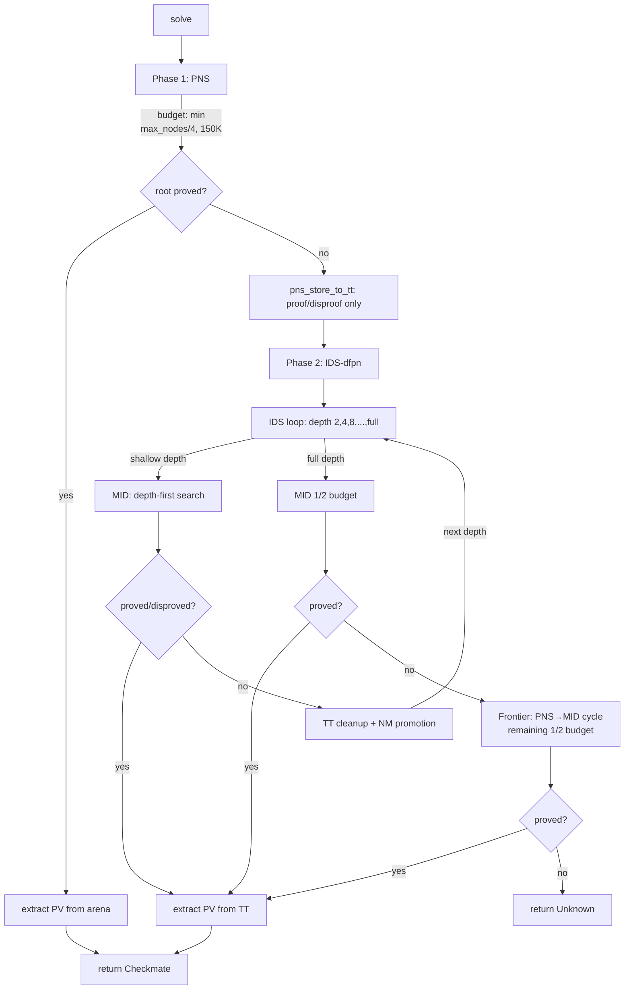
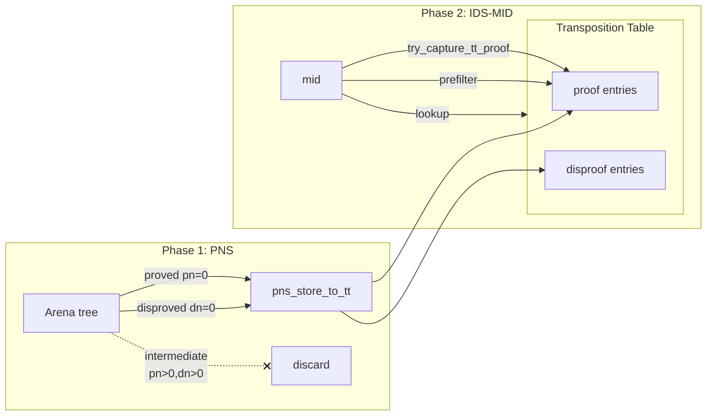
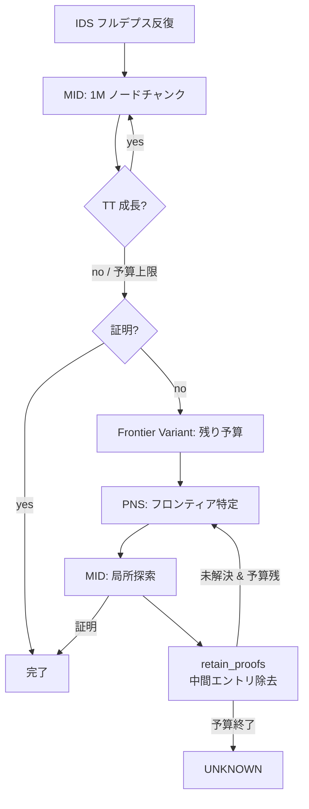

# 探索アーキテクチャ

### 2.1 Df-Pn (Nagai 2002)

**出典:** Nagai & Imai, "df-pn Algorithm Application to Tsume-Shogi" (IPSJ Journal 43(6), 2002);
Nagai, "Df-pn Algorithm for Searching AND/OR Trees" (Ph.D. Dissertation, UTokyo, 2002)

AND/OR 木を証明数(pn)・反証数(dn)に基づいて深さ優先で探索するアルゴリズム．
各ノードに pn/dn の閾値を設定し，閾値を超えた時点で親に復帰する．

- **OR ノード**(攻め方手番): `pn = min(child_pn)`, `dn = sum(child_dn)`
- **AND ノード**(守備方手番): `pn = sum(child_pn)`, `dn = min(child_dn)`

```
    OR node (attacker)              AND node (defender)
    pn=1, dn=5                      pn=5, dn=1
   /    |    \                     /    |    \
 AND   AND   AND                 OR    OR    OR
 pn=3  pn=1  pn=2              pn=2  pn=1  pn=2
 dn=2  dn=1  dn=2              dn=1  dn=3  dn=2
  |     ^                             ^
  |   select                        select
  |  (min pn)                      (min dn)

 pn = min(3,1,2) = 1            pn = sum(2,1,2) = 5
 dn = sum(2,1,2) = 5            dn = min(1,3,2) = 1
```

OR ノードでは pn が最小の子を選択して再帰(最も証明しやすい手を優先)．
AND ノードでは dn が最小の子を選択して再帰(最も反証しやすい応手を優先)．

**実装:** `mid()` 関数 (`solver.rs`)．
MID (Multiple Iterative Deepening) ループにより，選択→展開→バックアップを
閾値に達するまで繰り返す．

### 2.2 Best-First PNS (Phase 1)

**出典:** Seo, Iida & Uiterwijk, "The PN*-search algorithm" (AI 129, 2001);
Allis, "Searching for Solutions in Games and Artificial Intelligence" (1994)

明示的な探索木(アリーナ)上でグローバル最適なノード選択を行う best-first 探索．
Df-Pn の深さ優先制約を緩和し，thrashing(同一ノードの再展開)を回避する．

**実装:** `pns_main()` 関数 (`pns.rs`)．

- **アリーナ**: `Vec<PnsNode>` (`entry.rs`)，上限 `PNS_MAX_ARENA_NODES = 5,000,000`
- **ノード予算**: `PNS_BUDGET_CAP = 150,000` ノード (全体の 1/4，上限 150K)
- **停滞検出**: `PNS_STAGNATION_LIMIT = 500,000` イテレーション
- **合駒遅延展開**: AND ノードの合駒(drop)を `deferred_drops` に格納し，逐次活性化
- **TT 転写**: `pns_store_to_tt()` で証明済み(pn=0)・反証済み(dn=0)ノードのみを TT に保存．
  中間ノードは保存しない(Phase 2 の MID が中間値に束縛されるのを防止)

**出典との差異:**
- PN* は RBFS ベースの反復深化型だが，maou_shogi は明示的アリーナの best-first 方式
- PNS のバックアップは標準 OR/AND 公式だが，AND ノードに WPN (§4.1) を適用

### 2.3 IDS-dfpn (Phase 2)

**出典:** Seo et al. 2001 (PN*); Nagai 2002 (df-pn の反復深化)

探索深さ制限を段階的に増加させ，浅い証明を TT に蓄積しながら深い探索を実行する．
PNS で未解決の場合に自動的に Phase 2 として呼び出される．

**実装:** `mid_fallback()` 関数 (`pns.rs`)．

- **深さ進行**: 倍増ステップ

```
  depth=41 (long):  2 -> 4 -> 8 -> 16 -> 32 -> 41
                    |    |    |     |     |      |
                    +--->+--->+---->+---->+----->+
                    retain proofs between each step

  depth=31 (short): 2 -> 4 -> 31
                    |    |     |
                    +--->+---->+  (skip 8,16: jump to full depth)
```

  - `depth ≤ 31` の場合: 2 → 4 → depth (中間ステップを省略)
- **予算配分**: 各浅い反復に `remaining_budget / (remaining_steps + 1)` を割り当て，
  最終反復にノードを温存
- **反復間 TT 清掃**:
  - `clear_working()`: WorkingTT 全クリア(構造的不詰エントリ + path-dep disproof の汚染防止)
  - `clear_proven_disproofs()`: ProvenTT の confirmed disproof を除去(NoMate バグ対策)
  - rem=0 仮反証は TT に格納しないため，別途削除処理は不要(v0.24.14 以降，§6.6.4 参照)
- **NM 昇格**: 反復終了後に `depth_limit_all_checks_refutable()` で全王手が
  反駁可能と確認できれば，NM を `REMAINING_INFINITE` に昇格

**出典との差異:**
- 論文の IDS-dfpn は単純な深さ制限増加だが，maou_shogi では倍増ステップ +
  適応的予算配分 + 反復間 TT 清掃を組み合わせた独自方式
- MID 呼び出し時の閾値は `INF-1`(事実上無制限)で，深さ制限のみで探索範囲を制御

### 2.4 全体フロー



### 2.5 Phase 1 → Phase 2 の連携



#### PNS が TT に与える影響

Phase 1 の PNS 終了時に `pns_store_to_tt()` が呼ばれ，
アリーナ上の**証明済み(pn=0)・反証済み(dn=0)ノードのみ**を TT に転写する．
中間ノード(pn>0 かつ dn>0)は転写しない．

この設計には2つの意図がある:

1. **Phase 2 への情報伝達**: PNS が発見した浅い証明(例: 1手詰み，3手詰み)が
   TT に蓄積されるため，Phase 2 の IDS-MID が同じ局面に到達した際に
   TT ヒットで即座にスキップできる．特に OR ノードの子初期化時に
   `try_capture_tt_proof` (§8.4) が PNS 由来の証明を参照し，
   合駒の展開自体を回避できるケースが増える

2. **Phase 2 の自由度確保**: 中間ノードの pn/dn を転写すると，
   MID がそれらの値に束縛されて閾値配分が歪む．PNS の pn/dn は
   best-first 的な評価値であり，depth-first の MID とは閾値体系が異なるため，
   中間値の混在は MID の探索効率を低下させる

#### IDS 単体との差異

IDS のみのソルバー(Phase 1 なし)と比較した PNS → IDS の利点:

| 観点 | IDS 単体 | PNS → IDS |
|------|---------|-----------|
| 浅い詰みの発見 | 浅い IDS 反復で発見(再探索コストあり) | PNS が1回で発見(thrashing なし) |
| TT の初期状態 | 空 | PNS 由来の証明/反証が存在 |
| 合駒プレフィルタ | 浅い反復の蓄積を待つ必要あり | PNS 由来の証明で即座に機能 |
| グローバル最適性 | 各反復は depth-first(局所的) | PNS が大域的に最有望ノードを選択 |
| メモリ消費 | TT のみ | TT + アリーナ(最大 5M ノード) |

29手詰めテスト (`test_tsume_6_29te_no_pns`) では PNS なしの IDS のみでも
解けることが確認されているが，これは IDS-MID 自体のロバストネスを示すものであり，
PNS の寄与が不要であることを意味しない．
一般に PNS は浅い証明の高速発見と TT のウォームアップに寄与し，
特にチェーン合駒問題(§8)では PNS 由来の証明が
プレフィルタ(§8.4)のヒット率を大幅に向上させる．

### 2.6 IDS フルデプスステップ: MID + Frontier Variant

IDS の最終反復(フルデプス)では，MID 先行 + Frontier フォールバックの
2段構成を採用する．



#### 設計根拠

MID を先行させる理由: 閾値飢餓が発生しない部分木は MID が効率的に処理する
(NPS が Frontier の ~1.6 倍)．

v0.21.0 では動的予算配分(§10.2 方針B)を導入: MID の最大予算(全体の 1/2)を
1M ノード固定チャンクに分割し，各チャンク後に TT エントリ数の成長を確認する．
TT が成長しなくなった時点で閾値飢餓による停滞と判定し，
残り予算を Frontier に動的移行する．これにより MID が進捗可能な範囲を
効率的に処理した後，速やかに Frontier の閾値飢餓回避機構に切り替える．

#### MID → Frontier 遷移

MID と Frontier 間で **TT 清掃は行わない**．
MID が蓄積した証明・反証・中間エントリを Frontier がそのまま活用する．
これは Phase 1 → Phase 2 の連携(§2.5)とは異なる設計判断である:

- **Phase 1 → Phase 2**: `retain_proofs_only()`（証明のみ保持）．
  PNS の中間値は best-first 評価であり，depth-first の MID とは閾値体系が異なる
- **MID → Frontier**: 清掃なし．MID 直後の中間値は最新の探索状態を反映しており，
  Frontier 内の PNS/MID で再利用可能

#### Frontier サイクル内 TT 清掃

Frontier Variant の各 PNS→MID サイクル間では `retain_proofs()` を実行する．
MID が各サイクルで蓄積した中間エントリが次の PNS サイクルの
フロンティア選択を汚染するのを防止する．
証明(pn=0)と確定反証(dn=0, 非経路依存)は保持される．
